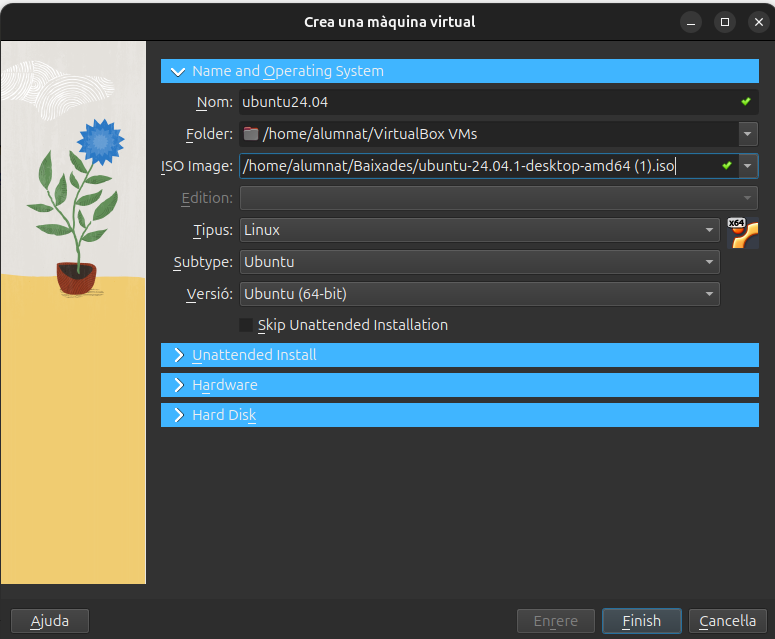
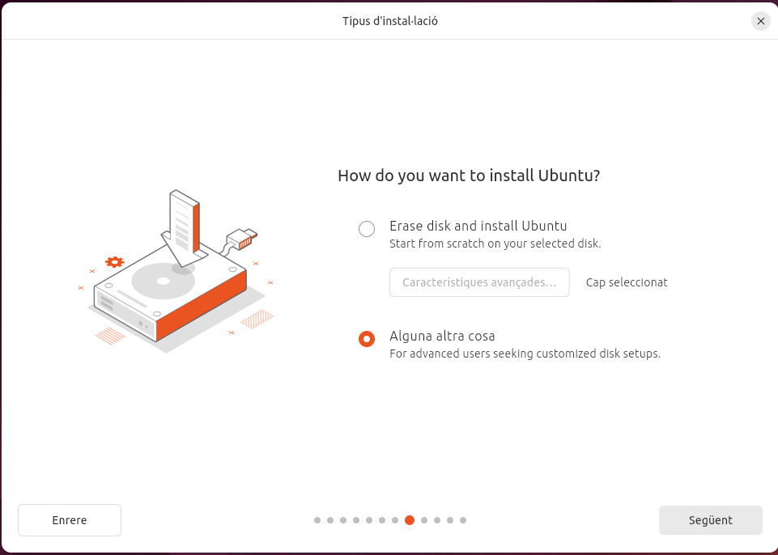
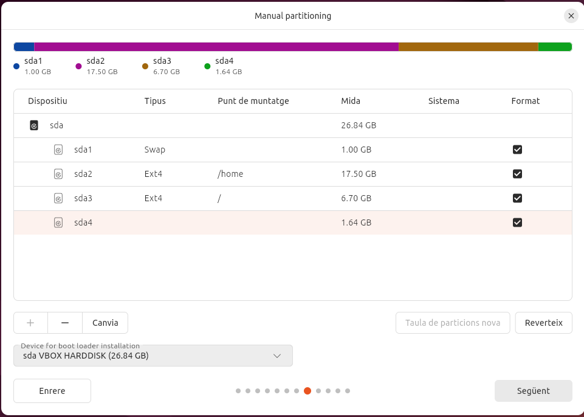

# Sprint 1

En aquest apartat es documentarà la informació i procediments necessaris per l'*Sprint 1*.

## Instal·lació del sistema operatiu.

Començarem per la instal·lació del sistema operatiu. En aquest cas crearem una màquina virtual amb una ISO de **ubuntu 24.04 LTS** al programa *Oracle VirtualBox*.

### Configuració

Havent obert el programa de VirtualBox clicarem sobre la icona de *Nova* i apareixerem a la finestra **Crear una màquina cirtual** . En aquest primer apartat anomenat *Name and Operating System* donarem un nom a la nostra màquina virtual, indicarem quina serà la seva carpeta arrel (deixarem l'assignada per defecte) i seleccionarem entre el buscador d'arxius la ISO del sistema operatiu que haurem descarregat previament.

Passant al següent apartat corresponent a *Unattended Install* proporcionarem al box de **Username and Password** l'usuari i la contrasenya que utilitzarem per accedir a la nostra màquina virtual quan aquesta s'executi. Al box **Additional Options** configurarem el *Hostname* i el *Domain Name* de manera que compleixi el que se'ns requereix si movem al cursor sobre la icona taronja que ens apareixerà a la dreta si el nom que es proporciona per defecte no és vàlid. Generalment, eliminant els espais que poden haver aparegut o caràcters especials que el camp no admeti serà suficient.

Avancem a la configuració de **Hardware**. Aquí assignarem els recursos de memòria RAM i nuclis del processador màxims que permetrem utilitzar a la nostra màquina virtual.

> **Nota:** Els valors que assignem en cap cas poden superior als valors màxims de la RAM o de nuclis del processador amb que treballem.
>
> Per a poder treballar mínimament còmodes amb una MV ubuntu assignem un mínim de 4GB de RAM i 4 nuclis.

Per acabar de muntar la nostra MV solament ens queda configurar el nostre **Hard Disk** . En aquest apartat, deixarem la carpeta de destí per defecte i per no tenir molts problemes amb una MV ubuntu assignem un mínim de 25GB.

> **Nota:** El valor que donem al espai del disc emprat per la màquina en cap cas podra superar a la capacitat màxima disponible del nostre disc físic.

 

## Particions

Quan executem la màquina virtual per primera vegada apareixerem a la configuració inicial d'Ubuntu. Durant aquest procediment podrem configurar les particions.

### Configuració inicial pas a pas

Comencem per seleccionar l'idioma amb que treballarà el nostre *SO*. En aquest cas nosaltres seleccionem **català**.

Deixarem la distribució del teclat en **espanyol** i amb la variant **Espanyol - Català** que apareix predefinida al seleccionar el llenguatge català.

Deixarem la connexió a internet establerta segons el nostre cas.

Sel·leccionarem que volem **instal·lar el sistema Ubuntu**.

Deixarem seleccionada la **instal·lació interactiva**.

Per aquesta màquina demanarem que ens instal·li la **sel·leció per defecte** de programari.

Per optimitzar el la nostra màquina **seleccionarem les dos opcions** a la part de *Install recommended propietary software?*.

### Configuració de les particions

Per a començar en essència amb la part de configurar les particions, al tipus d'instal·lació seleccionarem aquest cop  **'alguna altra cosa'**.

Clicarem sobre l'icona blanca del disc dur i ens dirigirem baix a l'esquerra i clicarem sobre l'icona de **+** per afegir una nova partició. En aquest cas, la nostra màquina disposa de 26.84 GB. així que farem les següents particions, clicant sobre *Espai lliure* i l'icona **+** cada cop que acabem de crear-ne una de nova.
 
> **Primera**:	Espai: 1.00 GB	Tipus: Swap	Punt de muntatge: '-'
>
> **Segona**:	Espai: 17.50 GB	Tipus: Ext4	Punt de muntatge: /home 
>
> **Tercera**:	Espai: 6.70 GB	Tipus: Ext4	Punt de muntatge: /
>
> **Quarta**:	Espai: 1.64 GB	Tipus: '-'	Punt de muntatge: '-'

Registrarem el nostre usuari i nom de l'ordinador. En aquest moment crearem també una contrasenya per a l'usuari i deixarem activa la selecció **fes que calgui una contrasenya per entrar**.

Seleccionarem al mapa la nostra franja horaria.

Després de confirmar les nostres configuracions a la taula que se'ns proporcionarà finalitzarem fent clic sobre **comença a instal·lar**.

## Llicències

Una llicència de programari és un conjunt de condicions legals que defineixen els drets i les restriccions sota les quals es pot utilitzar, modificar, distribuir o accedir a un programa informàtic. Aquesta llicència actua com un contracte entre el creador o titular dels drets del programari (sovint l'empresa o el desenvolupador) i l'usuari final, establint què es permet fer amb el programari i què no.

### Llicències de programari lliure 

Perquè una llicència de programari es consideri programari lliure, ha de complir quatre principis fonamentals que garanteixen a l'usuari llibertats plenes sobre l'ús i modificació del programari. Aquests principis, establerts per la Free Software Foundation (FSF), són els següents:

Llibertat d'ús:

L'usuari té la llibertat de fer servir el programa amb qualsevol propòsit, sense cap restricció. Això inclou l'ús personal, acadèmic, comercial o qualsevol altre.

Llibertat d'estudi i modificació:
L'usuari té la llibertat de estudiar com funciona el programa i de modificar-lo per adaptar-lo a les seves necessitats. Perquè això sigui possible, és necessari que el codi font estigui disponible.

Llibertat de distribució:
L'usuari té la llibertat de redistribuir còpies del programa a altres persones, ja sigui de manera gratuïta o cobrant-ne un preu, sense restriccions.

Llibertat de millorar i redistribuir les versions modificades:
L'usuari té la llibertat de millorar el programa i distribuir les versions modificades per tal que la comunitat en general es pugui beneficiar de les millores. Com amb la llibertat 1, per poder exercir aquesta llibertat és necessari l'accés al codi font.

> Aquests quatre principis asseguren que el programari sigui totalment lliure, no només en termes de preu, sinó sobretot pel que fa a les llibertats d'ús, modificació i redistribució.

		> font: [ChatGPT](https://chatgpt.com "Chat generatiu amb IA implementada") .

#### Tipus de llicències de programari lliure 

Dins de les llicències de programari lliure, hi ha diverses opcions que proporcionen diferents nivells de llibertat i condicions per als usuaris. A continuació, es presenten les llicències més utilitzades dins d'aquest àmbit, juntament amb les seves característiques principals:

> GNU General Public License (GPL)
>
>	 Característiques:
>
>		 · Té un efecte copyleft fort, la qual cosa significa que qualsevol treball derivat ha de mantenir-se sota la mateixa llicència.
>
>		 · Garanteix que el codi font estigui disponible tant per al programari original com per a qualsevol versió modificada.
>
>		 · Prohibeix la incorporació del programari en projectes que tinguin llicències privatives o propietàries.
>
>		 · Molt utilitzada en projectes de gran escala com Linux.

> GNU Lesser General Public License (LGPL)
>
>	 Característiques:
>
>		 · Similar a la GPL, però més permissiva, especialment dissenyada per a biblioteques de programari.
>
>		 · Permet que el programari sigui enllaçat amb programari propietari sense que aquest últim hagi de ser lliure.
>
>		 · Manté el copyleft en les modificacions directes de la biblioteca, però permet un ús més ampli quan s’utilitza en conjunció amb altres programes.

> MIT License
>
>	 Característiques:
>
>		 · És una de les llicències més permissives.
>
>		 · Permet que el programari es pugui utilitzar, modificar, redistribuir i fins i tot vendre, tant en projectes lliures com en propietaris.
>
>		 · No obliga a mantenir la llicència original en treballs derivats.
>
>		 · No inclou garanties ni responsabilitats del creador del programari.

> BSD License
>
>	 Característiques:
>
>		 · És molt similar a la MIT License en termes de permissivitat.
>
>		 · Ofereix llibertat completa per utilitzar, modificar i redistribuir el codi, tant en projectes lliures com privats.
>
>		 · Existeixen diverses versions d'aquesta llicència, com la BSD de 2 clàusules (simplificada) i la BSD de 3 clàusules (amb més restriccions per a evitar que el nom dels autors s'utilitzi per a fins comercials).

> Apache License 2.0
>
>	 Característiques:
>
>		 · Permet l'ús, modificació i distribució tant per a projectes lliures com comercials.
>
>		 · Inclou una clàusula de patents, la qual protegeix els usuaris de litigis relacionats amb patents si utilitzen el codi.
>
>		 · Els treballs derivats poden ser distribuïts sota altres llicències, però cal incloure una còpia de la llicència original i reconèixer l'autoria.

> Mozilla Public License (MPL)
>
>	 Característiques:
>
>		 · Ofereix un copyleft suau, permetent que parts del programari es puguin incorporar a projectes privats, però mantenint la llicència lliure en el codi original i modificat.
>
>		 · Molt adequada per a projectes grans amb components que poden ser reutilitzats en altres tipus de llicències.
>
>		 · Utilitzada en projectes com Firefox.

> Eclipse Public License (EPL)
>
>	 Característiques:
>
>		 · Té un copyleft suau similar al de la MPL.
>
>		 · Permet la combinació de codi lliure i codi propietari, mantenint la llicència lliure només en el codi original o modificat que es distribueixi.
>
>		 · Inclou proteccions legals contra reclamacions de patents.

Les llicències de programari lliure permissives i les llicències robustes (amb copyleft) ofereixen dos enfocaments diferents pel que fa a la gestió del codi. Les llicències permissives, com la MIT o la BSD, permeten una gran flexibilitat en l'ús, modificació i redistribució del programari, fins i tot en projectes propietaris o comercials. Aquesta flexibilitat facilita que el codi pugui ser integrat en una àmplia varietat de projectes, però no garanteix que les versions modificades es mantinguin lliures. En canvi, les llicències robustes, com la GPL, imposen restriccions més estrictes per assegurar que qualsevol modificació o treball derivat es distribueixi sota la mateixa llicència, protegint així la llibertat del codi a llarg termini. Això promou una comunitat oberta i col·laborativa, però limita l'ús del codi en projectes tancats o comercials. La decisió d'optar per una llicència permissiva o robusta dependrà de les prioritats del desenvolupador: més flexibilitat per a l'ús del codi o més control per garantir que es mantingui lliure.

#### Altres tipus de llicències

> Llicència de Programari de Codi Obert (Open Source License)
>
> Tot i que sovint es confon amb el programari lliure, el programari de codi obert té algunes diferències subtils. Aquestes llicències també permeten accés al codi font i la seva modificació, però poden tenir menys restriccions pel que fa a la redistribució. Un exemple destacat és la MIT License.
>
>	Característiques:
>
>		 · L'accés al codi font és obligatori.
>		 · No sempre s'exigeix mantenir la mateixa llicència en versions modificades (no té efecte copyleft).
>		 · Major permissivitat en termes d'ús comercial.
>
>
> Llicència Permissiva (Permissive License)
>
> Aquest tipus de llicència permet la màxima llibertat als usuaris per fer servir, modificar i redistribuir el programari, fins i tot en projectes privats o comercials, sense imposar moltes restriccions. Un dels exemples més coneguts és la BSD License.
>
> 	Característiques:
> 		· Permet la redistribució sota altres llicències, incloses llicències propietàries.
>		· Molt pocs requisits sobre com ha de ser redistribuït el programari.
>
>
> Llicència de Programari Propietari (Proprietary Software License)
>
> El programari propietari és aquell que no permet l'accés al codi font ni la seva modificació. L'usuari adquireix una llicència per utilitzar el programari, però sota condicions molt restrictives, sovint limitades a una màquina o a un ús específic.
>
> 	Característiques:
>
>		 · No es permet l'accés al codi font.
>		 · Generalment no es permet la redistribució ni la modificació del programari.
>		 · L'ús sovint està limitat per una llicència que restringeix el nombre d'usuaris o dispositius.
>
>
> Llicència Freeware
>
> El programari freeware es pot utilitzar de manera gratuïta, però, com el programari propietari, el codi font no està disponible, i les restriccions d'ús poden variar segons l'acord de llicència.
>
> 	Característiques:
>
> 		· Es distribueix de manera gratuïta.
> 		· No es permet l'accés ni la modificació del codi font.
> 		· Pot estar limitat a ús personal o no comercial.
>
>
> Llicència Shareware
> 
> El shareware és una modalitat de programari que es distribueix de manera gratuïta per un període de temps limitat o amb funcionalitats restringides. L'objectiu és que l'usuari provi el programari i després compri una versió completa o amb totes les funcionalitats desbloquejades.
>
> 	Característiques:
>
>		 · Es permet la distribució gratuïta, però sovint amb funcionalitats limitades.
>		 · Requereix pagament per accedir a la versió completa.
>		 · No es permet la modificació ni redistribució sense permís del propietari.

## Punts de restauració

Els punts de restauració són còpies de seguretat de l'estat actual del sistema operatiu, incloent-hi la configuració del sistema i els fitxers essencials, que permeten restaurar el sistema a un estat anterior en cas de problemes. Aquests punts permeten que, si es produeixen errors o es fan canvis no desitjats en el sistema (com actualitzacions defectuoses o modificacions a fitxers crítics), es pugui tornar a un estat anterior, minimitzant la pèrdua de dades i el temps d'inactivitat. En el cas de les màquines virtuals amb les que estem treballant, aquesta eina ens és especialment útil per fer passos enrere quan ens equivoquem amb la configuració de la màquina i aquesta arriba a petar. Crear aquestes instantànees ens permetra tornar a la configuració donada d'un moment en concret així com si fós el punt de guardat d'un videojoc. Una eina molt útil i popular per poder fer això és **Timeshift** .

### Instal·lació de Timeshift

El primer pas abans de començar a instal·lar qualsevol programa hauria de ser assegurar-nos que els repositoris de paquets estiguin actualitzats.

Ubuntu inclou Timeshift als seus repositoris oficials, de manera que es pot instal·lar directament amb la comanda següent:

Un cop instal·lat ens assegurem que aparegui l'icona buscant el nom de l'aplicació i l'executem.

Deixarem el tipus d'intantània com a **RSYNC** .

La ubicació de la instantània serà al **sda2** que com podrem veure retrocedint a l'apartat de *Configuració de les particions* correspon al **'/home'**.

Al següent apartat configurarem la programació de les instantànies. Ara per ara, en el nostre cas on sols estem testejant, deixarem la configuració per defecte.

Per a les nostres instantànies ens interessa incloure solament tots els fixers de la carpeta de l'usuari i exclourem tots el del **root**. 

Un cop acabada la configuració, clicarem sobre **Acaba** per finalitzar. 

> Amb aquesta configuració es crearan automàticament les instantànies amb la periodicitat que li haguem assignat. Si volem fer una instantània manual desde la terminal d'Ubuntu executarem la comanda **sudo timeshift --create** . En cas que el sistema tingui problemes i volem restaurar una instantània anterior executarem la comanda **sudo timeshift --restore** .

## Configuració bàsica de xarxa

La configuració bàsica de la xarxa a Ubuntu implica establir paràmetres essencials com l'adreça IP, la passarel·la predeterminada, el servidor DNS i la configuració de la màscara de subxarxa. En aquest cas nosaltres configurarem manualment la IP del nostre dispositiu per fer-la estàtica.

Dins a paràmetres accedim a **Xarxa** i farem clic sobre l'engranatfe de la connexió del cablejat per accedir a la configuració.

Dins de la configuració de la xarxa anem a l'apartat de **IPv4** i posem el mètode **manual** per poder configurar una *IP estàtica* amb les següents dades.  

Un cop fet desem la configuració i pasem al terminal on executarem la següent comanda.

Executem la comanda **posant davant 'sudo' per executar-la com a superusuari** perquè ens permeti modificar el **.yaml** i introduirem les següents dades.

Un cop configurat el *.yaml* premem **Ctrl+O** per desar i **Ctrl+X** per sortir de l'editor. Executem la última comanda per aplicar els canvis realitzats als paràmetres de la xarxa.

 

## Instal·lació bàsica de programes

Com a qualsevol (o gairebé qualsevol) SO, Ubuntu permet l'instal·lació de programari o *software* des de repositoris propis o externs i ens ofereix diferents mètodes. que veurem en aquest apartat, per fer possible aquesta instal·lació. Per als exemples intentarem instal·lar amb les diferents eines el **GNU Image Manipulator Program** .

### Instal·lació des de l'entorn gràfic

Ubuntu ofereix l'Ubuntu Software Center (més conegur com App Center), una interfície gràfica fàcil d'utilitzar per cercar, instal·lar i desinstal·lar aplicacions amb un sol clic. Només cal obrir la aplicació, buscar el programa desitjat, i fer clic a "Instal·lar".

### Instal·lació des de terminal

El programari també pot ser instal·lat des del terminal amb una serie d'eines i comandes. Algunes d'elles les veurem a continuació.

#### APT (Advanced Package Tools)

APT és una eina avançada de gestió de paquets que automatitza la instal·lació, actualització i eliminació de programes.

La comanda sudo apt update actualitza la llista de paquets disponibles des dels repositoris configurats, assegurant-se que el sistema tingui la informació més recent sobre versions i nous paquets. Després de realitzar un update, sovint es recomana executar sudo apt upgrade, que instal·la les versions més recents de tots els paquets ja instal·lats al sistema, mantenint-lo al dia. Si es volen actualitzar només alguns paquets específics sense tocar la resta, es pot utilitzar sudo apt install **nom_paquet** , que instal·la o actualitza el paquet especificat. En cas que sigui necessari eliminar un paquet, la comanda adequada és sudo apt remove **nom_paquet** , que desinstal·la el paquet, però deixa intactes els fitxers de configuració. Si es vol eliminar completament un paquet, incloent els fitxers de configuració, cal emprar sudo apt purge **nom_paquet** .

Per identificar paquets instal·lats o disponibles, es pot utilitzar apt search **nom_paquet** , que busca paquets per nom o descripció, o bé apt show **nom_paquet** , que proporciona informació detallada sobre un paquet específic, com la seva versió i dependències. Quan es vol netejar el sistema de paquets i biblioteques que ja no són necessaris, es pot fer servir sudo apt autoremove, que elimina automàticament els paquets orfes. Per a la neteja de paquets descarregats i emmagatzemats a la memòria cau (però no instal·lats), s'utilitza sudo apt clean, que allibera espai al sistema eliminant els fitxers de paquets descarregats.

##### Instal·lació de GIMP amb APT

1. Actualització de repositoris

2. Instal·lació paquets de GIMP.

3. Executar GIMP.

#### DPKG (Debian Package)

El gestor de paquets DPKG és una eina fonamental per gestionar paquets '.deb' manualment en sistemes basats en Debian, com Ubuntu.

Per instal·lar un paquet, s'utilitza la comanda sudo dpkg -i **nom_paquet'**.deb, que instal·la el paquet especificat des d'un fitxer .deb local. Si durant la instal·lació es produeixen errors per dependències trencades, es poden reparar amb sudo apt --fix-broken install. Per consultar els paquets instal·lats en el sistema, s'utilitza dpkg -l, que mostra una llista de tots els paquets instal·lats, incloent la seva versió i estat.

Si necessites verificar si un paquet específic està instal·lat, pots utilitzar dpkg -s **nom_paquet** , que mostra la informació de l'estat del paquet. Per desinstal·lar un paquet mantenint els fitxers de configuració, s'usa la comanda sudo dpkg -r **nom_paquet** , mentre que si es vol eliminar el paquet i tots els fitxers associats, incloent les configuracions, es fa servir sudo dpkg --purge **nom_paquet**.

En cas que vulguis veure el contingut d'un paquet .deb sense instal·lar-lo, pots fer servir dpkg -c **nom_paquet** .deb per llistar els fitxers del paquet. Si el que vols és extreure informació sobre els fitxers que s'han instal·lat des d'un paquet concret, la comanda adequada és dpkg -L **nom_paquet** . Finalment, per reinstal·lar un paquet, pots utilitzar sudo dpkg --configure -a, que reconfigura els paquets pendents de configuració, especialment útil quan s'han interromput instal·lacions.

##### Instal·lació de GIMP amb DPKG

1. Descarregem l'últim paquet '.deb' de GIMP utilitzant la comanda **wget**

2. Instal·lem el paquet Debian amb la comanda **sudo dpkg -i 'nom_paquet'** .

3. Corretgim les dependpencies que s'han pogut trovar trencades.

4. Executem GIMP.

#### Aptitude

Aptitude és un gestor de paquets avançat que ofereix més control sobre la instal·lació i gestió de paquets en comparació amb altres eines com apt o dpkg. És especialment útil per resoldre conflictes de dependències. A continuació es detallen algunes de les comandes més utilitzades d'aptitude i les seves funcions.

Per instal·lar un paquet, s'utilitza la comanda sudo aptitude install **nom_paquet** , que descarrega i instal·la el paquet especificat juntament amb totes les seves dependències. Si el que necessites és eliminar un paquet, pots utilitzar sudo aptitude remove **nom_paquet** , que elimina el paquet però manté els seus fitxers de configuració. Si vols una eliminació completa, incloent els fitxers de configuració, has d'usar sudo aptitude purge **nom_paquet** .

Per actualitzar la llista de paquets disponibles als repositoris configurats, s'executa sudo aptitude update. Aquest pas és important per assegurar que tens les últimes versions disponibles. Si vols actualitzar els paquets instal·lats al sistema, pots utilitzar la comanda sudo aptitude upgrade, que actualitza tots els paquets disponibles sense eliminar ni instal·lar nous paquets. Si desitges una actualització més agressiva que també permeti eliminar i instal·lar nous paquets per completar l'actualització, la comanda adequada és sudo aptitude full-upgrade.

Aptitude també permet cercar paquets amb aptitude search **nom_paquet** , que retorna una llista dels paquets que coincideixen amb el criteri de cerca. Per obtenir més informació sobre un paquet específic, incloent-ne la descripció, versió i dependències, es pot utilitzar aptitude show **nom_paquet** . Finalment, per netejar els paquets que ja no són necessaris, es pot utilitzar sudo aptitude autoclean o sudo aptitude clean. La primera només elimina els paquets que ja no són necessaris però encara tenen versions disponibles, mentre que la segona elimina tots els paquets emmagatzemats a la memòria cau.

##### Instal·lació de GIMP amb APTITUDE

Actualitzem la llista de paquets disponibles al sistema amb la següent comanda

Instal·lem GIMP amb la comanda corresponent.

Si vols revisar les dependències o paquets relacionats abans de la instal·lació, pots fer-ho utilitzant **aptitude show 'nom_programa'** .

Executem el programa amb la comanda adequada.

### Afegir repositoris 

Afegir repositoris a Ubuntu permet accedir a *software* que no està disponible als repositoris oficials del SO, com versions més recents o programes propietaris (Google i les seves aplicacions o controladors de hardware...). A més, facilita les actualitzacions. Els repositoris són fonts segures i verificades que permeten instal·lar i actualitzar *software* de manera senzilla.

## Gestors d'arrancada 

Els gestors d'arrencada són programes que s'executen en l'arrencada del sistema i permeten seleccionar quin sistema operatiu o quin nucli del sistema vols iniciar.

### GRUB2

GRUB2 és el gestor d'arrencada més utilitzat en sistemes Linux. És molt flexible i suporta múltiples sistemes operatius, cosa que el fa ideal per a entorns de doble arrencada. GRUB2 permet personalitzar el procés d'arrencada i inclou eines per solucionar problemes de càrrega.

### MBR (Master Boot Record)

L’MBR és el tipus tradicional de particionament utilitzat pels discs durs més antics. Conté informació sobre com arrencar el sistema operatiu i com està estructurat el disc. És compatible amb sistemes antics, però té limitacions, com el màxim de 4 particions primàries i un límit de 2 TB per partició.

### GPT (GUID Partition Table)

El GPT és el sistema de particionament modern, utilitzat majoritàriament amb sistemes UEFI. Supera les limitacions de l’MBR, permetent un nombre gairebé il·limitat de particions i suportant discs durs de grans dimensions (més de 2 TB).

## Recuperació de gestors d'arrencada 

El concepte de "recuperació dels gestors d'arrencada" fa referència al procés de reparar o restaurar el gestor d'arrencada (bootloader) d'un sistema operatiu quan aquest ha estat danyat, sobreescrit o eliminat, impedint que el sistema operatiu s'iniciï correctament.

### Boot-Repair

Boot-Repair és una eina gràfica dissenyada per facilitar la restauració de GRUB i altres gestors d'arrencada. Aquesta eina detecta automàticament els problemes amb el gestor d'arrencada i proporciona opcions per restaurar-lo sense necessitat de coneixements tècnics avançats.

#### Utilització de Boot-Repair

1. Afegim des del terminal el PPA de Boot-Repair.

2. Actualitzem repositoris.

3. Instal·lem Boot-Repair.

4. Executem Boot-Repair.

5. Seleccionem l'opció **Reparació recomanada** i seguim les instruccions. El programa detectarà i arreglarà el problema del gestor d'arrencada.

 

##Clonezilla 

Clonezilla és un programari de clonació de discos i particions lliure i de codi obert. Serveix principalment per fer còpies de seguretat i restauració de sistemes operatius, discos durs i particions. Funciona de manera similar a altres programes coneguts, com Norton Ghost, però amb l'avantatge de ser completament gratuït, el que el fa una opció popular tant en entorns domèstics com professionals.

Investigarem més sobre aquest programa al Sprint2.
