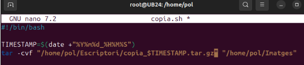
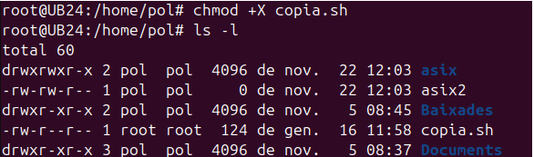
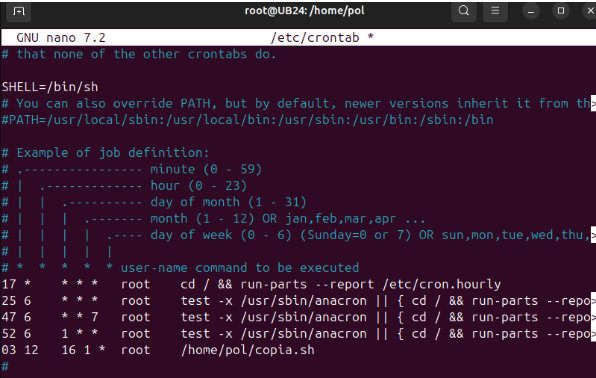
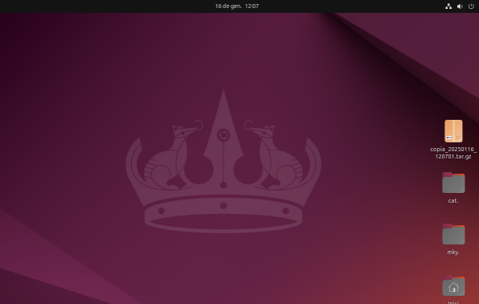
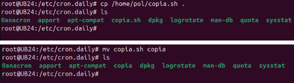
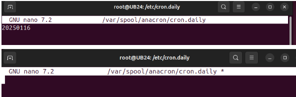
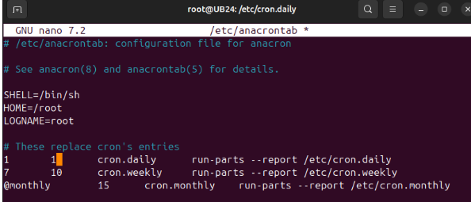
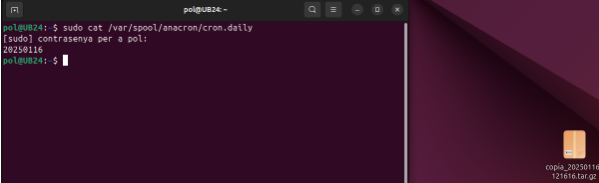

# Automatitzacions de Tasques

## Automatització amb Scripts, Cron i Anacron

En aquest apartat es descriuen dos processos importants per automatitzar tasques en sistemes operatius basats en Linux: **Cron** i **Anacron**. Aquests sistemes permeten programar l'execució d'scripts i tasques de manera recurrent, tot i que presenten algunes diferències que es detallen a continuació.

## Crontab vs Anacron

**Cron** i **Anacron** són eines que s'utilitzen per a l'automatització de tasques, i mentre que antigament funcionaven de manera separada, avui dia treballen conjuntament en molts sistemes operatius moderns, com Ubuntu.

**Quan utilitzar Cron o Anacron?**

- **Cron**: Es fa servir quan els ordinadors estan encesos de manera constant i volem que les tasques es duguin a terme a hores concretes, com per exemple: "executar aquest script cada dia a les 12:00".

- **Anacron**: Ideal per a sistemes que no estan sempre en funcionament. Permet assegurar-se que una tasca es realitzi encara que el sistema hagi estat apagat durant el moment programat.

**Usos generals**

| Eina    | Cas d'ús                                                                           |
|---------|------------------------------------------------------------------------------------|
| Cron    | Tasques específiques d'usuari o programades a hores concretes.                     |
| Anacron | Tasques de manteniment general del sistema operatiu, com neteja i actualitzacions. |

**Funcionament teòric**

**Cron**:

- Si volem programar tasques globals per a tots els usuaris, editem el fitxer: `/etc/crontab`.

- Si volem programar tasques específiques per a un usuari, utilitzem: `crontab -e -u <usuari>`.

**Anacron**:

- S'utilitza per programar tasques que han de garantir la seva execució, independentment de si el sistema estava apagat durant l'hora programada.

- Els arxius rellevants inclouen:

    - `/etc/anacrontab`: Configuració principal d'Anacron.

    - `/var/spool/anacron/`: Conté la informació sobre les tasques ja executades.

    - Directoris com `/etc/cron.daily/`, `/etc/cron.weekly/`, `/etc/cron.monthly/`.

**Taula comparativa: Cron vs Anacron**

| Característica             | Cron                                                                                          | Anacron                                                                                               |
|----------------------------|-----------------------------------------------------------------------------------------------|-------------------------------------------------------------------------------------------------------|
| Execució programada        | A hores i dates concretes.                                                                    | Dins d'un període flexible (diari, setmanal, mensual).                                                |
| Necessitat d'estar encesos | Requereix que el sistema estigui en funcionament en el moment exacte de l'execució.           | No requereix que el sistema estigui encesos; executa tasques pendents quan es reinicia.               |
| Configuració principal     | `/etc/crontab` i fitxers personals amb `crontab -e`.                                          | `/etc/anacrontab`.                                                                                    |
| Freqüència típica          | Hores específiques, segons l'horari definit.                                                 | Tasques diàries, setmanals o mensuals.                                                                |
| Ús principal               | Automatització de tasques específiques per a usuaris o processos puntuals.                   | Tasques de manteniment i gestió del sistema operatiu.                                                 |
| Adequat per a              | Sistemes sempre en funcionament (servidors, per exemple).                                    | Sistemes que poden estar apagats durant períodes de temps (portàtils, ordinadors personals).           |
| Ubicació de tasques        | `/etc/crontab`, `/etc/cron.d/`, `crontab -e`.                                                | `/etc/anacrontab`, `/var/spool/anacron/`, `/etc/cron.daily/`, etc.                                    |

## Arxius d'interès

**Cron**:

- `/etc/crontab`: Fitxer principal per a configurar tasques globals.

- `/etc/cron.d/`: Directori per afegir tasques personalitzades.

- `crontab -e`: Per configurar tasques específiques d'usuari.

**Anacron**:

- `/etc/anacrontab`: Fitxer principal de configuració.

- `/var/spool/anacron/`: Conté registres de tasques ja realitzades.

**Directoris**:

- `/etc/cron.daily/`: Tasques diàries.

- `/etc/cron.weekly/`: Tasques setmanals.

- `/etc/cron.monthly/`: Tasques mensuals.

### Exemple pràctic

Per aquest exemple, crearem dos fitxers dins del directori /home/Imatges per verificar que l'script funciona correctament.

Aquest script s'utilitza per crear una còpia de seguretat comprimida del directori d'imatges ubicat a `/home/alumne/Imatges`. La còpia es guarda al directori Escriptori amb un nom que inclou una marca de temps per identificar-la.

1. **Inicialització del script**

L'script està preparat per executar-se amb el shell bash, tal com indica la primera línia (#!/bin/bash).

2. **Generació de la marca de temps (`TIMESTAMP`)**

Es genera una cadena amb la data i hora actuals en el format `YYYYMMDD_HHMMSS`. Aquesta marca de temps permet crear noms únics per a cada còpia de seguretat.

3. Creació de la còpia de seguretat

S'utilitza una eina per empaquetar i comprimir el directori `/home/alumne/Imatges`. El resultat és un fitxer comprimit (`.tar.gz`) que es guarda al directori `/home/alumne/Escriptori` amb un nom que inclou la marca de temps (`copia_YYYYMMDD_HHMMSS.tar.gz`).

**Exemple de resultat**

Si l'script s'executa el **16 de gener de 2025 a les 13:30:45**, el fitxer resultant tindria el següent nom:

**/home/alumne/Escriptori/copia_20250116_133045.tar.gz**.

Assignem permisos d'execució al fitxer `copia.sh` amb la comanda `chmod +x copia.sh` i l'executem manualment per verificar el seu funcionament.

## Automatització del procés amb `crontab`

Per automatitzar l'execució del nostre script `copia.sh`, utilitzarem el programador de tasques `crontab`. A continuació, es detallen els passos per configurar-ho:

**Editar el fitxer `crontab` del sistema**

Obrim el fitxer de configuració del `crontab` amb permisos d'administrador per afegir la tasca programada:

`sudo nano /etc/crontab`

**Afegir la línia de programació**

Afegim la següent línia al final del fitxer:

`05 13 16 1 * /home/alumne/copia.sh`

Aquesta línia indica que l'script `copia.sh` s'executarà automàticament segons la programació especificada.

**Explicació de la sintaxi**

Els camps de la línia afegida al `crontab` tenen el següent significat:

- **05**: Minut en què s'executarà la tasca (05 minuts).

- **13**: Hora del dia (13:00 h).

- **16**: Dia del mes (16 de gener en aquest cas).

- **1**: Mes de l'any (gener).

- *: Qualsevol dia de la setmana (de dilluns a diumenge).

En el nostre cas, això significa que l'script s'executarà el **16 de gener de cada any a les 13:05**, independentment del dia de la setmana.

**Guardar i sortir**

Després d'afegir la línia, guardem els canvis i sortim de l'editor.

Esperem uns minuts i podem observar que s'ha realitzat la copia dels arxius.

### Configuració amb Anacron

A continuació, configurarem el nostre script perquè s'executi automàticament amb **Anacron**. Aquesta eina és ideal per a tasques periòdiques en sistemes que no estan en funcionament constant.

**Moure el script a `/etc/cron.daily`**

Per començar, copiem el nostre script a la carpeta designada per a tasques diàries:

- Accedim al directori `/etc/cron.daily/`.

- Copiem el fitxer `copia.sh` des de la seva ubicació original.

**Nota**: El fitxer no pot tenir extensions, així que canviem el nom per eliminar-la.

**Exemple**:

- **Original**: `copia.sh`

- **Renombrat**: `copia`

**Assegurar que s'executa avui mateix**

Per comprovar que l'script s'executa correctament, editem el fitxer de registre d'Anacron per a tasques diàries:

- Obrim el fitxer `/var/spool/anacron/cron.daily` i eliminem les dades que hi trobem.

**Configuració del temps d'execució**

Per ajustar el temps d'execució de la tasca diària, editem el fitxer de configuració d'Anacron:

- Obrim `/etc/anacrontab` i localitzem la línia corresponent a les tasques diàries.

- Modifiquem el segon valor (temps en minuts) a 1 si volem que la tasca s'executi només un minut després d'iniciar el sistema.

Per defecte, Anacron espera 5 minuts, però es pot ajustar segons les preferències. Ho he configurat a 1 minut per fer ràpid la prova.

Amb això, Anacron s'encarregarà d'executar l'script diàriament quan l'ordinador estigui en funcionament.

Reiniciem l'ordinador, esperem un minut i verifiquem que el procés s'ha executat correctament.

