# Unió de Clients al Domini LDAP

Aquesta secció se centra en el procés per unir els clients al domini LDAP. Els passos són senzills.

## Instal·lació dels Paquets Necessaris

Primer, assegureu-vos d'actualitzar el sistema abans de procedir amb la instal·lació:

Actualitzeu la llista de paquets:

- Executeu un apt update per assegurar-vos que disposeu de la informació més recent dels paquets.

**Instal·leu els paquets necessaris**:

- Instal·leu els següents paquets: `libnss-ldap, libpam-ldap i nscd`.

`sudo apt install libnss-ldap libpam-ldap nscd`

Quan premeu la tecla ENTER durant el procés, apareixerà una finestra de configuració. Si tanqueu aquesta finestra accidentalment o voleu reconfigurar el domini, no us preocupeu: podeu tornar a obrir-la.

### Reobrir la Finestra de Configuració

Per reobrir o reconfigurar la configuració del domini, executeu la comanda següent:

Utilitzeu `dpkg-reconfigure lpda-auth-config` per accedir de nou a la finestra de configuració.

`dpkg-reconfigure lpda-auth-config`

## Configuració Avançada per Unir Clients al Domini LDAP

A continuació, detallo els passos per completar la configuració del client LDAP, amb explicacions clares i referències visuals per facilitar el procés.

### Configuració Inicial del Reconfigure

1. **Servidor LDAP**:

Quan aparegui la primera finestra, assegureu-vos d'introduir l'adreça del servidor en el format següent:

`ldap://ip-of-the-server`.

> **Nota**: Si apareix `ldapi:///`, és incorrecte.

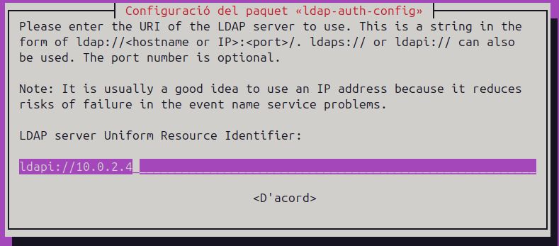

2. **Versió de LDAP**:

Seleccioneu la versió 3 del protocol LDAP.

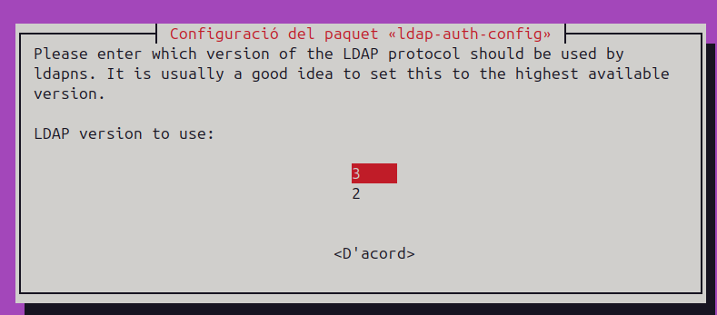

3. **Fer que el root local sigui administrador de la base de dades:**

Seleccioneu Sí en aquesta finestra.

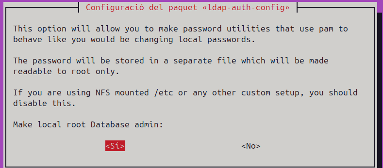

4. **Requereix autenticació la base de dades LDAP?**

Trieu Sí.

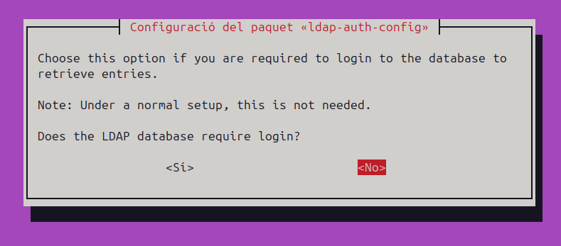

5. **Compte LDAP per al root**:
Utilitzeu un usuari "admin" que ja hagueu creat.

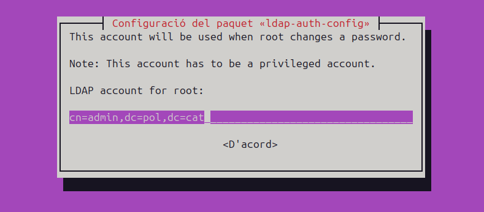

6. **Contrasenya del compte root de LDAP:**

Introduïu la contrasenya corresponent al compte d'administrador LDAP.

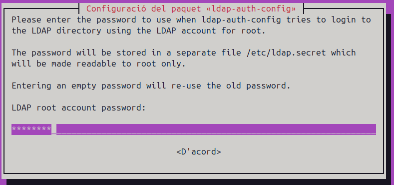

7. **Usuari sense privilegis per a la base de dades:**

En aquest cas, s'ha afegit un altre "usuari", però en entorns reals caldria usar un altre nom.

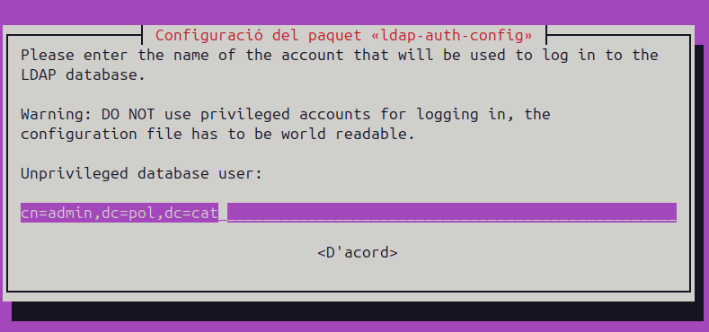

8. **Contrasenya per accedir a la base de dades LDAP:**

Introduïu la contrasenya que s'utilitzarà per accedir-hi.

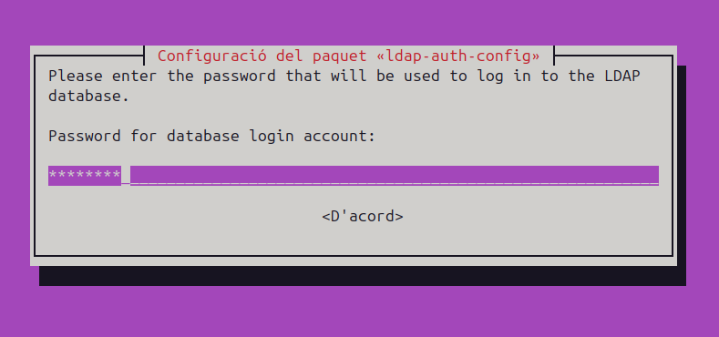

9. **Hash per defecte:**

Deixeu el valor predeterminat com MD5.

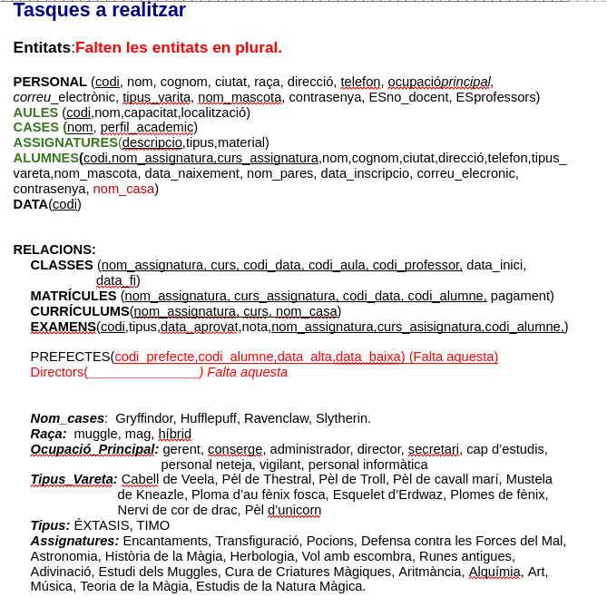

### Configuració Addicional

**Modificar `/etc/nsswitch.conf`**

Afegiu les línies següents al fitxer per integrar LDAP al sistema. Aquestes línies asseguren que el sistema consulti l’LDAP per a l’autenticació en lloc de buscar la informació localment.

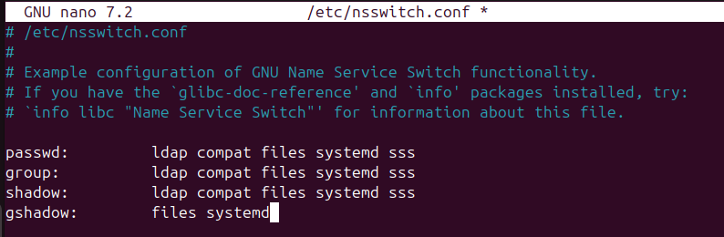

**Afegir Configuració a `common-session`**

Editeu el fitxer amb: `sudo nano /etc/pam.d/common-session` i afegiu aquesta línia al final:

`session optional pam_mkhomedir.so skel=/etc/skel umask=022`

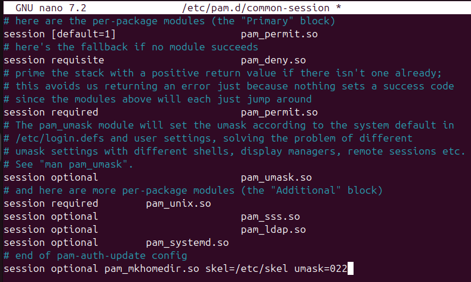

Aquesta línia crea automàticament el directori personal dels usuaris amb un umask de 022.

#### Configuració Opcional de LightDM

Pot ser que no sigui necessari, però si trobeu problemes per iniciar sessió amb un usuari, editeu el fitxer següent:

`sudo nano /usr/share/lightdm/lightdm.conf.d/50-ubuntu.conf`

Afegiu aquesta línia al final: `greeter-show-manual-login=true`

> **Nota**: Amb Ubuntu 24.0, no és necessari. Només afegiu aquesta configuració si no podeu iniciar sessió.

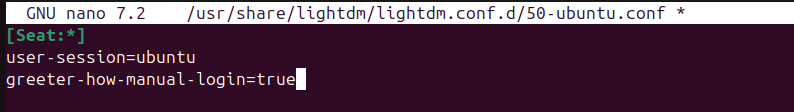

### Comprovació de la Configuració LDAP

Per verificar que el sistema pot autenticar-se correctament amb LDAP, seguirem els passos següents:

**Comprovar l'usuari amb la comanda `getent`:**

Per assegurar-vos que el sistema consulta correctament l’LDAP, podeu utilitzar la comanda sudo getent passwd. Si apareix l'usuari que heu afegit, per exemple, alu1, vol dir que la configuració és correcta.

**Reiniciar la màquina:**

Reinicieu la màquina per garantir que tots els serveis estan completament operatius abans d'intentar iniciar sessió.

**Iniciar sessió amb l'usuari LDAP:**

Proveu d'iniciar sessió utilitzant l'usuari `alu1` i la seva contrasenya definida a l'LDAP.

**Verificar la sessió:**

Un cop hàgiu iniciat sessió, podeu comprovar si sou realment l'usuari alu1 escrivint whoami. Si el resultat és alu1, vol dir que l’autenticació ha estat un èxit.

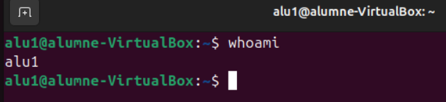