# Gestió del domini LDAP

En aquest apartat farem una breu explicació i introducció a les comandes i com podem gestionar el nostre servidor LDAP: add, delete i modify.

Ja tenim el nostre LDAP configurat com hem fet en l’apartat anterior. Fem un slapcat per comprovar.

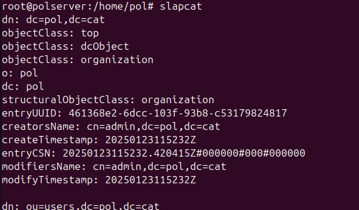

## ldapadd

La comanda ldapadd serveix per afegir els fitxers al domini LDAP. Podem fer-ho utilitzant l'ordre següent per afegir un fitxer .ldif que contingui les dades necessàries:

`ldapadd -c -x -D "cn=admin,dc=pol,dc=cat" -W -f gestiodades.ldif`

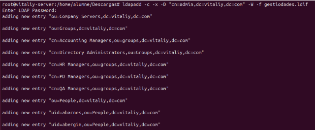

### Afegir un nou usuari

Per afegir un nou usuari, creem un fitxer amb extensió .ldif que contingui el següent codi:

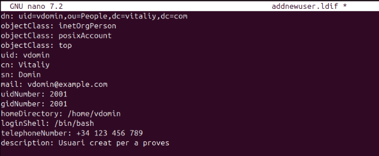

Un cop preparat, executem la comanda ldapadd per afegir l'usuari al domini.

**Execució de la comanda**

Utilitzem la següent comanda per afegir l’usuari:

`ldapadd -x -D "cn=admin,dc=pol,dc=cat" -W -f addnewuser.ldif`

Podem veure que l'usuari s'ha afegit correctament:

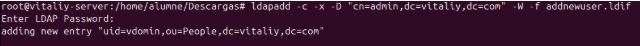

**Comprovació**

Finalment, realitzem una verificació amb la comanda ldapsearch per assegurar-nos que l'usuari s'ha creat correctament:

`ldapsearch -xLLL -b "uid=vdomin,ou=People,dc=pol,dc=cat"`

Resultat de la comprovació:

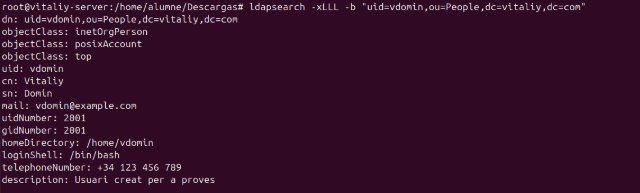

## ldapsearch

El comandament ldapsearch és una eina molt útil per consultar informació dins d’un domini LDAP. Amb aquesta eina podem buscar entrades, comprovar atributs, filtrar resultats i molt més. A continuació, veurem algunes de les seves funcionalitats bàsiques.

### Comprovació de les dades al domini

Ara que hem afegit el fitxer .ldif, comprovem que totes les dades estan correctament al domini. Això es pot fer amb la comanda ldapsearch:

`ldapsearch -xLLL -b "dc=pol,dc=cat" dn | wc -l`

> **Nota**: Afegim wc -l per fer un recompte de línies, ja que no volem que aparegui tot el text a la sortida.

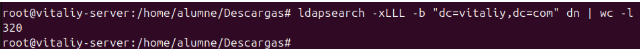

### Comprovació de les Unitats Organitzatives (UOs)

També podem fer una cerca per trobar totes les Unitats Organitzatives (UOs) del domini utilitzant la comanda següent:

`ldapsearch -xLLL -b "dc=pol,dc=cat" objectClass=organizationalUnit`

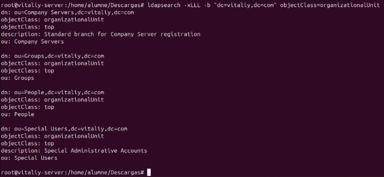

### Comprovació de Grups

Si volem saber quants grups hi ha dintre de la uo Groups, podem executar aquesta comanda.

`ldapsearch -xLLL -b "dc=pol,dc=cat" "(ou=Groups)" dn`

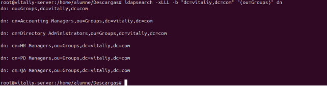

### Per fer una cerca més específica

L’usuari kvaughan, en quants grups el trobem com a uniqueMember i quins són?

Per fer això, podem executar la següent comanda per llistar els grups on l’usuari kvaughan és membre únic:

`ldapsearch -xLLL -b "dc=pol,dc=cat" "(uniqueMember=uid=kvaughan,ou=People,dc=pol,dc=cat)" dn`

Per comprovar quants grups hi ha en total, podem afegir el wc -l (word count list) per fer el recompte:

`ldapsearch -xLLL -b "dc=pol,dc=cat" "(uniqueMember=uid=kvaughan,ou=People,dc=pol,dc=cat)" dn | wc -l`

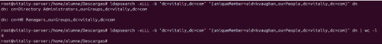

**Cerca específica: Usuaris de People amb uid començant per k i part de Human Resources**

Cerca usuaris que compleixen aquestes condicions:

- `uid` comença per k.

- Atribut `ou=Human Resources`.

`ldapsearch -xLLL -b "ou=People,dc=pol,dc=cat" "(&(uid=k*)(ou=Human Resources))" dn`

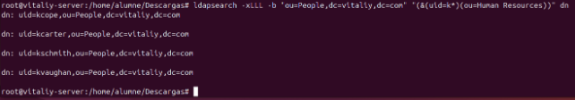

### Creació d'una nova UO

Per crear una nova Unitat Organitzativa (UO) anomenada "asix", necessitem preparar un fitxer .ldif amb la configuració de la nova UO. Un exemple del contingut del fitxer seria el següent:

`dn: ou=asix,dc=pol,dc=cat`
`objectClass: top`
`objectClass: organizationalUnit`
`ou: asix`

Després, utilitzarem la comanda ldapadd per afegir la UO al domini:

`ldapadd -x -D "cn=admin,dc=pol,dc=cat" -W -f asix.ldif`

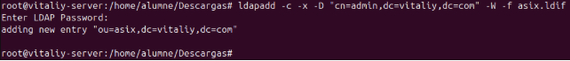

Un cop completada l’operació, la UO "asix" es crearà dins del domini. Per verificar-ho, podem utilitzar la següent comanda:

`ldapsearch -xLLL -b "dc=pol,dc=cat" objectClass=organizationalUnit uo`

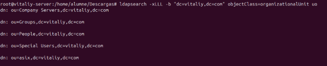

Amb això, assegurem que la nova UO ha estat afegida correctament.

## ldapdelete

Hi ha dues maneres de fer esborrats en un domini LDAP: utilitzar la comanda ldapdelete o utilitzar un fitxer .ldif amb ldapmodify.

### Esborrar atributs d’un usuari amb ldapmodify

Per esborrar atributs d’un usuari, primer necessitem crear un fitxer .ldif amb les modificacions que volem aplicar. En aquest cas, esborrarem l’atribut roomNumber de l’usuari ejohnson.

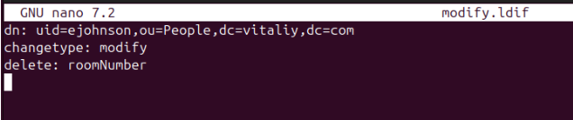

Després, executem la comanda ldapmodify per aplicar els canvis:

`ldapmodify -x -D "cn=admin,dc=pol,dc=cat" -W -f modify.ldif`

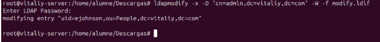

Finalment, fem un ldapsearch per comprovar que l’atribut roomNumber s’ha esborrat correctament:

`ldapsearch -xLLL -b "uid=ejohnson,ou=People,dc=pol,dc=cat"`

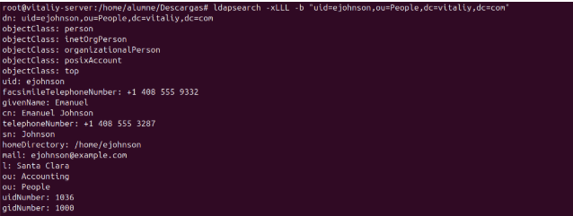

### Esborrar una entrada amb ldapdelete

Podem utilitzar la comanda ldapdelete per eliminar directament una entrada del domini. Per exemple, per esborrar una unitat organitzativa anomenada "prova":

`ldapdelete -x -D "cn=admin,dc=vitaliy,dc=com" -W "ou=prova,dc=pol,dc=cat"`

### Esborrar una entrada amb un fitxer .ldif i ldapmodify

També podem crear un fitxer .ldif amb les instruccions d'esborrat. Exemple del contingut del fitxer .ldif:

`dn: ou=prova,dc=pol,dc=cat` 
`changetype: delete`

Després, executem la comanda següent per aplicar l'esborrat:

`ldapmodify -x -D "cn=admin,dc=pol,dc=cat" -W -f dades.ldif`

## ldapmodify

**Modificar dades de l'usuari ejohnson**

Anem a modificar algunes dades de ejohnson, concretament el número de telèfon i el correu electrònic.

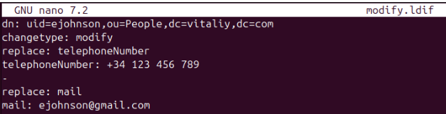

Executem la comanda del ldapmodify per aplicar els canvis i, posteriorment, fem un ldapsearch per verificar els canvis cercant únicament pel telèfon i el correu electrònic.

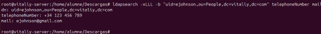

Canviar usuaris de grup amb ldapmodify
Anem a canviar 3 usuaris del seu grup principal i els anem a posar dins del grup de asix.

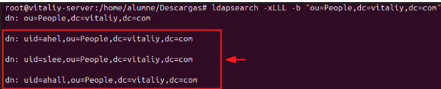

Crearem el fitxer de modificació i posteriorment l'executarem.

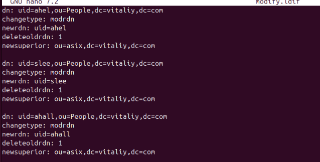

Executem la comanda per comprovar si realment s'han canviat d'OU:

`ldapsearch -xLLL -b "ou=asix,dc=pol,dc=cat"`

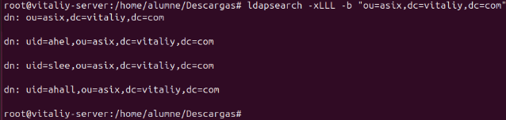

**Modificar diversos paràmetres**

També podem modificar diversos paràmetres d'un mateix usuari. En aquest cas, realitzarem múltiples accions sobre l'usuari vdomin. Això es pot fer mitjançant dos fitxers .ldif separats o executant dues vegades el fitxer modify.ldif amb informació diferent.

Les accions que realitzarem són les següents:

- Modificació: Canviarem el número de telèfon.

- Afegir: Afegeix un correu electrònic inventat i la ciutat de residència.

- Moure: Canviarem la UO de People a asix.

**Fitxer per editar les dades**

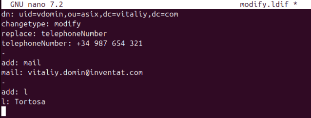

Resultat de moure l'usuari a la UO asix

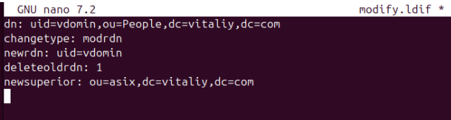

**Execució dels fitxers**

Executem els fitxers .ldif i comprovem que els canvis s'han aplicat correctament:

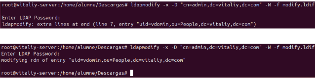

#### Verificació final

Per assegurar-nos que l'usuari s'ha mogut correctament a asix i que els atributs s'han modificat, fem servir la comanda següent:

`ldapsearch -xLLL -b "uid=vdomin,ou=asix,dc=pol,dc=cat"`

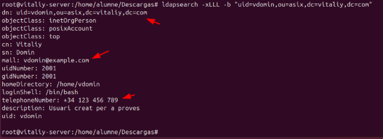
