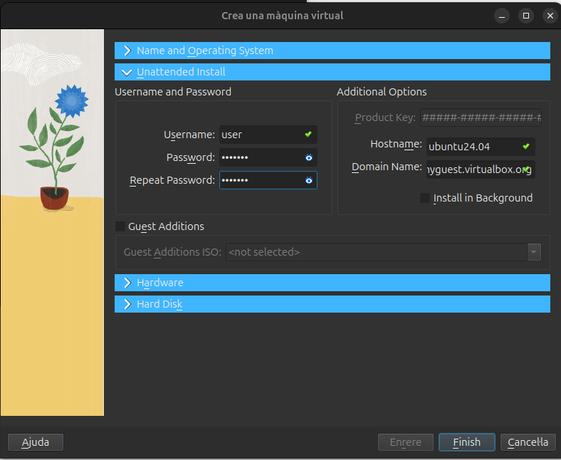
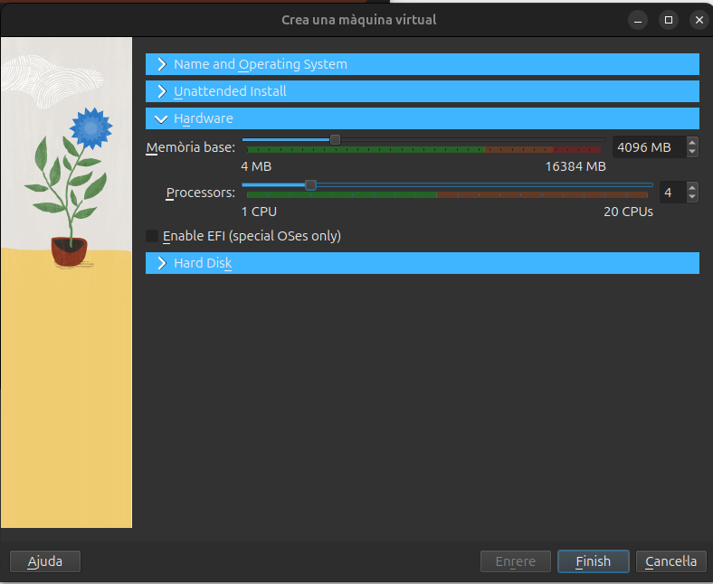
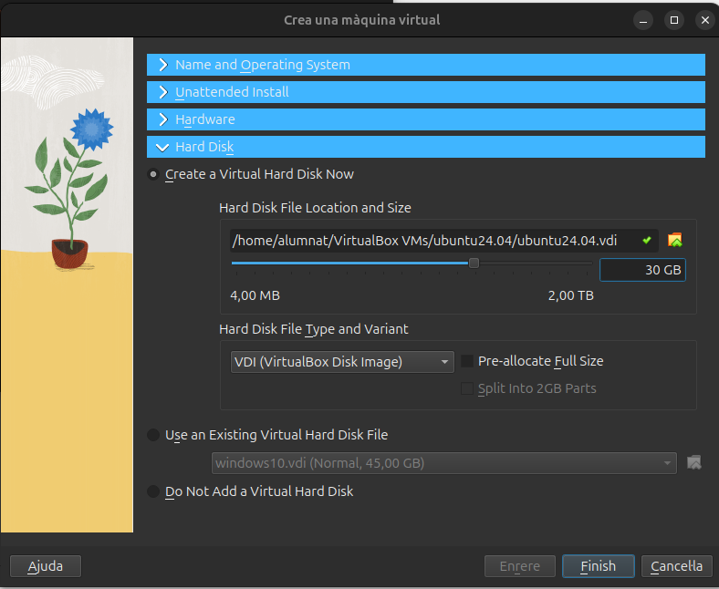

## Instal·lació del sistema operatiu.

Començarem per la instal·lació del sistema operatiu. En aquest cas crearem una màquina virtual amb una ISO de **ubuntu 24.04 LTS** al programa *Oracle VirtualBox*.

### Configuració

Havent obert el programa de VirtualBox clicarem sobre la icona de *Nova* i apareixerem a la finestra **Crear una màquina cirtual** . En aquest primer apartat anomenat *Name and Operating System* donarem un nom a la nostra màquina virtual, indicarem quina serà la seva carpeta arrel (deixarem l'assignada per defecte) i seleccionarem entre el buscador d'arxius la ISO del sistema operatiu que haurem descarregat previament.

Passant al següent apartat corresponent a *Unattended Install* proporcionarem al box de **Username and Password** l'usuari i la contrasenya que utilitzarem per accedir a la nostra màquina virtual quan aquesta s'executi. Al box **Additional Options** configurarem el *Hostname* i el *Domain Name* de manera que compleixi el que se'ns requereix si movem al cursor sobre la icona taronja que ens apareixerà a la dreta si el nom que es proporciona per defecte no és vàlid. Generalment, eliminant els espais que poden haver aparegut o caràcters especials que el camp no admeti serà suficient.

Avancem a la configuració de **Hardware**. Aquí assignarem els recursos de memòria RAM i nuclis del processador màxims que permetrem utilitzar a la nostra màquina virtual.

> **Nota:** Els valors que assignem en cap cas poden superior als valors màxims de la RAM o de nuclis del processador amb que treballem.
>
> Per a poder treballar mínimament còmodes amb una MV ubuntu assignem un mínim de 4GB de RAM i 4 nuclis.

Per acabar de muntar la nostra MV solament ens queda configurar el nostre **Hard Disk** . En aquest apartat, deixarem la carpeta de destí per defecte i per no tenir molts problemes amb una MV ubuntu assignem un mínim de 25GB.

> **Nota:** El valor que donem al espai del disc emprat per la màquina en cap cas podra superar a la capacitat màxima disponible del nostre disc físic.

 