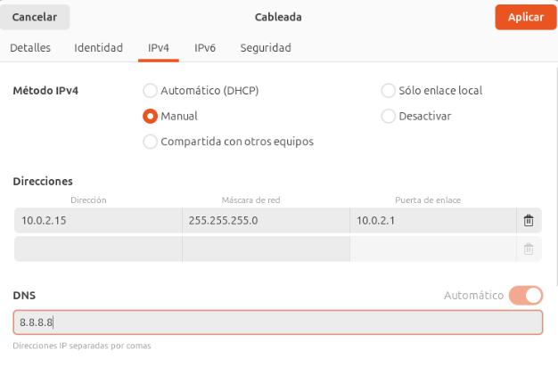

# Instal·lació DOMINI LDAP

## Què és un domini LDAP?
Un domini LDAP és una estructura jeràrquica utilitzada per emmagatzemar i organitzar informació d'usuaris, grups, dispositius i altres objectes dins d'una xarxa. LDAP (Lightweight Directory Access Protocol) permet accedir i gestionar aquesta informació de manera eficient.

> Un detall curiós: Active Directory es basa en LDAP. Així que podríem dir que LDAP és el "motor" que fa funcionar AD, mentre aquest s'encarrega de posar-hi la carrosseria pròpia de Windows.

### Avantatge respecte a Active Directory

- LDAP és més lleuger i estàndard, ideal per a diferents sistemes operatius.

- Active Directory està integrat a Windows i depèn del seu ecosistema, mentre que LDAP és més flexible i adaptable. A més, Active Directory requereix adquirir una llicència de Windows Server, llicències per als clients, i també pagar per cada ordinador connectat, sense oblidar el cost addicional de determinades eines o programari complementari.

### Per a què serveix un domini?

Serveix per centralitzar l'autenticació i l'administració d'usuaris, grups i recursos en una xarxa. Els objectes comuns inclouen:

- **Unitats Organitzatives (UO)**: Carpetes lògiques que organitzen altres objectes com usuaris o grups.

- **Usuaris i grups**: Per gestionar l'accés i permisos.

- **Dispositius**: Impressores, servidors, etc.

### Comandes i eines

**Slapcat**

Utilitzat per exportar dades del directori LDAP. Si no mostra el domini, cal verificar la configuració i el contingut inicial del directori. Pot ser necessari reinicialitzar o afegir dades correctes.

**Fitxers LDIF**

Els fitxers LDIF (LDAP Data Interchange Format) defineixen objectes per al directori.

- La primera línia d'un fitxer LDIF és la referència DN (Distinguished Name), que identifica de manera única l'objecte al directori.

## Creació d'un Domini amb LDAP

> **Nota**: Tot i que realitzarem aquest exemple en un Ubuntu Desktop, és recomanable utilitzar Ubuntu Server, ja que està millor optimitzat per a aquestes tasques.

1. Configurar una IP estàtica Assignarem una IP estàtica per evitar problemes futurs, ja que no ens interessa que la IP d'un servidor canviï. Si ho fa, podria ocasionar problemes greus en la xarxa. Aquesta configuració es pot realitzar editant el fitxer corresponent:

- Fitxer: `/etc/netplan`

- Alternativa: Configurar directament al router assignant una IP estàtica al servidor.

> **NOTA**: Si configures el netplan posteriorment has de fer netplan apply per aplicar la configuració.

2. Canviar el nom de la màquina (hostname)

És essencial definir un nom adequat per al servidor. Això es fa editant el fitxer:

`sudo nano /etc/hostname`

3. Assignar el nom i la IP al fitxer /etc/hosts
Perquè el sistema reconegui el nom del servidor i domini, hem de configurar el fitxer /etc/hosts. Afegirem una línia amb la IP estàtica del servidor, el seu nom i el domini:

`sudo nano /etc/hosts`

**Exemple:**

`10.0.2.4 polserver.pol.cat polserver`

Això assegura que la màquina pugui identificar-se correctament dins de la xarxa.

### Instal·lació de les eines necessàries

Amb la configuració prèvia completada, passem a instal·lar els paquets necessaris per treballar amb LDAP: slapd i ldap-utils.

- **slapd**: És el servidor LDAP, que ens permetrà gestionar i emmagatzemar la informació del directori.

- **ldap-utils**: És un conjunt d'eines per interactuar amb el servidor LDAP, com ara afegir, modificar o consultar dades.

**Instal·lació:**

`sudo apt install slapd ldap-utils`

#### Comprovació inicial amb slapcat

Després d’executar la comanda slapcat, veiem que el directori no està completament buit. En aquest cas, conté una configuració mínima inicial, amb el domini dc=nodomain. Això indica que el servidor LDAP està funcionant però encara no s’ha configurat correctament per incloure un domini personalitzat o altres dades específiques.

Aquest pas és essencial abans de començar a afegir la configuració adequada i els objectes al directori LDAP.

### Configuració amb dpkg-reconfigure slapd

Per configurar el servidor LDAP correctament, executem la comanda dpkg-reconfigure slapd. Aquesta obre una finestra interactiva amb una sèrie de passos a seguir:

1. Ometre la configuració?

Ens pregunta si volem "omitir la configuració". Seleccionem NO per procedir amb la configuració.

2. Introduir el nom del domini

Ens sol·licita el nom del domini. Introduïm el nom que hem configurat prèviament al fitxer /etc/hosts.

3. Nom de l’organització

Especifica el nom de l’organització. Aquest serà visible al directori LDAP.

4. Contrasenya d’administrador

Introduïm la contrasenya per al compte administrador del servidor LDAP. És molt important guardar aquesta contrasenya, ja que serà necessària per gestionar el directori LDAP.

5. Esborrar la base de dades durant el purge

Ens pregunta si volem eliminar la base de dades quan esborrem el paquet slapd. Seleccionem SI.

6. Moure la base de dades antiga

Si es detecta una base de dades antiga, ens pregunta si volem moure-la. Seleccionem SI per continuar amb una instal·lació neta.

7. Configuració completada

Un cop finalitzats els passos, el servidor LDAP estarà configurat correctament.

#### Verificació final

Un cop completada la configuració, podem utilitzar la comanda slapcat per comprovar que el domini i les dades que hem configurat ja apareixen correctament al directori LDAP.

Si tot ha anat bé, ara hauríem de veure les nostres dades reflectides.

#### Creació de fitxers LDIF

Els fitxers amb extensió .ldif (LDAP Data Interchange Format) són utilitzats per definir i importar dades al servidor LDAP. Aquests fitxers permeten configurar objectes com unitats organitzatives, usuaris, grups i altres estructures.

En aquest exemple, hem creat un fitxer uo.ldif per afegir una Unitat Organitzativa (OU) anomenada users. Els elements definits inclouen:

- **dn** (Distinguished Name): Identifica de manera única l'objecte al directori LDAP.

- **objectClass**: Defineix el tipus d'objecte (en aquest cas, una unitat organitzativa).

- **ou**: Nom de la unitat organitzativa (users).

Aquest fitxer serà utilitzat per carregar la configuració al servidor LDAP mitjançant comandes com ldapadd.

#### Creació del fitxer grup.ldif

El fitxer `grup.ldif` defineix un grup dins del nostre servidor LDAP. Aquest grup serà associat a una Unitat Organitzativa (OU) ja existent (en aquest cas, users). Aquí detallem els paràmetres utilitzats:

- **dn** (Distinguished Name): Identifica de manera única el grup (cn=alumnes,ou=users,dc=pol,dc=cat).

- **objectClass**: Defineix el tipus d'objecte (en aquest cas, posixGroup, per a grups POSIX).

- **cn**: Nom del grup (alumnes).

- **gidNumber**: Identificador únic del grup (1001).

- **memberUid**: Usuaris membres del grup (en aquest cas, alu1).

Aquest fitxer es pot importar al servidor LDAP per crear i gestionar grups d’usuaris, facilitant l’organització i la configuració d’accés.

#### Creació del fitxer usu.ldif

El fitxer `usu.ldif` defineix un usuari dins del nostre servidor LDAP. Aquest fitxer bàsic conté els paràmetres essencials per crear un compte d’usuari, però es pot ampliar amb més informació com correu electrònic, número de telèfon, etc.

**Paràmetres utilitzats:**

- **dn** (Distinguished Name): Identifica de manera única l’usuari (uid=alu1,ou=users,dc=vitaliy,dc=com).

- **objectClass**: Defineix les classes que caracteritzen l’usuari, com:

- **inetOrgPerson** i **organizationalPerson** per a informació personal i organitzativa.

- **posixAccount** i **shadowAccount** per compatibilitat amb sistemes POSIX i gestió de contrasenyes.

- **userPassword**: La contrasenya de l’usuari (alu1). És recomanable que estigui en format encriptat.

- **cn**: Nom comú de l’usuari (Primer).

- **sn**: Cognom de l’usuari (Alumne1).

- **gidNumber**: Grup al qual pertany l’usuari (1001).

- **uidNumber**: Identificador únic de l’usuari (1001).

- **homeDirectory**: Directori personal de l’usuari (/home/alu1).

- **loginShell**: Shell predeterminada de l’usuari (/bin/bash).

- **shadowExpire, shadowLastChange, shadowMax, shadowMin, shadowWarning**: Paràmetres relacionats amb la caducitat i avisos de contrasenyes.

Aquest fitxer es pot utilitzar per crear l’usuari dins de l’organització definida al directori LDAP. És possible afegir més atributs segons les necessitats, com ara correu electrònic, telèfon o ubicació.

#### Pujar els fitxers al servidor LDAP

Un cop creats els fitxers .ldif, hem de carregar-los al servidor LDAP perquè els objectes (unitats organitzatives, grups i usuaris) es creïn dins del directori.

Això es fa mitjançant la comanda ldapadd, que permet afegir dades al servidor LDAP. La sintaxi és la següent:

**Comanda:**

`ldapadd -c -x -D "cn=admin,dc=pol,dc=cat" -W -f <nom_fitxer>`

**Explicació dels paràmetres:**

- **-c**: Continua amb els altres fitxers encara que hi hagi errors en algun.

- **-x**: Utilitza autenticació simple.

- **-D**: Especifica el Distinguished Name de l'usuari administrador (cn=admin,dc=vitaliy,dc=com).

- **-W**: Demana la contrasenya de l'administrador abans d'executar la comanda.

- **-f**: Indica el nom del fitxer .ldif que es vol carregar.

**Exemple** Per pujar el fitxer `uo.ldif`, executem:

`ldapadd -c -x -D "cn=admin,dc=pol,dc=cat" -W -f uo.ldif`

Repetim aquesta comanda per als altres fitxers (grup.ldif, usu.ldif) per afegir-los al servidor LDAP.

Un cop carregats, els objectes definits als fitxers estaran disponibles al servidor LDAP i comprovem amb slapcat.

