# Configuració LDAP GUI

## Entorns Gràfics per a LDAP

En aquest document, explicarem com utilitzar diferents entorns gràfics per a LDAP, amb especial atenció a **Apache Directory Studio**.

---

Els entorns gràfics faciliten la gestió dels servidors LDAP, permetent la creació, modificació i administració d'usuaris, grups i altres objectes de manera visual. Algunes eines recomanades són:

1. [Apache Directory Studio](https://directory.apache.org/studio/) \- Eina completa amb interfície intuïtiva.  

2. [JXplorer](https://jxplorer.org/) \- Navegador i editor LDAP de codi obert.  

3. [phpLDAPadmin](http://phpldapadmin.sourceforge.net/) \- Aplicació web per gestionar LDAP des del navegador.  

4. [LDAP Account Manager](https://www.ldap-account-manager.org/lamcms/) \- Eina avançada per administrar usuaris i grups amb múltiples funcionalitats.

---

## Apache Directory Studio

En aquest tutorial farem ús d'Apache Directory Studio, una de les eines més populars per gestionar directoris LDAP. Aquesta aplicació permet administrar diversos servidors LDAP i ofereix funcionalitats com:

* Edició d'esquemes.  

* Cerca avançada d'entrades.  

* Configuració de la seguretat.

És especialment útil per a usuaris que necessiten una gestió flexible i professional dels seus directoris LDAP.

### Inici i Configuració

#### **1\. Descarregar i preparar l'eina**

* **Descarrega** Apache Directory Studio des de la [pàgina oficial](https://directory.apache.org/studio/):

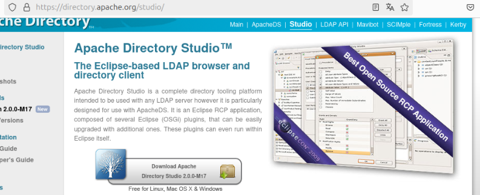

* **Descomprimeix** el fitxer descarregat i obre el directori resultant:

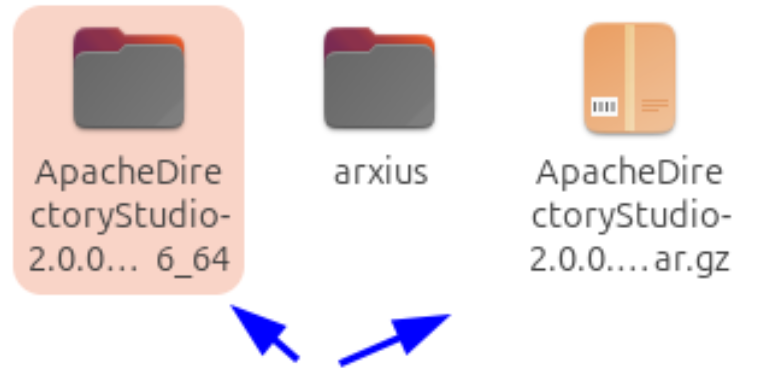

* **Executa** l'arxiu executable per iniciar l'eina:

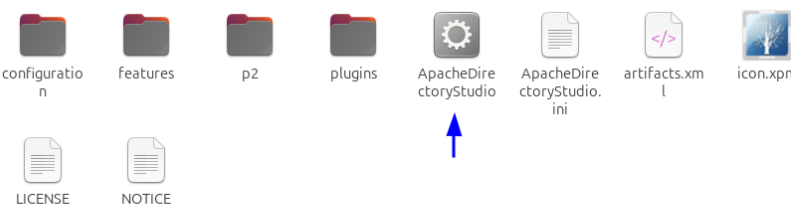

**Important:** Per evitar errors en iniciar Apache Directory Studio, assegura't de tenir instal·lat el Java Development Kit (JDK). Si no tens Java instal·lat, executa la comanda:

`sudo apt install default-jdk`

Aquesta comanda instal·la la versió per defecte del JDK en distribucions basades en Debian i Ubuntu, indispensable per a l'execució correcta de l'eina.

#### **2\. Crear una nova connexió LDAP**

* Fes clic a **LDAP** i selecciona **New Connection**:

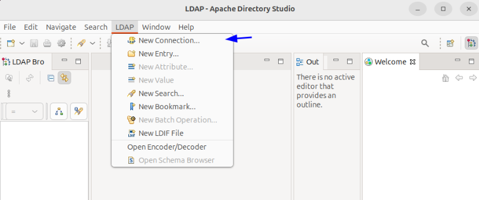

* Introdueix les dades de connexió:

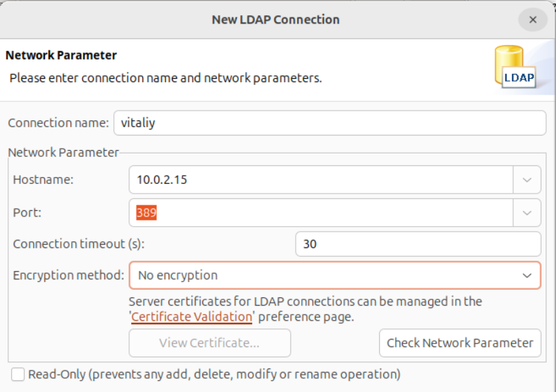

* Afegeix els detalls del **cd**, **dc** i la contrasenya de l'administrador:

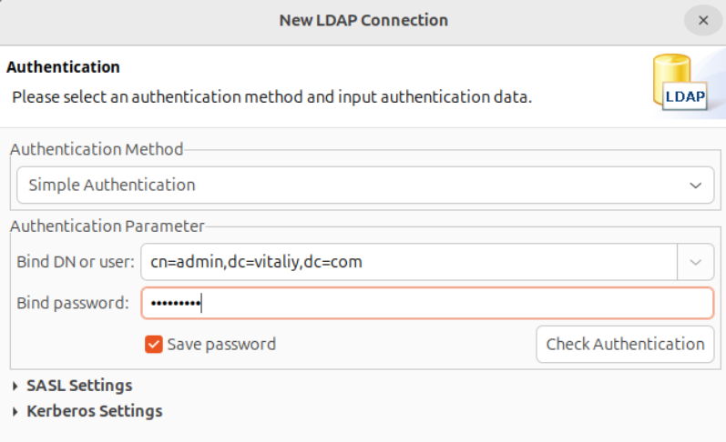

* Un cop establerta la connexió, podràs visualitzar l'estructura LDAP amb la OU (*Organizational Unit*), el CN (*Common Name*) i els UID:

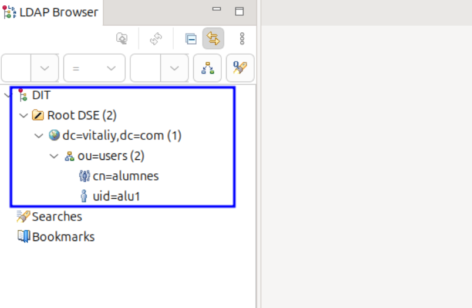

---

## Afegir Registres Manualment

Per afegir un nou registre manualment, segueix aquests passos:

### 1\. Crear una nova entrada

* Fes clic dret sobre la OU on vols afegir el registre i selecciona **New Entry**:

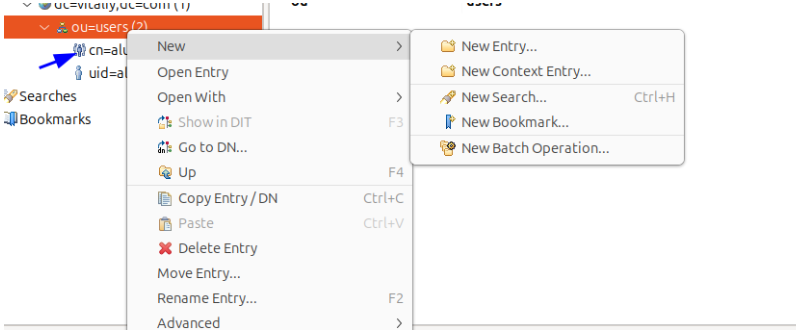

* Escull l'opció per crear una entrada des de zero:

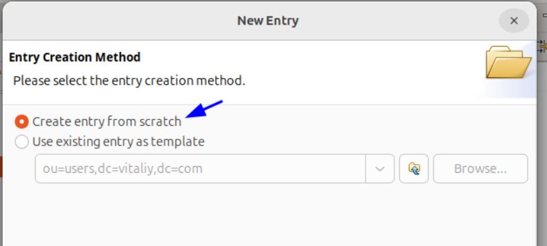

### 2\. Configurar el registre

* **Defineix l'objectClass:**  

En aquest exemple, crearem un grup seleccionant **posixGroup**:

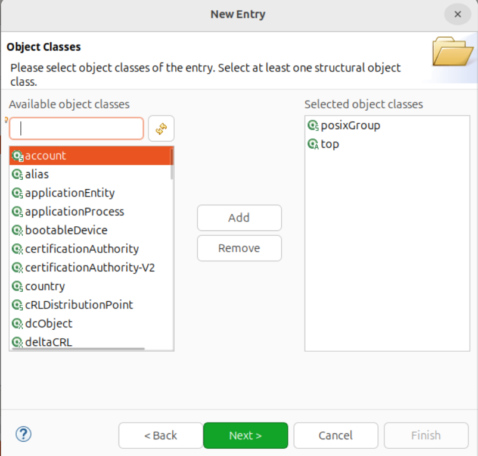

* **Estableix el RDN:**  

Introdueix el RDN necessari. En aquest cas, utilitzarem el **cn** amb el nom "Public" (pots usar el nom que prefereixis):

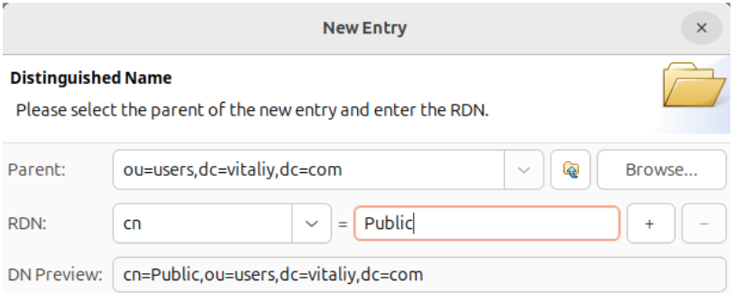

* **Assigna un gidNumber:**  

Com que es tracta d'un grup, se't demanarà que introdueixis un **gidNumber**. Per exemple, pots posar el valor 5000:

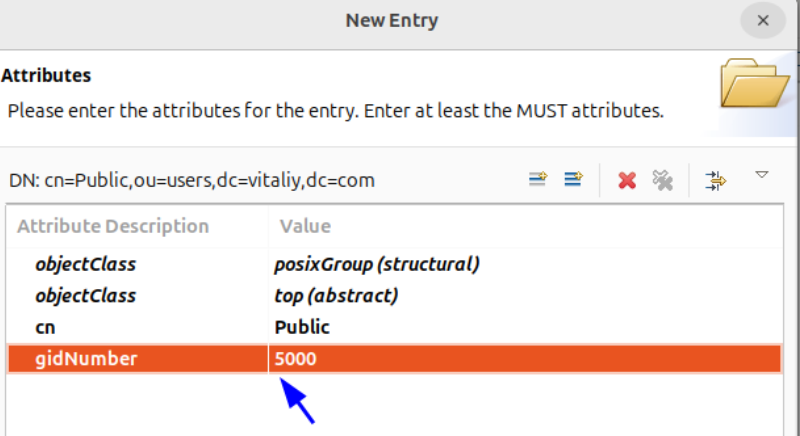

### 3\. Verificar la creació

Un cop completats aquests passos, el registre s'ha creat correctament. Verifica-ho navegant per l'estructura del directori:

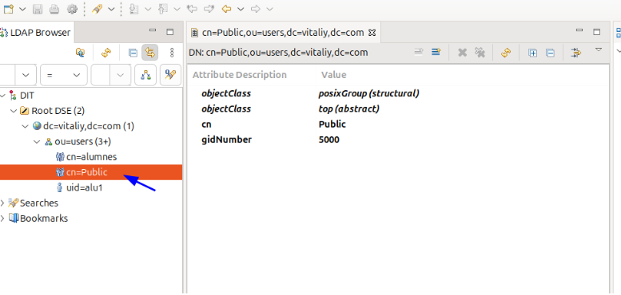

---

## Creació amb Plantilles

En aquesta secció, afegirem un registre utilitzant una plantilla existent, seleccionant la plantilla d’un usuari que ja tenim creat.

* **Seleccionar la plantilla d'usuari:**

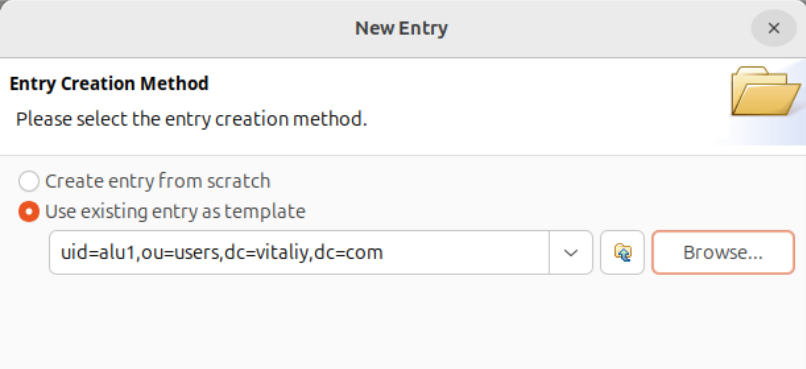

* En aquest cas, no cal modificar res, ja que volem crear un usuari i la configuració per defecte ens serveix:

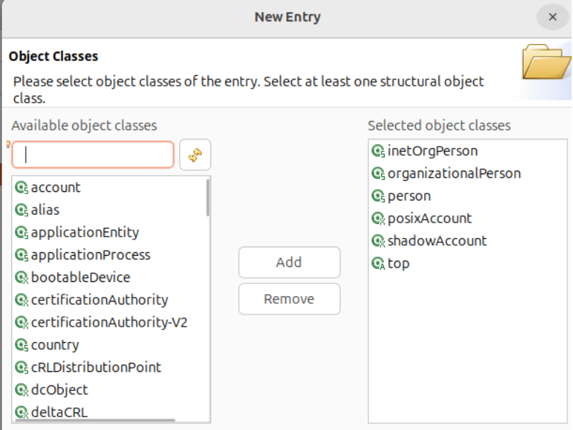

* **Modificar el `cn`:**  

Canvia el `cn` del registre per assignar-li un nou nom.

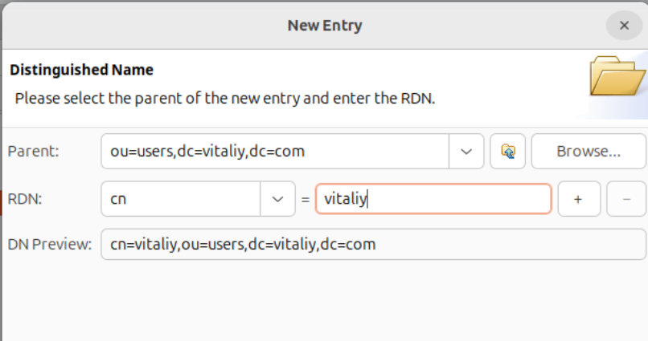

* En fer clic a **Next**, se't demanarà que introdueixis un `UID` posarem el nostre nom:

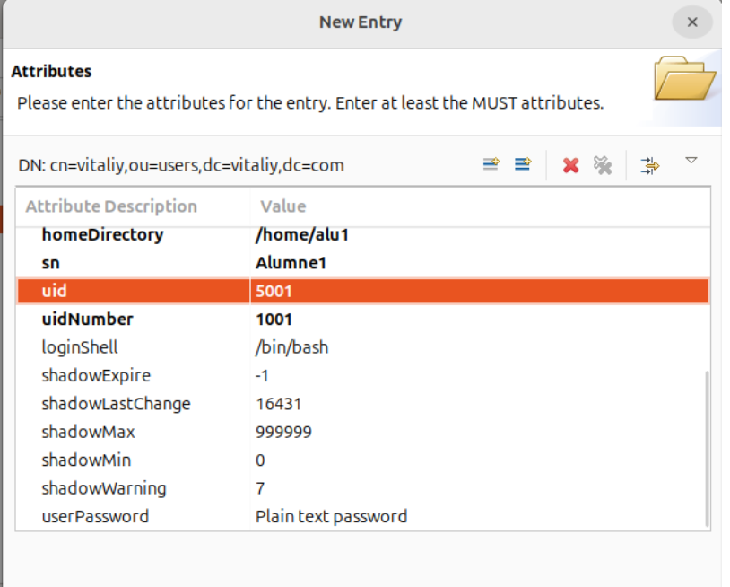

**Important:** No oblidis canviar també la ruta `/home/` per al nou usuari, el uidNumber, gidNumber i el uid que és el nom de l'usuari de sessió.

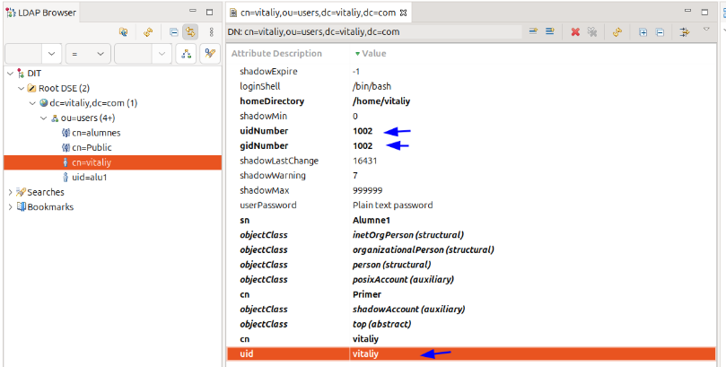

---

## Comprovació

Amb un client integrat al domini LDAP, inicia sessió. En fer-ho, es crea automàticament el directori `/home/pol`. Per verificar-ho, executa la comanda `whoami` per confirmar el nom d'usuari i `id` per visualitzar la informació d'identificació.

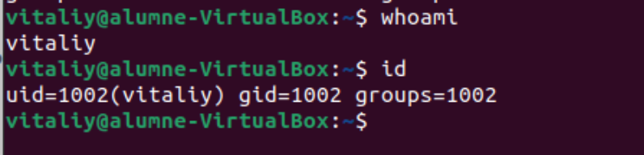

---

## Solució de Problemes

Aquí tens algunes solucions als problemes més comuns:

**Error de Java o JDK:**  

* Si al iniciar Apache Directory Studio apareixen errors relacionats amb Java, assegura't d'haver instal·lat correctament el JDK amb:

`sudo apt install default-jdk`

**Connexió fallida al servidor LDAP:**  

* Verifica que la informació de connexió (cd, dc i credencials) sigui correcta.  

* Assegura't que el servidor LDAP estigui en funcionament i accessible des de la teva xarxa.  

**Problemes en la creació de registres:**  

* Comprova que els atributs obligatoris (com `objectClass`, `cn`, `gidNumber` o `UID`) s'hagin introduït correctament.  

* Revisa la configuració de les plantilles per assegurar-te que no hi hagi errors de format o informació duplicada.