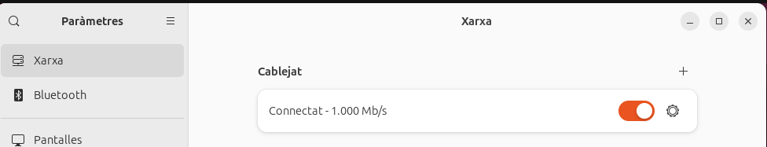
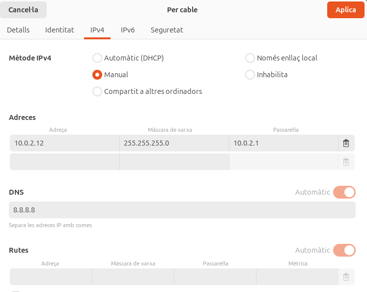
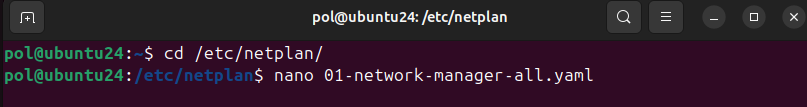
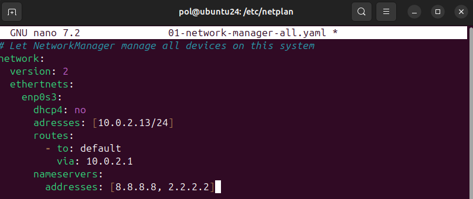
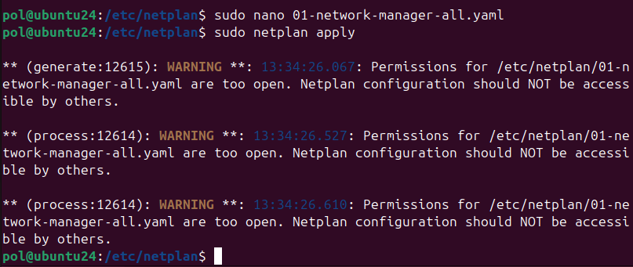

## Configuració bàsica de xarxa

La configuració bàsica de la xarxa a Ubuntu implica establir paràmetres essencials com l'adreça IP, la passarel·la predeterminada, el servidor DNS i la configuració de la màscara de subxarxa. En aquest cas nosaltres configurarem manualment la IP del nostre dispositiu per fer-la estàtica.

Dins a paràmetres accedim a **Xarxa** i farem clic sobre l'engranatfe de la connexió del cablejat per accedir a la configuració.

Dins de la configuració de la xarxa anem a l'apartat de **IPv4** i posem el mètode **manual** per poder configurar una *IP estàtica* amb les següents dades.  

Un cop fet desem la configuració i pasem al terminal on executarem la següent comanda.

Executem la comanda **posant davant 'sudo' per executar-la com a superusuari** perquè ens permeti modificar el **.yaml** i introduirem les següents dades.

Un cop configurat el *.yaml* premem **Ctrl+O** per desar i **Ctrl+X** per sortir de l'editor. Executem la última comanda per aplicar els canvis realitzats als paràmetres de la xarxa.

