## Particions

Quan executem la màquina virtual per primera vegada apareixerem a la configuració inicial d'Ubuntu. Durant aquest procediment podrem configurar les particions.

### Configuració inicial pas a pas

Comencem per seleccionar l'idioma amb que treballarà el nostre *SO*. En aquest cas nosaltres seleccionem **català**.

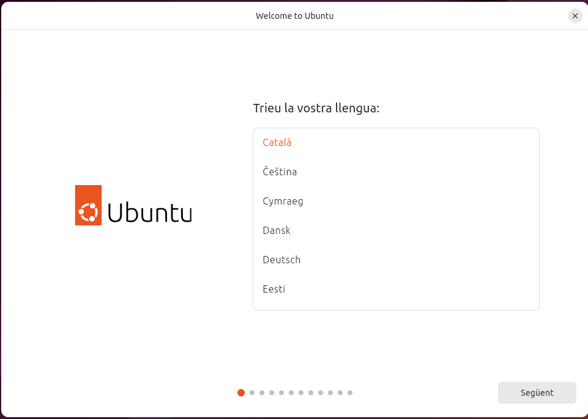

Deixarem la distribució del teclat en **espanyol** i amb la variant **Espanyol - Català** que apareix predefinida al seleccionar el llenguatge català.

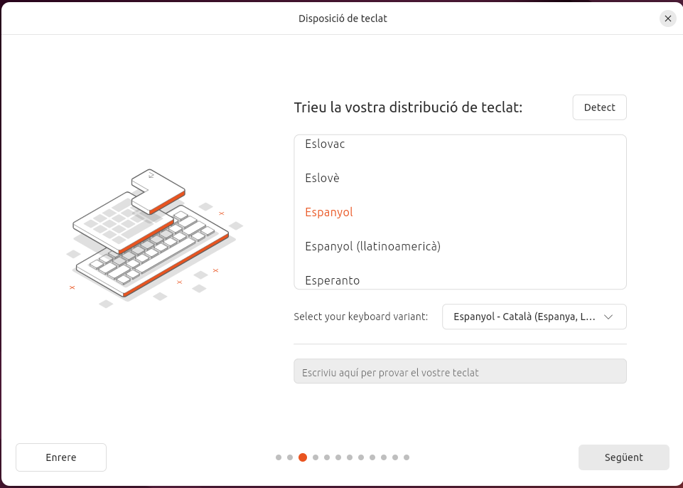

Deixarem la connexió a internet establerta segons el nostre cas.

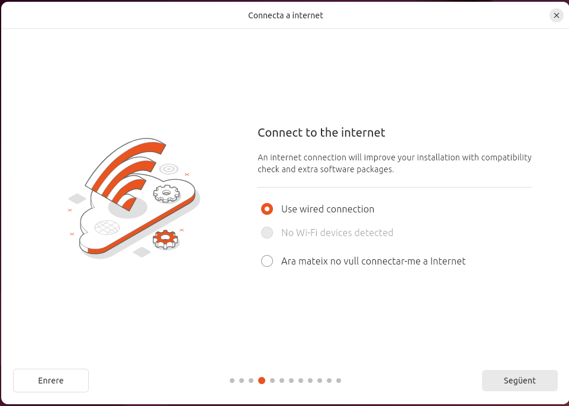

Sel·leccionarem que volem **instal·lar el sistema Ubuntu**.

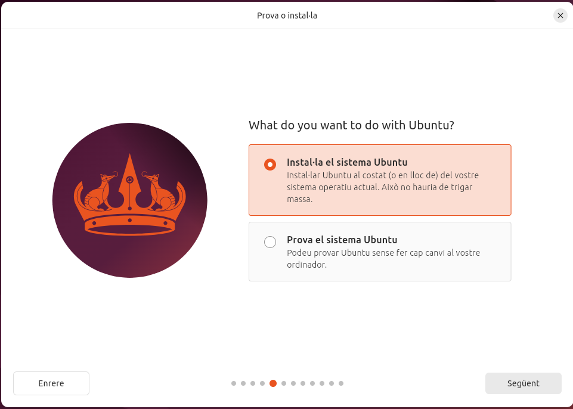

Deixarem seleccionada la **instal·lació interactiva**.

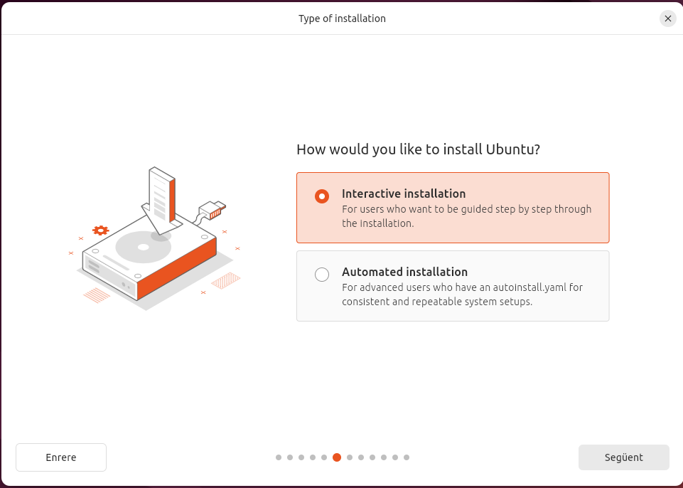

Per aquesta màquina demanarem que ens instal·li la **sel·leció per defecte** de programari.

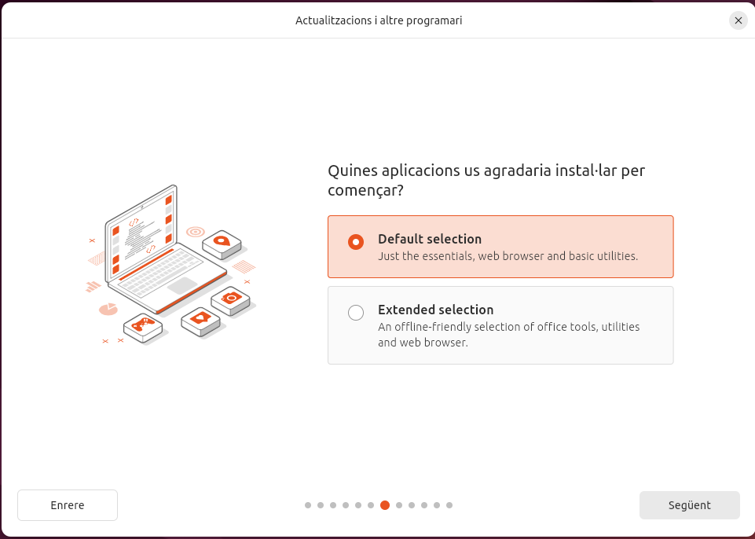

Per optimitzar el la nostra màquina **seleccionarem les dos opcions** a la part de *Install recommended propietary software?*.

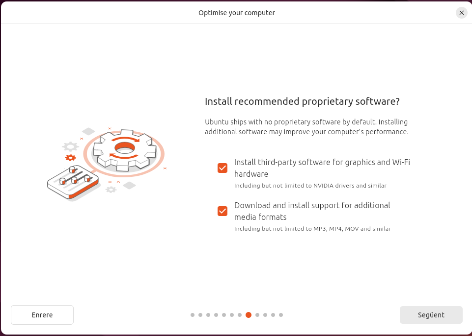

### Configuració de les particions

Per a començar en essència amb la part de configurar les particions, al tipus d'instal·lació seleccionarem aquest cop  **'alguna altra cosa'**.

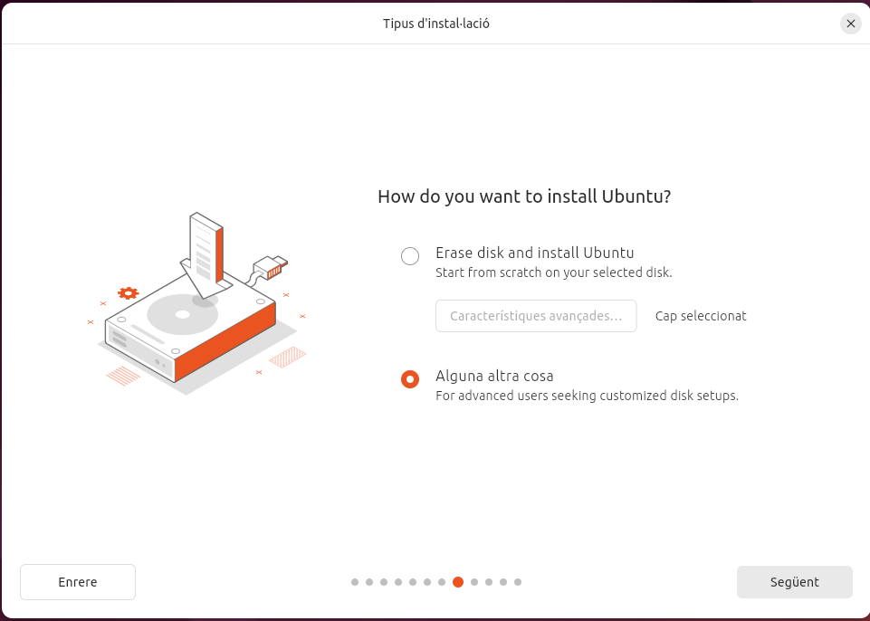

Clicarem sobre l'icona blanca del disc dur i ens dirigirem baix a l'esquerra i clicarem sobre l'icona de **+** per afegir una nova partició. En aquest cas, la nostra màquina disposa de 26.84 GB. així que farem les següents particions, clicant sobre *Espai lliure* i l'icona **+** cada cop que acabem de crear-ne una de nova.
 
> **Primera**:	Espai: 1.00 GB	Tipus: Swap	Punt de muntatge: '-'
>
> **Segona**:	Espai: 17.50 GB	Tipus: Ext4	Punt de muntatge: /home 
>
> **Tercera**:	Espai: 6.70 GB	Tipus: Ext4	Punt de muntatge: /
>
> **Quarta**:	Espai: 1.64 GB	Tipus: '-'	Punt de muntatge: '-'

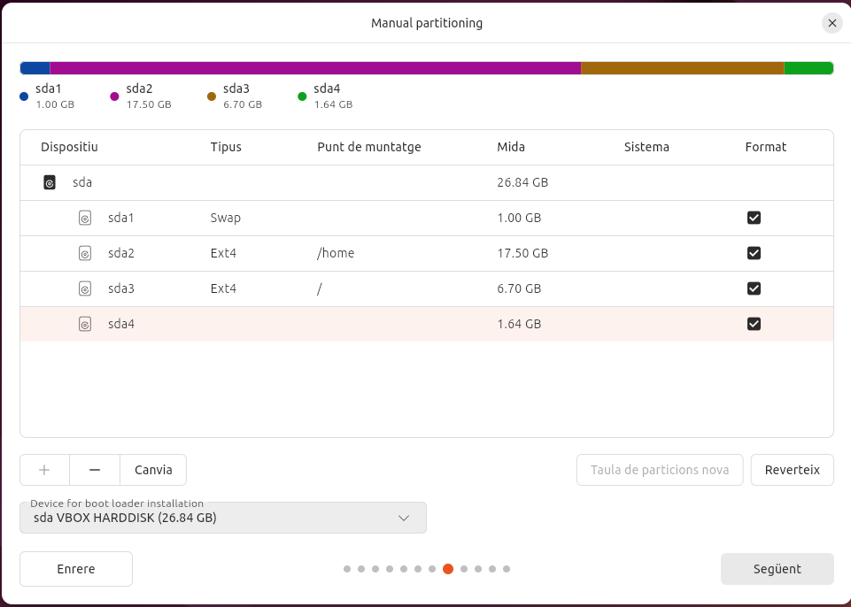

Registrarem el nostre usuari i nom de l'ordinador. En aquest moment crearem també una contrasenya per a l'usuari i deixarem activa la selecció **fes que calgui una contrasenya per entrar**.

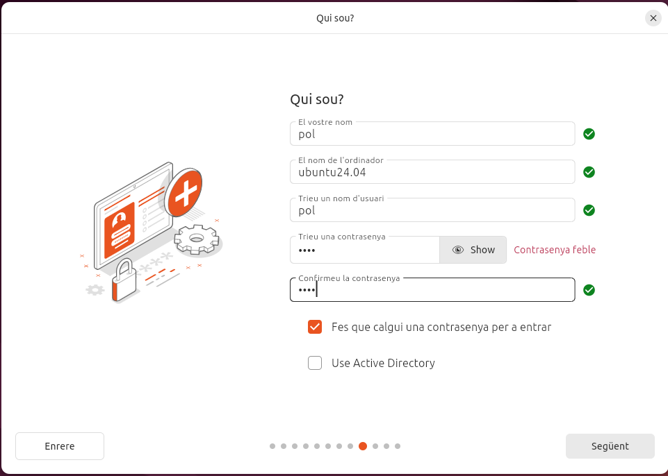

Seleccionarem al mapa la nostra franja horaria.

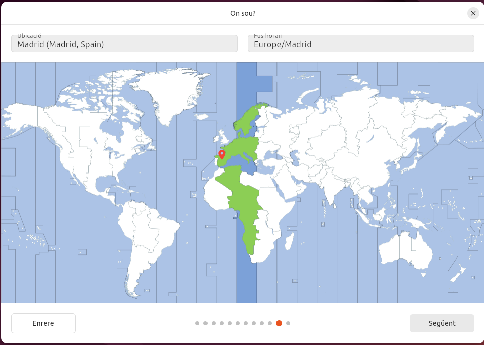

Després de confirmar les nostres configuracions a la taula que se'ns proporcionarà finalitzarem fent clic sobre **comença a instal·lar**.

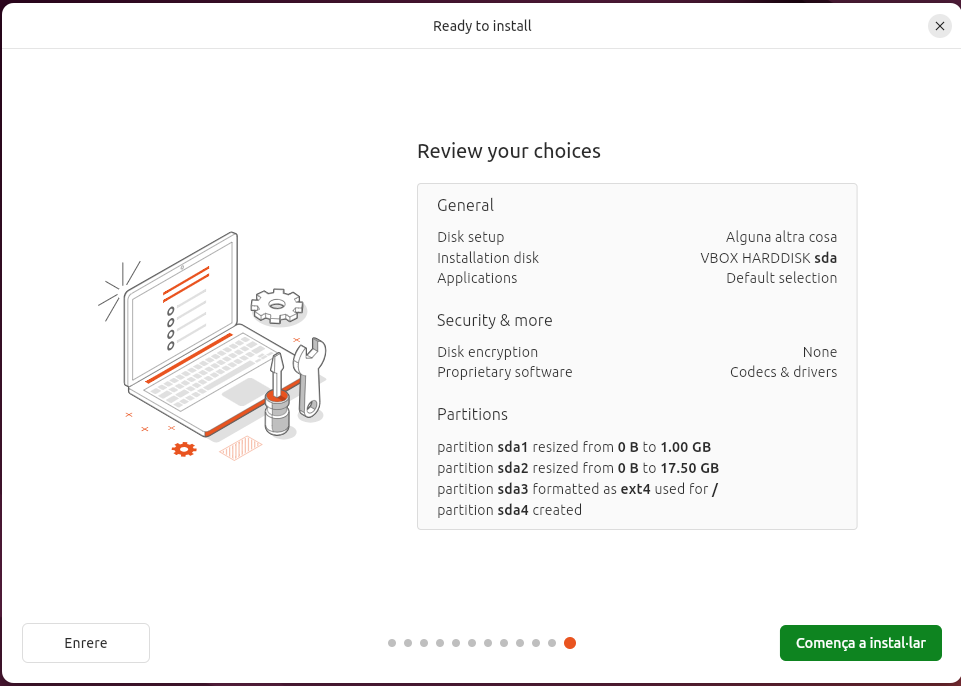
