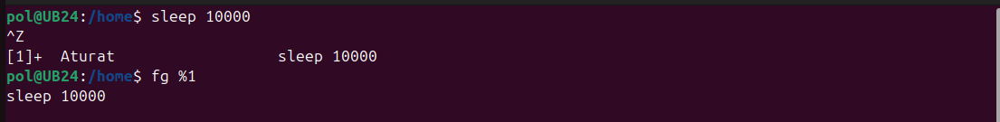

# Gestió de processos

## <b>Què és un procés?</b>

Un procés és un programa en execució que inclou:

- El codi del programa.

- Els recursos assignats (memòria, fitxers oberts, etc.).

- La seva execució en un o més fils (threads).

Els processos en Linux poden ser:

- **Processos en primer pla (foreground)**: S'executen interactuant amb l'usuari a la terminal.

- **Processos en segon pla (background)**: Funcionen sense interferir directament amb l'usuari.


### Comanda <code>top</code>

La comanda <code>top</code> mostra en temps real una llista dels processos actius del sistema.


Proporciona informació com:

- **PID**: Identificador únic del procés.

- **USER**: Usuari que ha iniciat el procés.

- **%CPU**: Percentatge d'ús del processador.

- **%MEM**: Percentatge d'ús de la memòria RAM.

- **COMMAND**: Nom de la comanda o programa.

#### Eines útils

- **q**: Sortir de la vista de <code>top</code>

- **k**: Permet matar un procés especificant el seu PID.


### Comanda <code>htop</code>

<code>htop</code> és una eina interactiva per monitoritzar processos i recursos del sistema en temps real. Ofereix una interfície gràfica basada en text que resulta més intuïtiva i fàcil d'usar en comparació amb <code>top</code>. Tot i que no està instal·lada per defecte en la majoria de sistemes Linux, es pot instal·lar fàcilment.

##### Característiques principals de <code>htop</code>

1. Interfície intuïtiva:

    - Mostra els processos en un format visual clar i organitzat.

    - Utilitza colors per indicar l'ús de recursos com CPU, memòria i swap.

2. Controls interactius:

    - Permet navegar per la llista de processos amb les tecles de fletxa.

    - Pots matar, pausar o reprendre processos amb tecles directes sense necessitat de recordar els PID.

3. Visualització dels recursos del sistema:

    - Representa gràficament l'ús de la CPU, memòria RAM i swap.

    - Mostra informació clara sobre els cores individuals de la CPU.

4. Filtratge i ordenació fàcil:

    - Pots ordenar els processos per ús de CPU, memòria, temps d'execució o altres criteris amb tecles simples.

    - Permet buscar processos pel seu nom.

##### Diferències i millores respecte a <code>top</code>

| Característica              | `htop`                                    | `top`                                   |
|-----------------------------|-------------------------------------------|-----------------------------------------|
| **Interfície gràfica**          | Colorida, clara i interactiva.            | Simple i basada en text.               |
| **Navegació**                   | Tecles de fletxa per moure't per la llista. | No permet navegació interactiva.       |
| **Gestió de processos**         | Es poden matar, pausar o reprendre directament. | Cal introduir el PID manualment.      |
| **Visualització dels recursos** | Gràfics de CPU, memòria i swap per nucli.  | Informació textual menys visual.       |
| **Ordenació i filtres**         | Opcions d'ordenació intuïtives i cerca fàcil. | Ordenació manual i menys accessible.  |
| **Configuració**                | Altament configurable des del menú.        | Configuració limitada.                 |

##### Per què <code>htop</code> és millor per a molts usuaris

- **Facilitat d'ús**: L'interfície intuïtiva fa que sigui més còmode treballar amb processos, especialment per a usuaris menys experimentats.

- **Eficiència visual**: Els gràfics i els colors ajuden a interpretar ràpidament l'ús de recursos.

- **Gestió interactiva**: Navegar i gestionar processos és molt més ràpid i senzill.

Si tens preferència per eines intuïtives, <code>htop</code> és una excel·lent alternativa a <code>top</code>.

```sudo apt install htop```


### Comanda <code>pstree</code>

<code>pstree</code> mostra els processos en forma d'arbre jeràrquic, visualtizant com els processos estan relacionats (pare-fill).


#### Eines importants

- **-p**: Mostra els PIDs dels processos.

- **-u**: Mostra els noms dels usuaris que han iniciat els processos.

- **-a**: Mostra arguments complets de les comandes associades als processos.

- **-h**: Ressalta el procés actual dins de l'arbre de processos.

- **-l**: Evita truncar línies llargues, mostrant tot l'arbre sense talls.


### Comanda <code>ps aux</code>

La comanda <code>ps aux</code> mostra informació sobre tots els processos actius del sistema, incloent-hi aquells que no estan associats amb un terminal.


#### Sortida de <code>ps aux</code>

La sortida de <code>ps aux</code> mostra informació clau sobre els processos en execució.

- **USER**: Usuari que ha iniciat el procés.

- **PID**: Identificador únic del procés.

- **%CPU** i **%MEM**: Percentatge de CPU i memòria RAM utilitzats pel procés.

- **VSZ**: Memòria virtual total utilitzada pel procés.

- **RSS**: Memòria física resident utilitzada pel procés.

- **TTY**: Terminal associat al procés (mostra ? si no n'hi ha cap).

- **STAT**: Estat del procés:

| Símbol | Significat                                      |
|--------|------------------------------------------------|
| R      | Executant-se (Running).                        |
| S      | Inactiu (esperant dades).                      |
| T      | Pausat (Stopped).                              |
| Z      | Procés zombi (Zombie).                         |
| I      | Inactiu (Idle), sense consumir recursos.       |
| <      | Alta prioritat de CPU (High-priority).         |
| s      | Líder de sessió (session leader).              |
| l      | Multithread (utilitza diversos fils).          |
| +      | Associat al terminal en primer pla.            |

Aquesta taula ajudarà a monitoritzar i gestionar els processos del sistema.


### Senyals de processos en Linux

Els senyals són eines que permeten interactuar amb processos en Linux per gestionar-los de diverses maneres, com tancar-los, pausar-los o reprendre'ls. A continuació, es presenta un resum dels senyals més utilitzats i els seus números associats.

#### Taula de senyals i accions

| Senyal   | Número | Acció                                           |
|----------|--------|------------------------------------------------|
| SIGTERM  | 15     | Sol·licita que el procés s'acabi de manera ordenada. |
| SIGKILL  | 9      | Força la terminació immediata del procés.       |
| SIGSTOP  | 19     | Pausa el procés sense matar-lo.                |
| SIGCONT  | 18     | Reprèn un procés pausat.                       |


> **NOTA** Els números associats als senyals són estàndards en sistemes Linux, però poden variar lleugerament segons l'arquitectura o sistema operatiu.


### Fer 'STOP' d'un procés

En aquest exemple, fem que el procés de *Firefox* entri en un estat "dormint" (pausat), on deixarà d'executar-se temporalment i no respondrà.

##### Identificar el procés

Primerament, hem d'identificar el PID (Process ID) del procés de Firefox utilitzant la comanda següent:

```pgrep *nomProcés*```


Ara procedirem a "dormir" el procés amb el senyal **STOP**. Per fer això, són necessaris els permisos d'administrador.

```sudo kill -SIGSTOP *PID*```


El procés ha entrat en estat *STOPPED*. Firefox no contestarà ara.

Per tornar a aixecar el procés que hem pausar, utilitzem la següent comanda.

```sudo kill -SIGCONT *PID*```


**Tl**: Indica que el procés està pausat.

**Sl**: Després del <code>kill -SIGCONT</code>, el procés es reprén.


### Gestió de processos amb <code>kill</code>

El comandament <code>kill</code> permet enviar senyals als processos per realitzar accions com finalitzar-los de manera ordenada, forçar la seva terminació o gestionar el seu estat (pausar-los o reprendre'ls).

##### <code>pkill</code> (Finalitzar pel nom)

Permet acabar processos especificant el nom del procés en lloc del PID. És útil quan no es coneix el PID exacte.

##### <code>killall</code> (Finalitzar tots els processos amb un nom)

Tanca tots els processos que comparteixen un mateix nom, facilitant la gestió de processos múltiples.

##### <code>SIGKILL</code> (Forçar finalització)

Enviar la senyal **SIGKILL** acaba immediatament un procés. Aquesta acció no permet al procés netejar recursos abans de finalitzar. És útil per a processos que no responen o estan bloquejats.

> Sempre és recomanable començar amb <code>SIGTERM (15)</code> per permetre un tancament ordenat, i només utilitzar <code>SIGKILL (9)</code> si el procés no respon.

Les senyals com <code>pkill</code> o <code>killall</code> són molt útils si no coneixes el PID del procés o si tens moltes pestanyes obertes.


### Gestió de processos <code>Ctrl+C</code> i <code>Ctrl+Z</code>

##### <code>Ctrl+C</code>

- Finalitza immediatament el procés en primer pla.

- Útil per aturar programes que no responen o que ja no necessites.

- El terminal queda lliure per acceptar noves ordres.

Per tant:

> Prement <code>Ctrl+C</code>, el procés es finalitza immediatament, alliberant el terminal per noves ordres.

##### <code>Ctrl+Z</code>

- Pausa el procés en primer pla i l'envia al segon pla amb estat "Aturat".

- El procés es pot reprendre més tard en primer o segon pla.

- Ideal per gestionar programes sense tancar-los completament.

Per tant:

> Prement <code>Ctrl+Z</code>, el procés es pausa i es col·loca en segon pla amb l'estat **"Aturat (T)"**.

##### Verificació de l'estat de processos

La verificació de processos es pot fer amb eines com <code>jobs</code>.


#### Beneficis de <code>Ctrl+C</code> i <code>Ctrl+Z</code>

**Flexibilitat en la gestió de processos**: 

- <code>Ctrl+C</code> i <code>Ctrl+Z</code> són eines molt útils per gestionar programes en execució al terminal. 

-Permeten controlar l'estat dels processos (pausar-los, reprendre'ls o finalitzar-los) sense necessitat de tancar el terminal.

##### Casos pràctics:

- **Pausar descàrregues llargues**: Si estàs descarregant un fitxer amb <code>wget</code> o similar i necessites aturar momentàniament la descàrrega, pots pausar-la amb <code>Ctrl+Z</code> i reprendre-la més tard amb <code>bg</code>.

- **Interrompre processos llargs**: Quan un procés, com <code>sleep</code> o una cerca massiva de fitxers, bloqueja el terminal, pots aturar-lo temporalment amb <code>Ctrl+Z</code> per realitzar altres tasques i reprendre'l quan sigui necessari.

- **Proves de desenvolupament**: Si estàs executant un programa en desenvolupament, pots pausar-lo per fer canvis ràpids al codi i reprendre'l sense haver de reiniciar tota l'execució.

##### Eficàcia i seguretat:

- Eviten la necessitat de matar un procés completament, cosa que pot ser útil per preservar l'estat o continuar-lo més tard.

- Permeten gestionar processos interactius de manera no intrusiva, deixant el terminal disponible per altres ordres.

##### Conservació de recursos:

- Els processos pausats amb <code>Ctrl+Z<code> no consumeixen recursos de CPU, cosa que és útil en entorns amb càrrega elevada.


### Reprendre els processos pausats

Després de pausar un procés amb <code>Ctrl+Z</code>, aquest es pot reprendre en *primer pla* o en *segon pla*. Aquí es detalla com fer-ho:

#### Reprendre un procés en primer pla

Utilitza la comanda <code>fg</code> (foreground) per reprendre el procés pausat i tornar-lo al primer pla.

*Exemples:*

- Si només tens un procés pausat, escriu: <code>fg</code>

- Si tens múltiples processos, especifica el número del treball (job): <code>fg %1</code>



> Això farà que el procés torni a executar-se en el terminal actual, bloquejant-lo fins que el procés finalitzi o es torni a pausar.


#### Reprendre un procés en segon pla

Utilitza la comanda <code>bg</code> (background) per reprendre el procés pausat i executar-lo en segon pla.

*Exemples:*

- Si només tens un procés pausat, escriu: <code>bg</code>

- Si tens múltiples processos, especifica el número del treball (job): <code>bg %1</code>

Això farà que el procés continuï executant-se en segon pla, deixant el terminal lliure per a noves ordres.


#### Com saber el número d'un treball (job)?

Utilitza la comanda <code>jobs</code> per llistar els processos pausats o en segon pla.

*Exemple de sortida*: <code>[1]+ Aturat sleep 1000</code>

Els números dels treballs són els valors entre claudators (en aquest cas <code>1</code>)


### Processos zombies i orfes

#### Què són els processos zombies?

Un **procés zombie** és un procés que ja ha finalitzat la seva execució, però que encara conserva una entrada a la taula de processos. Això passa perquè el seu procés pare no ha recollit el seu codi de sortida. Els processos zombies no consumeixen recursos de CPU o memòria, però poden ocupar espai a la taula de processos del sistema, limitant el nombre màxim de processos que es poden executar.

#### Identificar processos zombies

Per trobar processos zombies, pots utilitzar la comanda <code>ps</code> amb l'opció <code>STAT</code> per veure l'estat del procés:

```ps aux | grep Z```


La comanda <code>ps aux | grep Z</code> s'utilitza per buscar processos que continguin la lletra "z" en el seu nom o estat. En aquest cas, analitzem la sortida obtinguda:

| USER | PID  | %CPU | %MEM | VSZ   | RSS  | TTY   | STAT | START | TIME  | COMMAND              |
|------|------|------|------|-------|------|-------|------|-------|-------|----------------------|
| pol  | 7041 | 0.0  | 0.0  | 17852 | 2304 | pts/0 | S+   | 18:19 | 0:00  | grep --color=auto Z  |

#### Com matar aquests processos

Si algun d'aquests processos es torna problemàtic o consumeix massa recursos, pots utilitzar la comanda **kill** per finalitzar-lo.

##### Identifica el PID del procés

A la taula anterior, el **PID** de cada procés es troba a la segona columna. 

- <code>7041</code> és el pid corresponent per a <code>grep --color=auto Z</code>
