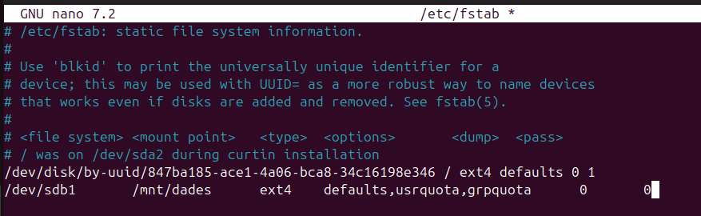

# Quotes per a Usuaris i Grups

**Què són les QUOTES de disc?**

Les quotes de disc són una eina essencial per limitar i gestionar l'espai d'emmagatzematge utilitzat per usuaris i grups en un sistema Linux. Aquestes permeten prevenir l'ús excessiu d'espai de disc, assegurant que cap usuari o grup monopolitzi els recursos del sistema.

En aquest apartat aprendrem:

- Què són les quotes de disc i per què són útils.

- Com assignar quotes a usuaris individuals.

- Com configurar quotes per a grups.

- Com monitoritzar les quotes i configurar notificacions automàtiques.

## Aplicar quotes

Primerament, instal·lem <code>quota</code> utilitzant la següent comanda:

```apt install quota```

Hem creat una partició `/dev/sdb1` i posteriorment hem muntat la carpeta `/mnt/dades` editant el fitxer **fstab**.

> **Atenció!** Molt de compte amb el fitxer **fstab**. Si introdueixes alguna configuració incorrecta, el sistema pot no arrencar i hauràs de reparar-lo manualment.



Afegim les opcions `defaults,usrquota,grpquota`. Això habilitarà les quotes tant per a grups com per a usuaris.

Després de configurar-ho, reiniciem el sistema perquè el muntatge s'apliqui correctament.

### Activar Quotes en un Directori

Un cop el sistema estigui en marxa, comprovem si els fitxers de quota existeixen executant:

- `quotacheck -cug /mnt/dades`

- `quotaon /mnt/dades`

Aquests passos verificaran i activaran les quotes.


> **Nota!** Si no veus els fitxers aquota.group i aquota.user, pots forçar-ne la creació amb `quotacheck -cugm /mnt/dades` i posteriorment activar-los amb `quotaon /mnt/dades`.

### Aplicar quotes a un usuari

Per assignar quotes als usuaris, existeixen dues maneres. 

Una d'elles és utilitzant `edquota -u + nomUsuari`, que permet editar manualment les quotes assignades a un usuari.

```edquota -u nomUsuari```


- **Bla o Soft**: Indica el límit tou, que l'usuari pot excedir durant el període de gràcia.

- **Dur o Hard**: Representa el límit màxim que no es pot excedir.

Configura aquests valors segons les necessitats de cada usuari.

Una altra manera d'assignar quotes és amb la següent comanda:

```setquota -u nomUsuari 1024 2048 0 0 /mnt/dades```

Aquesta comanda fa el mateix que l'edició manual amb **edquota**, però no cal entrar dins del fitxer ni modificar-lo manualment.

**Exemple**

En aquesta secció, expliquem com assignar quotes als usuaris amb exemples pràctics.


> **Nota**: Si l'usuari no pot escriure executa `chmod 777 /mnt/dades`.

**Intentem sobrepassar el límit per veure què pot passar**


La comanda `dd` s'utilitza per copiar i convertir fitxers de manera controlada. En aquest cas, s'utilitza per crear fitxers de prova amb dades generades aleatòriament a partir de `/dev/zero`.

**Comanda:**

`dd if=/dev/zero of=test bs=1K count=800`

- **if=/dev/zero**: Especifica el fitxer d'entrada, en aquest cas `/dev/zero`, que és un dispositiu especial que genera zeros contínuament.

- **of=test**: El fitxer de sortida, en aquest cas es crea un fitxer anomenat **test**.

- **bs=1K**: La mida del bloc de dades que es copiaran és de **1KB**.

- **count=800**: Es copien **800 blocs de 1KB**, resultant en un fitxer de **800KB**.

L'execució de la comanda crea un fitxer `test` de 819200 bytes (800KB) i mostra la velocitat de còpia (en aquest cas, **585 MB/s** en la primera execució i **713 MB/s** en la segona).

### Comprovació de la quota d'usuari

A la captura es mostra la comanda `quota -u pol` per comprovar l'estat de la quota d'un usuari específic, en aquest cas, l'usuari **pol**.


**Comanda:**

```quota -u nomUsuari```

Aquesta comanda mostra la informació de les quotes de disc per a un usuari específic.

**Explicació de la sortida:**

- `/dev/sdb1`: La partició on s'aplica la quota (en aquest cas, `/dev/sdb1`).

- `1028*`: L'espai actual utilitzat per l'usuari en blocs (1028 blocs). El símbol `*` indica que s'ha superat el límit tou.

- `1024`: Límit tou (soft limit) assignat, en blocs (1024 blocs o 1 MB).

- `2048`: Límit dur (hard limit) assignat, en blocs (2048 blocs o 2 MB).

- `7 días`: El període de gràcia de 7 dies per superar el límit tou.

- `3`: El nombre de fitxers utilitzats.


### Superar el Límit de Quota


A la captura es mostra el que passa quan l'usuari `pol` supera el límit de quota assignat:

**Comanda `dd` per crear fitxers:**

L'usuari intenta crear fitxers amb la comanda dd, però es genera un error perquè s'ha superat la quota de disc. Els missatges d'error són els següents:

- *"dd: error al escribir en 'test2': Se ha excedido la cuota de disco"*

- *"dd: error al escribir en 'test3': Se ha excedido la cuota de disco"*

Això indica que quan l'usuari intenta escriure més dades en els fitxers, el sistema bloqueja l'operació perquè s'ha arribat al límit de quota.

**Comprovació de la quota amb `quota`:**

Quan l'usuari comprova l'estat de la seva quota amb la comanda `quota -u nomUsuari`, es pot veure que ha superat el límit de quota assignat:

```/dev/sdb1 2048* 1024 2048 6 días```

- `2048*`: L'usuari ha utilitzat 2048 blocs, que és el límit dur (hard limit).

- `1024`: Límit tou (soft limit) de 1 MB.

- `2048`: Límit dur (hard limit) de 2 MB.

- `6 días`: El període de gràcia de 6 dies, durant el qual l'usuari pot seguir utilitzant l'espai fins que redueixi l'ús d'espai.

### Comportament al superar el límit:

Quan un usuari supera el límit dur (hard limit), el sistema impedeix que pugui escriure més dades al disc fins que redueixi l'ús d'espai per sota del límit dur. Això és el que es veu en la captura: el sistema bloqueja l'escriptura després d'excedir la quota.

Quan descarreguem una foto i intentem guardar-la a `/mnt/dades`, obtenim el següent resultat:


Apareix una descàrrega completa amb un pes de **0 bytes**. Això passa perquè no ens permet excedir la quota de disc.

Aquest procés falla. A més, si intentem moure alguna foto o arxiu dins del directori `/mnt/dades/`, apareix aquest altre error indicant que hem superat la quota.


### Aplicar Quotes a Grups

Una altra manera molt utilitzada per aplicar quotes és fer-ho a nivell de grups. En aquest cas, podem assignar una quota a un grup i afegir-hi els usuaris. Així, els usuaris dins d'aquest grup heretaran la quota del grup.

Afegim l'usuari **pol** al grup de **classe** i apliquem la quota.

```setquota -g classe 5120 10240 0 0 /mnt/dades```


> **Atenció!** Aquesta configuració només funcionarà si els usuaris no tenen una quota assignada de manera individual. Si l'usuari té una quota pròpia, aquesta prevaldrà sobre la quota del grup, com podem observar a la següent captura.


En aquesta captura, podem veure que l'usuari **pol** està dins del grup **classe**, però quan utilitzem la comanda `repquota -g /mnt/dades` per verificar les quotes del grup, la quota aplicada a l'usuari **pol** continua sent la seva quota individual, no la del grup.

Quan verifiquem la quota de l'usuari amb la comanda `repquota -u /mnt/dades`, veiem que la quota de **pol**** preval sobre la quota del grup, ja que la quota personal de l'usuari és visible en lloc de la quota del grup. Això confirma que, quan un usuari té una quota assignada directament, aquesta preval sobre les quotes assignades al grup.

**Creació de l'usuari "Mireia" i el grup "Classe"**

En aquest apartat, crearem un nou usuari anomenat **mireia**. Posteriorment, afegirem **mireia** al grup **classe** i assignarem la carpeta `/mnt/dades` a aquest grup.


No és estrictament necessari que el grup propietari de `/mnt/dades` sigui **classe**, però és recomanable per assegurar que els membres del grup tinguin els permisos adequats per accedir i escriure a la carpeta.

Per assignar el grup propietari, utilitzarem la comanda següent:

```chown :classe /mnt/dades```

### Creació de fitxers i intent de sobrepassar el límit de quota

Després de crear l'usuari i assignar-li el grup, crearem alguns fitxers per intentar sobrepassar el límit de quota del grup **classe**.


**Comprovació de l'estat de la quota de grup**

Finalment, comprovem l'estat de les quotes del grup **classe** utilitzant la comanda:

`repquota -g /mnt/dades`


**Explicació de la Captura**

Aquesta captura mostra la sortida de la comanda `repquota -g /mnt/dades` per al grup **classe** en un sistema de fitxers montat a `/mnt/dades`.

- **Grup**: `classe`

- **Usat**: El grup ha utilitzat **20480** blocs. Això significa que el grup **classe** ha utilitzat **20MB d'espai** a la partició.

- **Blando (límit tou)**: El límit tou (soft limit) per al grup és de **10240** blocs (10MB). El grup ha superat aquest límit, però encara està dins del límit dur.

- **Duro (límit dur)**: El límit dur (hard limit) per al grup és de **20480** blocs (20MB). El grup està exactament al límit dur, el que significa que ja ha arribat al límit màxim d'espai permès.

- **Gracia**: El període de gràcia és de **6 dies**. Això vol dir que el grup té 6 dies per reduir el seu ús d'espai per sota del límit dur abans que es prenguin mesures.

**Notes addicionals:**

- El símbol `+` a la columna **Usat** indica que el grup ha superat el límit tou però no ha arribat al límit dur.

- Els altres usuaris (com **root** i **pol**) no tenen cap quota assignada o només s'han mostrant les dades generals sense que s'excedeixin els límits.