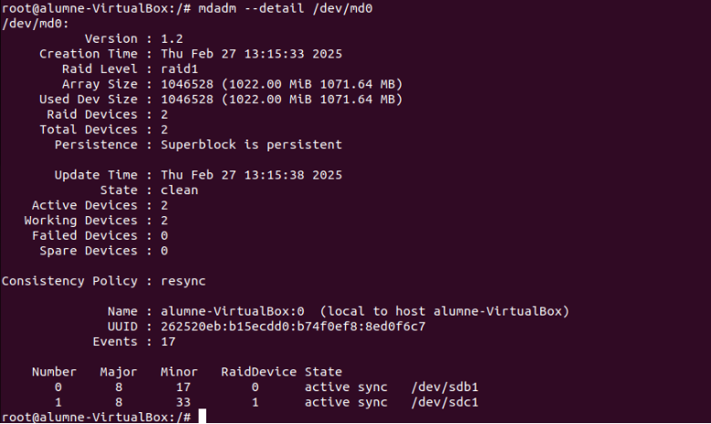

# Configuració de RAID 1

Aquest document descriu el procés per configurar un RAID 1 utilitzant dos discs d'1GB. RAID 1 duplica les dades entre els discs, oferint redundància i protecció en cas de fallada d'algun d'ells.

## Preparació dels Discs

**Neteja dels discs:**  

Assegureu-vos que els discs estan nets o que les dades que contenen es poden esborrar.

**Creació de particions:**  

Quan creeu les particions, recordeu d'especificar l'opció "t" per definir el tipus de partició i "fd" per indicar que és de tipus Linux RAID autodetectable.

**Instal·lació de l'eina de gestió:**  

Instal·leu `mdadm` (l'eina que us permetrà configurar el RAID).

sudo apt install mdadm 

**Creació del directori de muntatge:**  

Creeu un directori on muntareu el RAID (per exemple, `/mnt/raid1`) i, temporalment, configureu permisos 777 per facilitar la prova.

---

## Creació del Dispositiu RAID 1

**Creació del RAID:**  

Utilitzeu `mdadm` per crear un dispositiu RAID 1 que agrupi les particions dels dos discs (per exemple, `/dev/sda1` i `/dev/sdb1`) en un dispositiu com `/dev/md0`.

`sudo mdadm \--create /dev/md0 \--level=1 \--raid-devices=2 /dev/sda1 /dev/sdb1`

**Verificació de l'estat del RAID:**  

Comproveu que el RAID s'està creant correctament. Podeu veure l'estat amb la comanda que mostra informació detallada (per exemple, consultat a `/proc/mdstat` o amb "`mdadm \--detail /dev/md0`").  

**Generació i actualització de la configuració de mdadm:**  

Executeu la comanda per escanejar la configuració actual del RAID i guardar-la al fitxer de configuració (per exemple, "`mdadm \--detail \--scan \> /etc/mdadm/mdadm.conf`").

**Nota:** Aquesta comanda és important perquè registra la configuració actual del RAID al fitxer de configuració, assegurant que el sistema pugui detectar i muntar el RAID automàticament en futurs arrencades.  

**Verificació i edició del fitxer de configuració:**  
Obriu el fitxer `/etc/mdadm/mdadm.conf` amb un editor (per exemple, "`nano /etc/mdadm/mdadm.conf`") per confirmar que la configuració s'ha desat correctament i, si cal, afegiu una nova línia o ajustos addicionals.  

---

## Formatació i Muntatge del Dispositiu RAID

**Formatació:**  

Un cop creat i sincronitzat el dispositiu RAID (`/dev/md0`), formatgeu-lo amb el sistema d'arxius que preferiu (per exemple, `ext4`).  

**Configuració de muntatge automàtic:**  

Afegiu una entrada al fitxer `/etc/fstab` perquè el dispositiu RAID es munte automàticament en arrencar el sistema.  

**Muntatge i actualització del sistema:**  

Executeu les ordres necessàries per muntar el dispositiu RAID, reiniciar el daemon corresponent i actualitzar la configuració d'arrencada del sistema amb una comanda com `update-initramfs \-u \-k all`.

**Explicació:**

Aquesta actualització (`update-initramfs`) assegura que el nou dispositiu RAID estigui inclòs en la configuració d'arrencada del sistema, permetent que es munte correctament en futurs reinicis.

---

## Comprovació del funcionament

En aquest apartat comprovarem que el RAID creat funciona correctament.

* Comencem creant un fitxer "`prova.txt`" per fer una prova bàsica.

* A continuació, desconnectem un disc del RAID amb la comanda `mdadm /dev/md0 -f /dev/sdb1`.

`mdadm /dev/md0 \-f /dev/sdb1`

* Verifiquem l'estat del RAID amb `mdadm --detail /dev/md0`. La sortida mostra que el disc `/dev/sdb1` es troba en estat "`faulty`".

* Procedim a treure el disc defectuós amb `mdadm /dev/md0 --remove /dev/sdb1` i verifiquem la configuració amb la mateixa comanda.

`mdadm /dev/md0 \--remove /dev/sdb1`

* Per confirmar què ha passat amb les nostres dades, fem un `ls` al directori del RAID (per exemple, `/raid1/`). Comprovem que les dades no s'han esborrat, gràcies al RAID 1 que replica tot.

* Finalment, reinserim el disc amb `mdadm /dev/md0 -a /dev/sdb1` i podem observar que el sistema inicia el procés de "*rebuilding*". En uns instants, el disc tornarà a estar disponible per a l'ús.

`mdadm /dev/md0 \-a /dev/sdb1`

## Eliminar el RAID

Per desfer o esborrar el RAID, seguiu aquests passos:

* **Desmuntar el dispositiu RAID:**

`umount /dev/md0`

* **Aturar el dispositiu RAID:**

`mdadm \--stop /dev/md0`

* **Eliminar la informació del superblock:**

`mdadm \--zero-superblock /dev/sdb1 /dev/sdc1`

* **Treure el dispositiu RAID:**

`mdadm \--remove /dev/md0`

* **Eliminar el directori de muntatge:**  

`rm \-r /raid1`

Comproveu que el RAID s'ha eliminat correctament amb:

`mdadm \--detail /dev/md0`

A continuació, esborreu la configuració actual del RAID del fitxer `/etc/mdadm/mdadm.conf` deixant-lo buit.

Finalment, elimineu o comenteu la línia que heu afegit al fitxer `/etc/fstab`.

