# Configuració de RAID 5

## RAID 5

RAID 5 combina la distribució de dades amb la paritat, de manera que la informació de paritat es reparteix entre tots els discos. Això permet recuperar les dades en cas de fallada d'un disc. En aquesta configuració s'utilitzen quatre discos, on la paritat actua com una protecció addicional.

### Afegir els Discos

El primer pas és assegurar-se que els quatre discos estiguin correctament connectats al sistema. Podeu verificar-ho visualment i amb eines de gestió del sistema.  

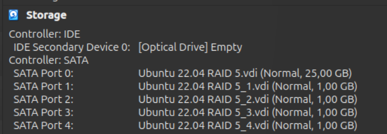

**Comprovació amb lsblk**

Un cop connectats, comproveu que el sistema reconeix tots els discos executant la comanda `lsblk`. Aquesta ordre mostrarà una llista dels dispositius d'emmagatzematge disponibles.  

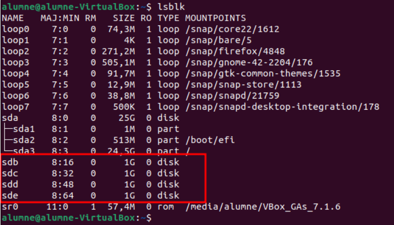

**Creació de Particions**

Cal crear particions a cada disc indicant el tipus adequat. Quan feu les particions, assegureu-vos d'especificar l'opció "t" per definir el tipus de partició i "fd" per indicar que són particions de Linux RAID autodetectable. 

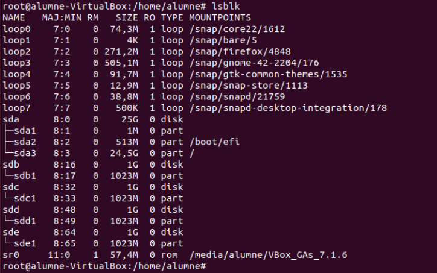

### Creació del RAID 5

Per crear el RAID 5, s'executa la comanda següent:  

`sudo mdadm --create /dev/md0 --level=5 --raid-devices=4 /dev/sdb1 /dev/sdc1 /dev/sdd1 /dev/sde1`  

Aquesta instrucció agrupa les particions dels quatre discos en un únic dispositiu RAID, anomenat `/dev/md0`.  

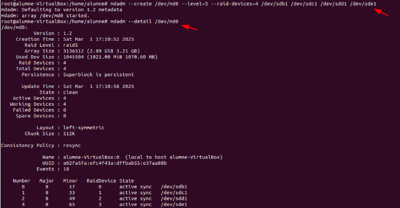

**Verificació del RAID**

Després de crear el RAID, és important comprovar-ne l'estat. Executeu la comanda `sudo mdadm --detail /dev/md0` per confirmar que s'ha creat correctament i que està operatiu.  

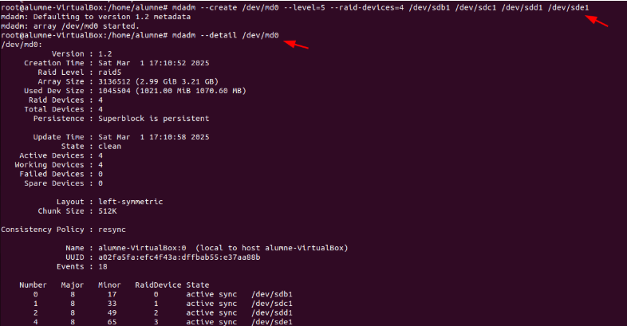

**Formatació del RAID**

Un cop creat el dispositiu RAID, cal formatgeu-lo amb el sistema d'arxius que preferiu, per exemple, ext4. Aquesta operació prepara el RAID per a l'emmagatzematge de dades.  

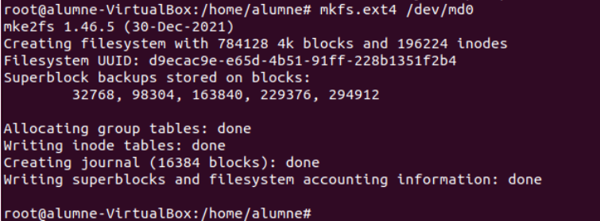

**Muntatge Temporal**

A continuació, creeu un directori de muntatge, com per exemple `/mnt/raid5`, i munteu-hi el dispositiu RAID de manera temporal per provar-ne el funcionament.  

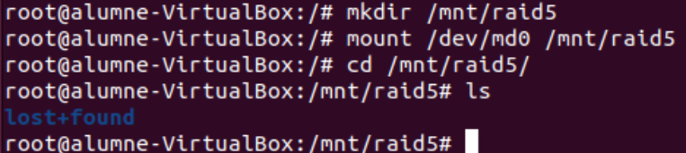

### Actualització de la Configuració de mdadm

Per desar la configuració actual del RAID, escanegeu-la i deseu-la al fitxer de configuració executant:  

`mdadm --detail --scan > /etc/mdadm/mdadm.conf`  

Aquesta acció permet que el sistema detecti automàticament el RAID en futurs arrencades.  

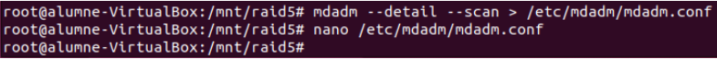

**Revisió del Fitxer de Configuració**

Obriu el fitxer `/etc/mdadm/mdadm.conf` amb l'editor de text que preferiu per confirmar que la configuració s'ha desat correctament. Si cal, realitzeu els ajustos addicionals corresponents.  

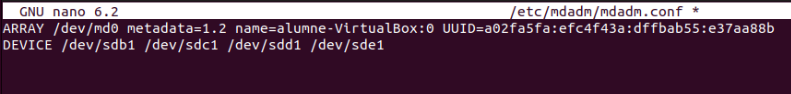

### Configuració del Muntatge Automàtic FSTAB

Per assegurar que el dispositiu RAID es munte automàticament en arrencar el sistema, afegiu la línia corresponent al fitxer `/etc/fstab`. D'aquesta manera, no caldrà muntar-lo manualment en cada reinici.  

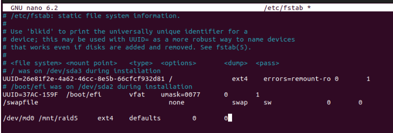

### Actualització del Sistema d'Arrencada

Finalment, executeu la comanda `update-initramfs -u -k all` per actualitzar la configuració d'arrencada del sistema. Aquesta actualització garanteix que el nou dispositiu RAID s'inclogui en el procés d'arrencada, permetent que es munte correctament en futurs reinicis.  

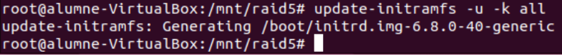

## Proves del RAID5

En aquest apartat es crearan fitxers dins del directori muntat del RAID 5 per comprovar la integritat de les dades. Posteriorment, es simularà la fallada d'un dels discos (disk número 3\) per verificar que la redundància implementada protegeix la informació.

Per començar, es creen fitxers de prova al directori del RAID.  

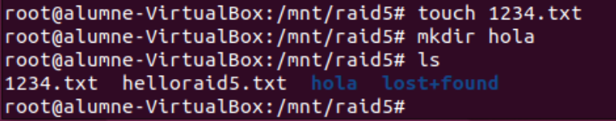

A continuació, es simula la fallada eliminant el disc número 3 del conjunt RAID.  

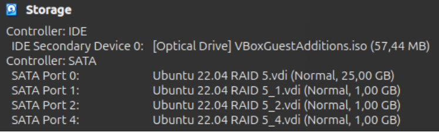

Un cop realitzada aquesta simulació, es reinicia el sistema per comprovar si la informació continua disponible o si s'ha perdut. Cal tenir en compte que, en aquest cas, el sistema sol trigar més en arrancar perquè intenta detectar i reconstruir el RAID amb la manca d'un disc.

### Recuperació del RAID5

En reiniciar el sistema, hem detectat un "ensurt" ja que el RAID es troba inactiu i sembla que les dades han desaparegut. No et preocupis: això només vol dir que el RAID està aturat, no que les dades s'hagin perdut.

Per reactivar el RAID i recuperar la seva funcionalitat, cal executar les següents comandes:

`mdadm \--stop /dev/md0`

`mdadm \-As /dev/md0`

`mount \-a` 

`update-initramfs \-u \-k all`

Un cop s'executin aquests passos, el RAID tornarà a estar actiu i el dispositiu es muntarà correctament, assegurant que tot torni a funcionar gràcies a la redundància del RAID 5\.

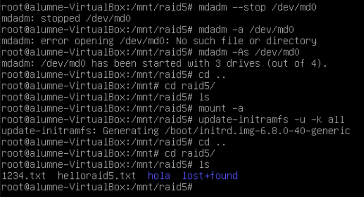

### Tornem a afegir un disc nou per a restaurar la configuració de 4 discs

Ja ens ha arribat el nou disc i el hem connectat al PC.  

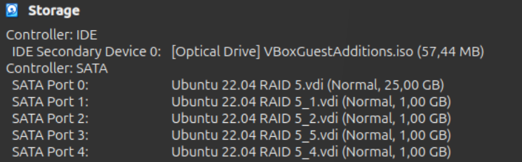

Abans d'afegir-lo al RAID, és necessari preparar el disc. Utilitzeu l'eina fdisk per crear la partició corresponent i configurar-la per a Linux RAID autodetectable. Un cop preparat, podeu afegir el disc al RAID amb mdadm i verificar la seva incorporació.  

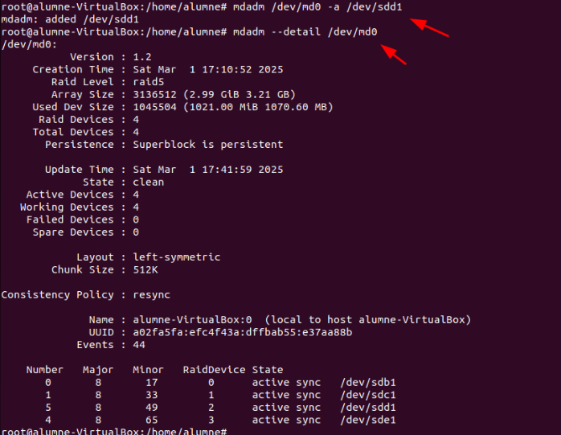

Finalment, comproveu que les dades segueixen assegurades i que el RAID funciona correctament amb la nova configuració.  

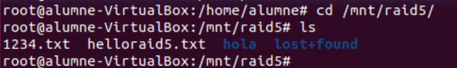