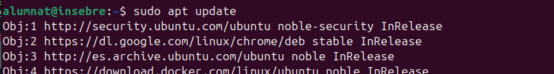
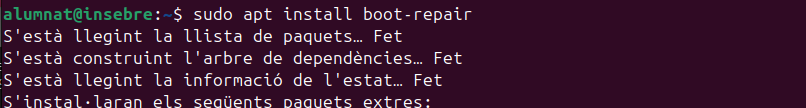
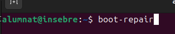

## Recuperació de gestors d'arrencada 

El concepte de "recuperació dels gestors d'arrencada" fa referència al procés de reparar o restaurar el gestor d'arrencada (bootloader) d'un sistema operatiu quan aquest ha estat danyat, sobreescrit o eliminat, impedint que el sistema operatiu s'iniciï correctament.

### Boot-Repair

Boot-Repair és una eina gràfica dissenyada per facilitar la restauració de GRUB i altres gestors d'arrencada. Aquesta eina detecta automàticament els problemes amb el gestor d'arrencada i proporciona opcions per restaurar-lo sense necessitat de coneixements tècnics avançats.

#### Utilització de Boot-Repair

1. Afegim des del terminal el PPA de Boot-Repair.

2. Actualitzem repositoris.

3. Instal·lem Boot-Repair.

4. Executem Boot-Repair.

5. Seleccionem l'opció **Reparació recomanada** i seguim les instruccions. El programa detectarà i arreglarà el problema del gestor d'arrencada.

