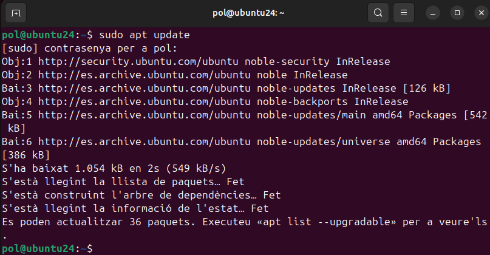
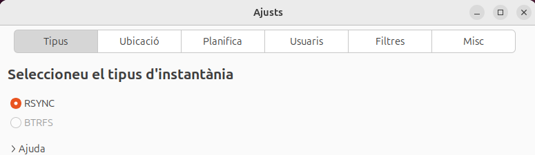
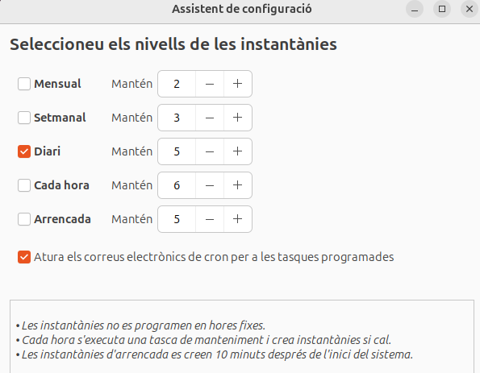
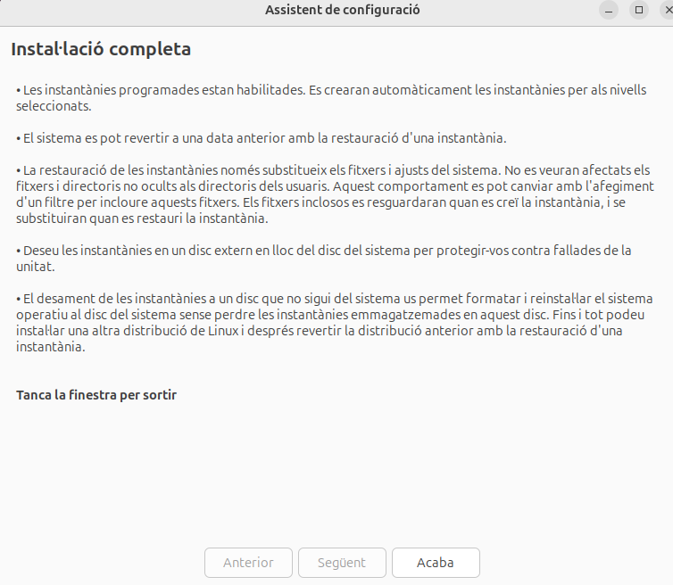

## Punts de restauració

Els punts de restauració són còpies de seguretat de l'estat actual del sistema operatiu, incloent-hi la configuració del sistema i els fitxers essencials, que permeten restaurar el sistema a un estat anterior en cas de problemes. Aquests punts permeten que, si es produeixen errors o es fan canvis no desitjats en el sistema (com actualitzacions defectuoses o modificacions a fitxers crítics), es pugui tornar a un estat anterior, minimitzant la pèrdua de dades i el temps d'inactivitat. En el cas de les màquines virtuals amb les que estem treballant, aquesta eina ens és especialment útil per fer passos enrere quan ens equivoquem amb la configuració de la màquina i aquesta arriba a petar. Crear aquestes instantànees ens permetra tornar a la configuració donada d'un moment en concret així com si fós el punt de guardat d'un videojoc. Una eina molt útil i popular per poder fer això és **Timeshift** .

### Instal·lació de Timeshift

El primer pas abans de començar a instal·lar qualsevol programa hauria de ser assegurar-nos que els repositoris de paquets estiguin actualitzats.

Ubuntu inclou Timeshift als seus repositoris oficials, de manera que es pot instal·lar directament amb la comanda següent:

Un cop instal·lat ens assegurem que aparegui l'icona buscant el nom de l'aplicació i l'executem.

Deixarem el tipus d'intantània com a **RSYNC** .

La ubicació de la instantània serà al **sda2** que com podrem veure retrocedint a l'apartat de *Configuració de les particions* correspon al **'/home'**.

Al següent apartat configurarem la programació de les instantànies. Ara per ara, en el nostre cas on sols estem testejant, deixarem la configuració per defecte.

Per a les nostres instantànies ens interessa incloure solament tots els fixers de la carpeta de l'usuari i exclourem tots el del **root**. 

Un cop acabada la configuració, clicarem sobre **Acaba** per finalitzar. 

> Amb aquesta configuració es crearan automàticament les instantànies amb la periodicitat que li haguem assignat. Si volem fer una instantània manual desde la terminal d'Ubuntu executarem la comanda **sudo timeshift --create** . En cas que el sistema tingui problemes i volem restaurar una instantània anterior executarem la comanda **sudo timeshift --restore** .

