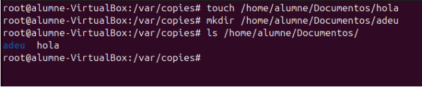
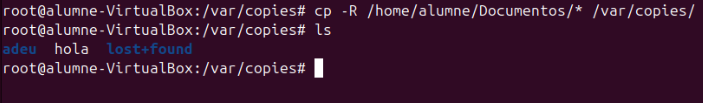
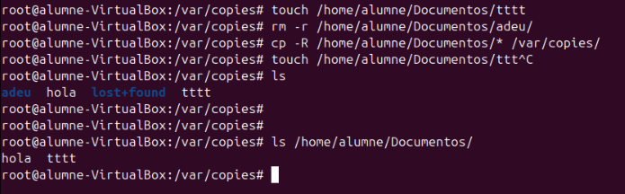
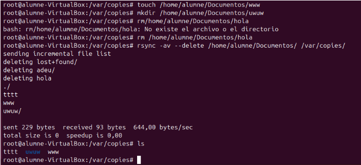
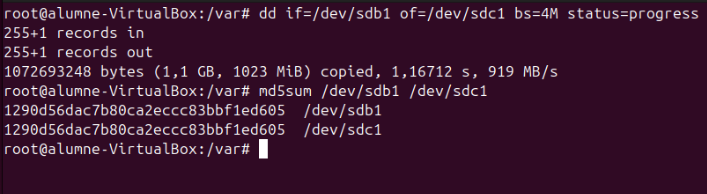

# Còpies de seguretat

**Què és una còpia de seguretat?**

Una còpia de seguretat és una rèplica dels fitxers i dades importants emmagatzemades en un dispositiu o sistema. S'utilitza per prevenir la pèrdua d'informació en cas d'errors, atacs, o danys en el sistema original. Normalment, es guarda en un lloc separat, com un disc extern, un servidor, o el núvol, per garantir la seva seguretat.

## Tipus de Còpies de Seguretat

**Còpies completes**

| Descripció                                | Avantatges                                      | Desavantatges                          |
|-------------------------------------------|------------------------------------------------|----------------------------------------|
| Una còpia de totes les dades seleccionades. | - Es copia i guarda tot.                       | - Ocupa molt espai d'emmagatzematge.  |
|                                           | - Independent d'altres còpies per a la restauració. | - Tarda molt a realitzar-se.          |

**Nota**: Només es necessita l'última còpia completa per recuperar les dades.

**Còpies diferencials**

| Descripció                                   | Avantatges                                     | Desavantatges                                                             |
|---------------------------------------------|-----------------------------------------------|---------------------------------------------------------------------------|
| Inclou els canvis des de l'última còpia completa. | - Ocupa menys espai que una còpia completa.   | - Necessites l'última còpia completa i l'última còpia diferencial per restaurar les dades. |
|                                             | - Més ràpida de crear que una còpia completa. |                                                                           |

**Nota**: Acumula canvis fins que es realitza una nova còpia completa.

**Còpies incrementals**

| Descripció                                                    | Avantatges                                     | Desavantatges                                                                     |
|--------------------------------------------------------------|-----------------------------------------------|-----------------------------------------------------------------------------------|
| Inclou els canvis des de l'última còpia (completa o incremental). | - Ocupa menys espai que una còpia diferencial. | - Necessites l'última còpia completa i totes les còpies incrementals fins al punt de restauració. |
|                                                              | - La més ràpida de crear.                     |                                                                                   |

**Nota**: Redueix espai i temps, però requereix més passos per a la recuperació.

**Recomanacions**

- Realitza còpies completes periòdicament (per exemple, setmanalment).

- Completa-les amb còpies diferencials o incrementals diàries per optimitzar l'espai i el temps.

- Assegura't de provar les còpies de seguretat periòdicament per garantir la seva integritat.

- Emmagatzema còpies fora del lloc (off-site) per protegir-les contra desastres locals.

## Còpies de Seguretat: CP, rsync i DD

### Explicació i Taula Comparativa

Les comandes per a la gestió de còpies de seguretat tenen usos específics segons les necessitats. A continuació, es presenta una explicació i una taula comparativa dels principals comandaments:

| Comanda | Descripció                                                                                   | Treball Local | Treball Remot | Intel·ligència (només modifica canvis) |
|---------|---------------------------------------------------------------------------------------------|---------------|---------------|---------------------------------------|
| cp      | Còpia simple, no intel·ligent. Es limita a copiar fitxers o directoris sense optimització.   | Sí            | No            | No                                    |
| rsync   | Permet copiar només les modificacions de fitxers, optimitzant espai i temps. Suporta SSH per a còpies remotes. | Sí            | Sí            | Sí                                    |
| dd      | Clonació de discos o particions a nivell de blocs. No és específic per a còpies de seguretat de fitxers. | Sí            | No            | No                                    |

### cp

- **Descripció**: La comanda cp és una eina simple per copiar fitxers i directoris.

- **Limitació**: No és capaç de reconèixer canvis en els fitxers, per tant, sempre copia tot de nou.

**Exemple d'ús**:

`cp -r /origen /destinació`

**Paràmetres comuns**:

- `-r`: Copia recursivament un directori i els seus continguts.

- `-u`: Només copia fitxers més nous o que no existeixen al destí.

Crearem un directori i un fitxer per a fer aquesta prova.

`touch /home/alumne/Documentos/hola`

`mkdir /home/alumne/Documentos/adeu`

Posteriorment, utilitzarem la comanda `cp` per copiar els fitxers i directoris de /Documentos/ al nou directori.

`cp -R /home/alumne/Documents/* /var/copies/`

> **Nota**: El símbol asterisc (*) després de /Documentos/ indica que es copiarà tot el que es trobi dins d'aquest directori.

Un punt important és que hem copiat únicament els fitxers i subdirectoris que es trobaven al directori `/home/alumne/Documents` en el moment de la còpia:

`cp -R /home/alumne/Documents/* /var/copies/`

Aquesta comanda copia tot el que hi ha al directori `/home/alumne/Documents` (fitxers i subdirectoris) al directori `/var/copies`.

Un cop feta la còpia, els fitxers copiat a `/var/copies` són independents. Això significa que si posteriorment esborrem els fitxers o directoris de `/home/alumne/DocumentS`, no afectaran la còpia que hem fet a `/var/copies.`

Aquesta operació crea una còpia segura dels fitxers en un altre directori i no es veu afectada pels canvis posteriors al directori original.

### rsync

- **Descripció**: rsync és una eina avançada per a còpies de seguretat que només copia els canvis en els fitxers, reduint l'ús de recursos.

- **Avantatges**: Permet còpies locals i remotes via SSH. Pot mantenir sincronitzades dues ubicacions.

**Paràmetres comuns**:

- `-a`: Mode arxiu (conserva permisos, propietaris, etc.).

- `-v`: Mostra informació detallada del procés.

- `-z`: Comprimeix les dades durant la transferència per optimitzar la velocitat.

**Exemple d'ús**:

`rsync -avz /origen user@host:/destinació`

`rsync -av --delete /home/alumne/Documentos/ /var/copies/`

Aquesta comanda sincronitza el contingut del directori `/home/alumne/Documents` amb `/var/copies`. L'opció `--delete` elimina qualsevol fitxer o directori a `/var/copies` que no estigui present a `/home/alumne/Documents`. Això significa que:

- Es copien els nous fitxers (`www` i `uwuw`).

- Esborra fitxers o directoris a `/var/copies` que ja no existeixen a `/home/alumne/Documents` (com `hola` i `lost+found`).

Llistem els continguts actuals del directori `/var/copies`, que ara conté:

- `tttt`: Fitxer prèviament copiat.

- `www`: Nou fitxer copiat.

- `uwuw`: Nou directori copiat.

**Resum**

L'ús de `rsync --delete` assegura que `/var/copies` sigui una còpia exacta de `/home/alumne/Documents`, eliminant qualsevol fitxer que no existeixi al directori original.

### dd

**Descripció**: dd no és específicament per a còpies de seguretat, sinó per a clonació de discos i particions a nivell de blocs. També es pot utilitzar per sobreescriure blocs o particions abans de formatar.

Precaucions:

- `dd` és una eina potent però perillosa; un mal ús pot provocar la pèrdua de dades.

- Sempre assegura't d'especificar correctament els dispositius d'origen (if) i destí (of).

**Exemple d'ús**:

- Clonar un disc: `dd if=/dev/sdX of=/dev/sdY bs=4M status=progress`

- Sobreescriure una partició amb zeros: `dd if=/dev/zero of=/dev/sdX bs=1M`

En aquesta imatge es mostren dues operacions utilitzant les comandes `dd` i `md5sum` per copiar i verificar la integritat de les dades entre dues particions:

`dd if=/dev/sdb1 of=/dev/sdc1 bs=4M status=progress`

Aquesta comanda copia el contingut de la partició `/dev/sdb1` a la partició `/dev/sdc1`. Els paràmetres utilitzats són:

- `if=/dev/sdb1`: Especifica la partició d'entrada (origen).

- `of=/dev/sdc1`: Especifica la partició de sortida (destí).

- `bs=4M`: Defineix una mida de bloc de 4 MB per a una transferència més eficient.

- `status=progress`: Mostra el progrés de la còpia en temps real.

`md5sum /dev/sdb1 /dev/sdc1`

Aquesta comanda calcula el hash MD5 de les particions `/dev/sdb1` i `/dev/sdc1` per verificar que les dades copiades són idèntiques.

**Resultat**:

Els hash generats per totes dues particions són iguals (`1290d56dac7b80ca2eccc83bbf1ed605`), la qual cosa confirma que la còpia s'ha realitzat correctament i sense errors.