# Compartir recursos amb SAMBA

## Instal·lació i configuració de Samba

Samba és un servei similar a NFS que permet la compartició de carpetes, però també permet compartir altres recursos, com impressores.

**Diferències principals amb NFS**

Una de les diferències més importants respecte a NFS és que l'autenticació en Samba es realitza a nivell d'usuari, mentre que en NFS es fa a nivell de host. Això permet un control més detallat sobre qui pot accedir als recursos compartits.

**Integració amb LDAP**

Per utilitzar Samba no és necessari tenir un servidor LDAP, però existeix la possibilitat d'integrar-lo amb LDAP per gestionar els usuaris de manera centralitzada.

**Compatibilitat**

Samba ofereix compatibilitat tant amb sistemes Ubuntu com amb Windows, facilitant la interoperabilitat entre diferents plataformes.

## Instal·lació i proves

### Servidor Samba

Comencem la instal·lació del servei Samba al nostre servidor amb la següent comanda:

`sudo apt install samba`

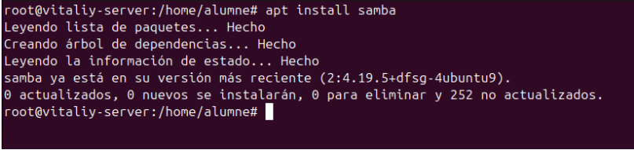

A continuació, crearem la carpeta que volem compartir i li assignarem els permisos corresponents. El propietari i el grup han de ser `nobody:nogroup`. Pel que fa als permisos, aquests dependran del criteri de cada entorn. En aquesta pràctica, assignarem permisos 777 per facilitar la configuració.

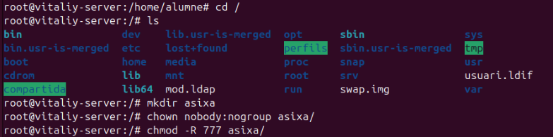

Un cop fet això, comprovem que els permisos s'han aplicat correctament.

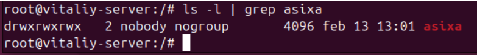

### Configuració de `smb.conf`

Per compartir el directori creat, hem de modificar l'arxiu de configuració de Samba, situat a `/etc/samba/smb.conf`, afegint una configuració bàsica.

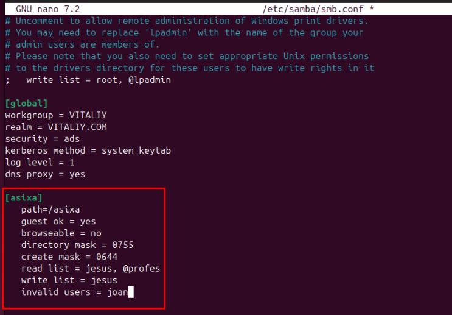

En aquesta configuració, hem especificat el path del directori compartit, l'opció `guest ok`, i l'opció `browsable`, que es pot configurar a "*yes*" o "*no*" segons les necessitats. A més, hem definit la màscara del directori (`directory mask`) i la màscara dels fitxers creats (`create mask`).

Pel que fa als permisos destacats:

- L'opció `read list` permet accés de només lectura exclusivament a l'usuari `jesus` i al grup `professors` (identificat amb l'arrova `@`).  

- L'opció `write list` concedeix permís d'escriptura únicament a `jesus`.  

- L'usuari `joan` no tindrà accés ni podrà connectar-se al recurs compartit.

---

**Reinici del servei i comprovació**

Un cop configurat `smb.conf`, reiniciem el servei per aplicar els canvis i comprovem que funciona correctament.

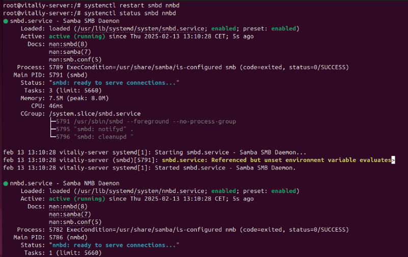

#### **Creació d'usuaris i grups**

Per gestionar l'accés als recursos compartits, creem els usuaris i els assignem als grups corresponents.

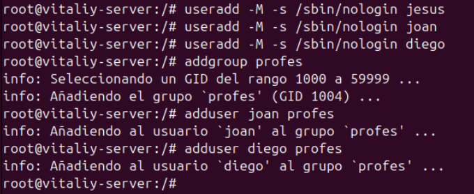

Un cop creats, comprovem que els usuaris s'han afegit correctament al grup corresponent.

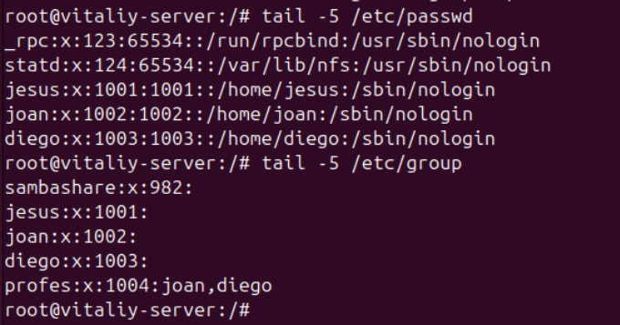

#### **Canvi de contrasenya per a usuaris Samba**

Perquè els usuaris puguin accedir al directori compartit, cal assignar-los una contrasenya específica per a Samba. Això es fa amb la comanda següent:

`smbpasswd -a "nom_usuari"`

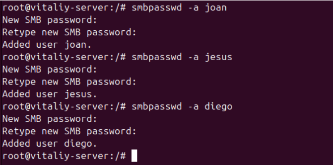

> Aquesta contrasenya és independent de la contrasenya del sistema i és necessària per autenticar-se en els recursos compartits de Samba.

## Instal·lació i configuració del client

### Instal·lació del client Samba

Primerament, hem d'instal·lar el servei `smbclient` al nostre client.

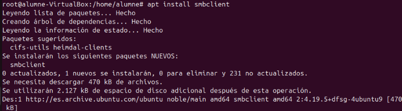

Un cop instal·lat, obrim el cercador de fitxers i ens dirigim a **"Altres ubicacions"**. Afegim la IP del nostre servidor Samba i el directori compartit. Per exemple:

`smb://10.0.2.15/asixa/`

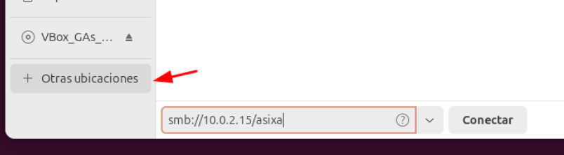

### Connexió com a usuari anònim

Com que hem afegit el paràmetre `guest`, ens podem connectar com a usuari anònim.

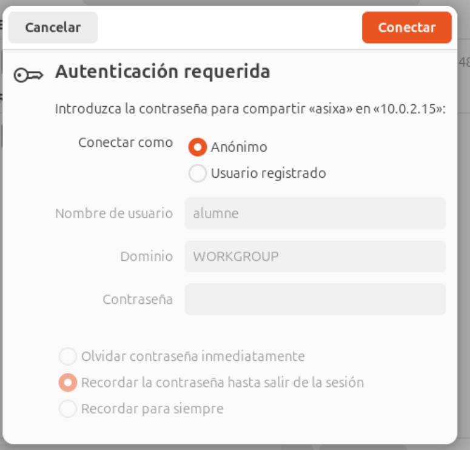

Aquesta connexió ens permet veure els fitxers existents, però no ens permet obrir-los ni crear nous fitxers o directoris.

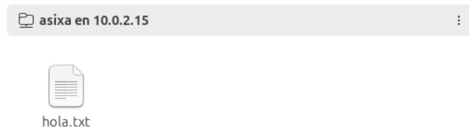

Si intentem crear un fitxer, obtenim un error.

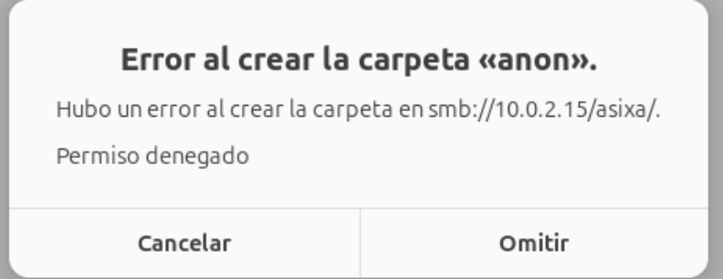

Tampoc podem llegir el fitxer `hola`, que ja estava creat prèviament.

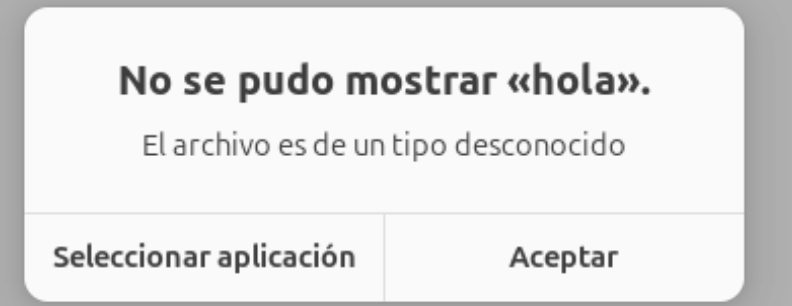

### Connexió amb usuaris amb permisos específics

**Usuari Jesus**

Intentem accedir amb l'usuari `Jesus` i la contrasenya assignada en el pas previ.

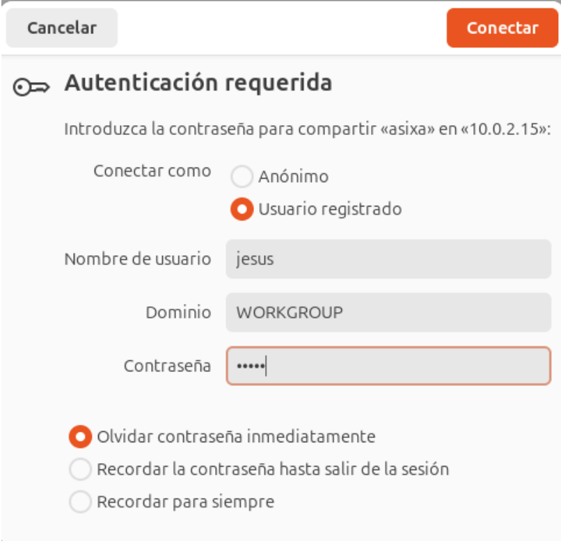

Aquest usuari pot llegir i també crear fitxers i directoris.

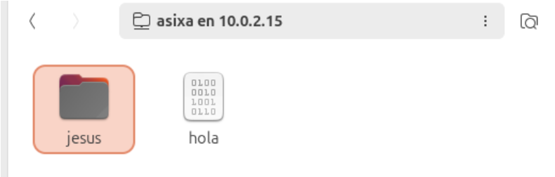

També podem llegir els fitxers.

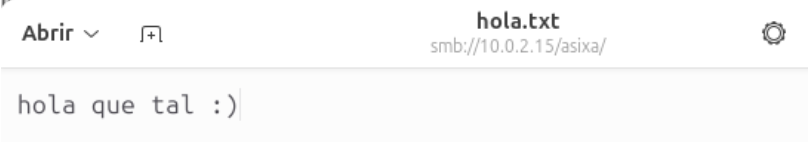

---

**Usuari Diego**

També podem accedir amb l'usuari `Diego`, però aquest només té permisos de lectura i no pot crear nous fitxers.

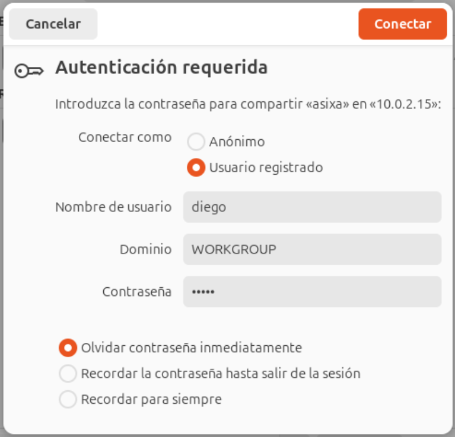

Si intentem crear un directori, obtenim un error.

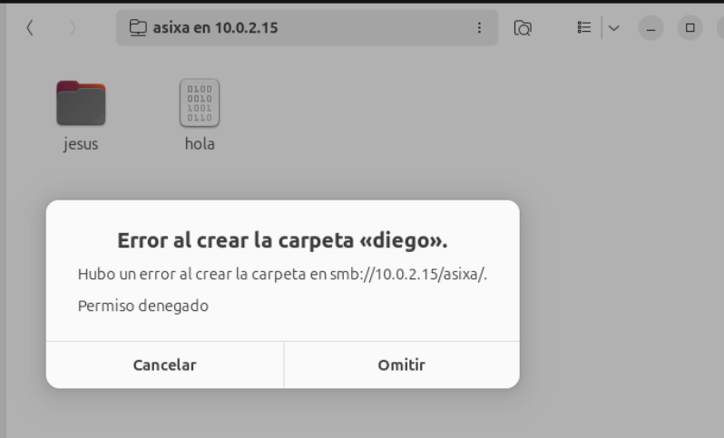

Però en canvi si podem llegir.

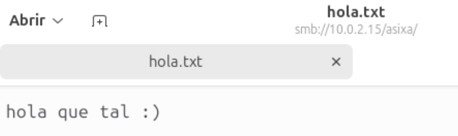

---

**Usuari Joan**

L'usuari `Joan` no pot accedir al recurs compartit, ja que li hem denegat l'accés en la configuració de Samba.

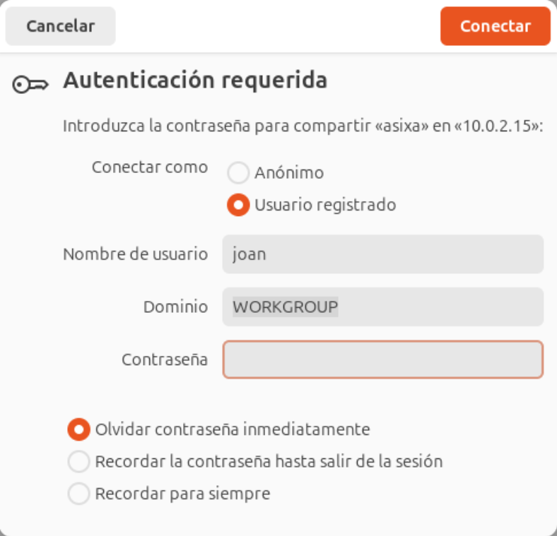

### Ldap \+ Samba

Integrar Samba amb LDAP és força complex, ja que cal utilitzar el `samba.schema` entre molts altres paràmetres. No recomano fer-ho, ja que pot causar molts inconvenients i dificultats en la configuració.

Una solució que pots considerar per simplificar la integració entre Samba i LDAP és utilitzar una eina com **Samba AD (Active Directory)**, que està més estandarditzada i és menys propensa a errors de configuració. Samba AD proporciona una implementació compatible amb Active Directory que permet gestionar usuaris, grups i permisos a través de LDAP, però amb un conjunt d'eines que faciliten la configuració i l'administració.