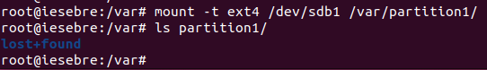
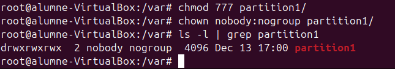
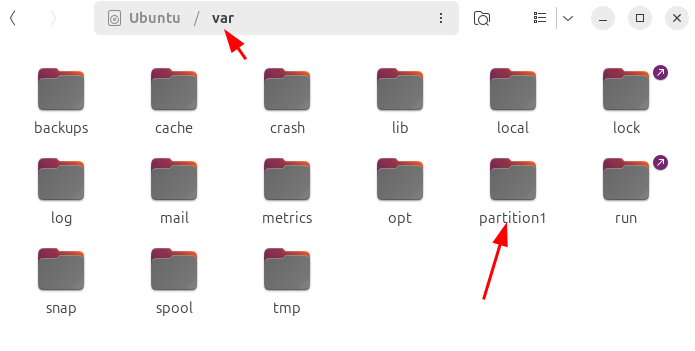

# Gestió de Particions i Compartició de Recursos

## Creació i muntatge de particions

En aquest apartat aprendrem a crear particions tant en format **ext4** com **NTFS**. També veurem com muntar particions de manera temporal i definitiva.

A més, explicarem com utilitzar **FSTAB** per configurar el muntatge automàtic de particions. Finalment, compartirem aquestes particions utilitzant **Samba** i **nautilus-share**.

### Creació de la partició i formateig

Primer de tot, comprovem el nom de la nostra partició amb la comanda <code>fdisk -l</code>.


> **Nota:** En el nostre cas, el disc és <code>/dev/sdb</code> (el teu pot ser diferent).

Per crear la partició, executarem la comanda següent:

```sudo fdisk /dev/sdb```.

- Escriu <code>n</code> per crear una nova partició.

- Selecciona <code>p</code> per crear una partició primària.

- Defineix la mida de la partició introduint el sector inicial i la meitat del disc, per exemple **2000000 bytes**.

- Escriu <code>w</code> per guardar els canvis i sortir del programa.


**Comprovació de la partició**

Un cop creada la partició, comprovem si s'ha creat correctament.


### Formateig de particions EXT4

Amb la partició creada, procedirem a formatar-la en format **ext4**.

Utilitzarem la següent comanda:

```sudo mkfs.ext4 -b 2048 /dev/sdb1```

L'opció <code>-b 2048</code> especifica la mida del bloc que assignem manualment.


**Comprovació de la mida del bloc**

Fem la comprovació de la mida del bloc que hem assignat a la partició. Per fer-ho, utilitzem la següent comanda:

```sudo tune2fs -l /dev/sdb1 | grep Block```

Aquest és el resultat obtingut:


- **Block count**: Indica el nombre total de blocs que té la partició, en aquest cas, 499488 blocs.

- **Block size**: Mostra la mida del bloc assignada, que és 2048 bytes (2 KB).

- **Blocks per group**: Indica el nombre de blocs per grup, que és 16384.

**Conversió a MB**

La mida total del sistema de fitxers es pot calcular així:

1. Multipliquem el **Block count** pel **Block size**:

<code>499488 blocs * 2048 bytes = 1022035968 bytes</code>

2. Convertim el resultat a megabytes:

<code>1022035968 bytes ÷ 1024 ÷ 1024 = 974 MB</code>

Així, la mida aproximada de la partició és **974 MB**.


### Formateig de particions NTFS

Hem creat una segona partició, <code>/dev/sdb2</code>, de **1GB** al mateix disc. Aquesta partició es destinarà al format **NTFS**.


Un cop creades les particions, les hem formatat segons els sistemes de fitxers desitjats:

- **/dev/sdb1**: Formatada amb **ext4**, un sistema de fitxers ideal per a sistemes Linux.

- **/dev/sdb2**: Formatada amb **NTFS**, un sistema de fitxers compatible amb Windows.

Hem aprofitat per formatar <code>/dev/sdb1</code> amb **ext4** durant el mateix procés.


## Verificació

Un cop formatades, podem verificar el tipus de sistema de fitxers i el muntatge de les particions utilitzant:

```lsblk -f```


### Muntatge temporal de la carpeta a la partició

Després, crearem una carpeta i un arxiu dins d'aquesta carpeta.


Executem la comanda següent:

```sudo mount -t ext4 /dev/sdb1 /var/partition1/```

Aquesta acció muntarà la carpeta dins de /dev/sdb1.

Per a l'usuari no és visible, però d'aquesta manera ens assegurem que les dades no es perdin si succeeix algun problema amb el disc principal.



**Exemple:** Els arxius es guarden a la partició que hem muntat, però els arxius que prèviament hem creat a <code>/partition1/</code> no s'han esborrat. En realitat, aquests arxius queden "ocults", ja que la carpeta <code>/partition1/</code> està muntada sobre la partició <code>/dev/sdb1</code>. Quan desmuntem la partició, els arxius locals tornen a ser visibles.


**Explicació de la captura**

- **ls partition1/**: Llistem el contingut del directori <code>partition1/</code>. Inicialment només apareix el directori **lost+found**, que es crea automàticament en particions formatades amb **ext4**.

- **touch partition1/bye**: Creem un fitxer buit anomenat **bye** dins de la carpeta muntada <code>partition1/</code>.

- **umount /dev/sdb1**: Desmuntem la partició <code>/dev/sdb1</code>, fent que el contingut de la partició deixi d'estar accessible.

- **ls partition1/**: Tornem a llistar el contingut de la carpeta. Ara no apareix el fitxer **bye**, ja que aquest estava dins de la partició muntada i aquesta ja no està accessible.

- **ls partition1/** (*després de desmuntar*): Aquí es mostren només els fitxers que pertanyen al directori local, fora del sistema de fitxers muntat. Quan es desmunta, el contingut de la partició queda separat del directori. Això demostra com el muntatge i desmuntatge funcionen per accedir al contingut de particions.

> Nota: Tornem a muntar la carpeta amb la comanda anterior.

Comprovem que la partició existeix utilitzant la comanda <code>df -T</code>.


S'observa que la partició està present. Després, reiniciem la màquina per assegurar-nos que tot funciona correctament.

En fer la comprovació després del reinici, observem que la partició ja no està muntada. Això es deu al fet que la carpeta estava muntada de forma temporal i no de manera permanent.


### Muntatge Permanent de la carpeta a la partició

Per fer que el muntatge sigui permanent, cal editar el fitxer <code>/etc/fstab</code> afegint els paràmetres necessaris.


> **IMPORTANT!** Tingues molta cura amb les modificacions en aquest fitxer, ja que un error pot fer que el sistema no arranqui. Si això succeeix, hauràs d'utilitzar un **Live Boot** per reparar el fitxer **FSTAB**.

Després de reiniciar el sistema, utilitzem la comanda <code>df -T</code> per verificar l'estat de la partició.

Podem observar que la partició es munta automàticament en iniciar la sessió gràcies a la configuració del fitxer <code>/etc/fstab</code>.


### Compartició de Fitxers en Xarxa

Hi ha diverses maneres de compartir fitxers en xarxa, però en aquest exemple utilitzarem Nautilus-share i **Samba**.

**Què significa compartir arxius en xarxa?**

Compartir arxius en xarxa permet que diferents dispositius connectats a la mateixa xarxa accedeixin a fitxers o carpetes des d'un ordinador central. Això facilita l'intercanvi de dades sense necessitat de copiar fitxers manualment amb dispositius externs, com USB o discs durs. És una solució molt útil en entorns domèstics o d'oficina per col·laborar, gestionar recursos i estalviar temps.

Amb aquest procés, es poden configurar permisos perquè només usuaris específics tinguin accés, garantint la seguretat i el control sobre els fitxers.

**Nautilus-Share**

Hem creat una carpeta anomenada partition1 dins del directori /var/, i ara la compartirem a través de la xarxa utilitzant Nautilus.


Primerament, cal instal·lar **Nautilus-share** amb la següent comanda:

```sudo apt install nautilus-share```

Un cop creada la carpeta <code>partition1</code>, és necessari ajustar els permisos i el propietari per facilitar l'accés a altres usuaris.

1. **Permisos 777**:

Els permisos 777 atorguen màxima flexibilitat, ja que permeten a qualsevol usuari llegir, escriure i executar els fitxers dins de la carpeta. Aquesta configuració és útil quan es vol garantir accés total, però s'ha d'usar amb precaució, especialment en entorns on la seguretat és prioritària.

2. **Propietari nobody:nogroup**:

Assignar **nobody:nogroup** com a propietari de la carpeta fa que no estigui associada a cap usuari o grup específic. Això significa que qualsevol persona que accedeixi a la xarxa podrà interactuar amb els fitxers dins de la carpeta.

> **Nota:** Aquesta configuració és adequada per a entorns on la seguretat no és una preocupació principal. En sistemes més restringits, és recomanable ajustar els permisos i propietaris segons les necessitats específiques de seguretat.



**Obrir Nautilus amb permisos d'administrador:**

Obrim un terminal i escrivim <code>sudo nautilus</code>. Esperem que s'obri l'explorador de fitxers.

**Localitzar la carpeta:**

Ens dirigim al directori <code>/var/</code> i localitzem la carpeta partition1 que hem creat prèviament.



**Opció de compartir:**

Fem clic dret a la carpeta que volem compartir i seleccionem l'opció **Sharing Options**.


**Configuració de la compartició:**

Apareixerà una finestra per configurar la compartició de la carpeta. Habilitem les opcions que desitgem (com "Compartir aquesta carpeta") i fem clic a **Modify Share**.


**Accés des d'un altre dispositiu:**

1. Verifiquem la IP de la nostra màquina amb la comanda <code>ip -a</code>.

2. Ens dirigim a un altre ordinador de la mateixa xarxa i escrivim a la barra de cerca del gestor de fitxers: <code>smb://la-ip-de-la-maquina/</code>.

Per exemple, en aquest cas: <code>smb://192.168.1.18/</code>.


En fer doble clic a la carpeta <code>partition1</code>, se'ns demanaran credencials d'accés. Si disposem de credencials, les podem utilitzar, però com que hem configurat l'accés com a "**Guest**", podem seleccionar l'opció **Anonymous**.


Un cop connectats, ja podem crear, visualitzar i esborrar arxius i carpetes dins de <code>partition1</code>.


Si ens dirigim a la màquina des d'on hem compartit el fitxer, podem comprovar si s'ha creat la nova carpeta.

En efecte, la carpeta s'ha creat amb el nom del propietari "**nobody:nogroup**", tal com hem configurat prèviament.


## Samba

**¿Què és Samba?**

**Samba** és una implementació de programari lliure del protocol **SMB/CIFS** (*Server Message Block/Common Internet File System*) que permet la compartició de fitxers, carpetes i impressores entre ordinadors que utilitzen diferents sistemes operatius, com **Linux**, **Windows** i **macOS**.

Samba s’utilitza principalment en entorns mixtos, on cal que màquines amb Linux puguin interactuar amb sistemes Windows per compartir recursos de xarxa. És una eina clau per integrar sistemes operatius i facilitar la col·laboració en xarxes locals.

**Funcions principals de Samba:**

- **Compartir fitxers i carpetes**: Permet que ordinadors d'una xarxa accedeixin a recursos compartits, com carpetes o unitats de disc.

- **Compartir impressores**: Facilita l'accés a impressores configurades en altres dispositius.

- **Autenticació i permisos**: Proporciona eines per gestionar usuaris, grups i permisos d'accés.

- **Integració amb Windows**: Samba pot actuar com un controlador de domini per a entorns Windows, gestionant autenticacions i serveis.

**Avantatges de Samba:**

- **Multiplataforma**: Funciona en xarxes amb diversos sistemes operatius.

- **Flexibilitat**: Configurable per adaptar-se a diferents necessitats (compartició pública, accés restringit, etc.).

- **Gratuït i de codi obert**: Està disponible sense cost i amb suport d’una comunitat activa.

**Exemple d'ús:**

Un servidor Linux amb Samba pot permetre que usuaris de Windows accedeixin a fitxers i carpetes com si es trobessin en un servidor Windows, sense necessitat de canviar el sistema operatiu o les eines utilitzades.

**Nota sobre Kerberos:**

> En configuracions simples, Samba no requereix l'ús de Kerberos per compartir fitxers entre Linux i Windows. No obstant això, en entorns empresarials o quan es necessita integració amb Active Directory, Kerberos es fa necessari per gestionar l'autenticació segura. Això permet un accés centralitzat i segur als recursos compartits en xarxes complexes.

### Instalació i Configuració del Samba.

Executem la comanda sudo apt install samba.

```sudo apt install samba```


Posteriorment configurem el arxiu del <code>smb.conf</code> i afegir les linies que tenim a continuació.

```sudo nano /etc/samba/smb.conf```


### Compartir un directori amb Samba

Primer, crearem el directori <code>/var/partition1/</code> i configurarem els permisos i el propietari per garantir que sigui accessible a tots els usuaris.

1. **Creació de la carpeta**:

El directori <code>partition1/</code> es crearà dins del directori <code>/var/</code>.

2. **Permisos 777**:

Assignarem permisos **777** al directori per permetre que qualsevol usuari pugui llegir, escriure i executar fitxers dins d'aquest.

3. **Propietari nobody:nogroup**:

Canviarem el propietari del directori a **nobody:nogroup** perquè no estigui associat a cap usuari o grup específic. Això garanteix que qualsevol persona pugui accedir als recursos compartits sense restriccions.


Per aquest exemple, crearem un usuari anomenat **diego**.

### Afegir usuaris a Samba amb <code>smbpasswd</code>

La comanda <code>smbpasswd -a diego</code> s'utilitza per afegir l'usuari **diego** al sistema de gestió d'usuaris de Samba. Aquesta comanda permet que l'usuari pugui accedir als recursos compartits configurats a través de Samba.


#### Pas a pas del procés

**Assignació d'una contrasenya SMB:**

- Es demana a l'administrador que introdueixi i confirmi una contrasenya per a l'usuari diego.

- Aquesta contrasenya serà utilitzada específicament per autenticar-se als recursos compartits de Samba.

**Afegir l'usuari a la base de dades de Samba:**

- L'usuari **diego** es registra a la base de dades d'usuaris de Samba.

- Això permet que tingui accés a les carpetes compartides segons els permisos configurats al fitxer <code>smb.conf</code>.

> **Nota**: Aquest procés no afecta els permisos ni les contrasenyes del sistema Linux de l'usuari, ja que la base de dades d'usuaris de Samba és independent.

**Reiniciar el servei de Samba:**

Després de configurar el fitxer <code>smb.conf</code>, cal reiniciar els serveis de Samba perquè els canvis es facin efectius.

- <code>systemctl restart smbd</code>: Reinicia el servei que gestiona la compartició de fitxers i autenticació d’usuaris.

- <code>systemctl restart nmbd</code>: Reinicia el servei que gestiona el servei de noms i la descoberta de recursos en la xarxa.


**Connexió des d'un altre ordinador:**

En un altre dispositiu de la mateixa xarxa, obrim el gestor de fitxers i introduïm l'adreça IP del servidor Samba al camp de cerca, seguint aquest format:
<code>smb://<IP_del_ordinador></code>

- **Consell**: Si no saps quina és la IP del servidor, pots consultar-la executant la comanda ip -a al servidor Samba.


**Introduir les credencials:**

Quan es demanin credencials, introduïm el nom d'usuari i la contrasenya que hem configurat prèviament per Samba. En aquest exemple, introduïm les credencials de l'usuari **diego**.


**Provar la connexió:**

Un cop connectats, intentem crear un fitxer o carpeta dins del recurs compartit per assegurar-nos que tenim els permisos necessaris.


**Comprovació al servidor:**

Tornem al servidor i comprovem que el fitxer o carpeta que hem creat està correctament desat al directori <code>/var/particio1/</code>.


**Verificació del propietari:**

En efecte, el fitxer creat té com a propietari l'usuari **diego**, tal com s'ha configurat en el fitxer <code>smb.conf</code>.


### Compartir un directori formatat amb NTFS mitjançant Samba

També és possible compartir un directori formatat amb **NTFS** utilitzant **Samba**. A continuació, es detallen els passos principals:

**Crear i muntar el directori**

S'ha creat un directori anomenat **Windows** al camí <code>/var/Windows</code>. A continuació, s'ha configurat l'arxiu <code>/etc/fstab</code> per tal de muntar automàticament la partició <code>/dev/sdb2</code> al directori <code>/var/Windows</code> durant l'arrencada del sistema.

En l'arxiu **fstab**, s'ha afegit la configuració adequada per a la partició **NTFS**, assegurant que aquesta es muntarà correctament sempre que el sistema s'iniciï.


**Configurar Samba per compartir el directori**

Per compartir el directori **Windows** mitjançant **Samba**, s'ha editat l'arxiu <code>/etc/samba/smb.conf</code> per afegir una configuració específica. Aquesta configuració permet que el directori sigui visible a la xarxa, navegable i amb permisos adequats per als usuaris.

Els paràmetres inclouen opcions com la visibilitat de la carpeta a la xarxa, els permisos d'escriptura i l'accés per a convidats.


Un cop realitzada aquesta configuració, s'han reiniciat els serveis de Samba perquè els canvis s'apliquin correctament.


**Resum del procés**

- S'ha creat la partició <code>/dev/sdb2</code>.

- La partició s'ha formatat amb el sistema de fitxers **NTFS**.

- S'ha muntat la carpeta <code>/var/Windows</code> a la partició <code>/dev/sdb2</code>.

- S'ha configurat Samba per compartir aquesta carpeta, permetent l'accés des d'altres dispositius de la xarxa.


Amb aquests passos, el directori **Windows** és accessible a la xarxa mitjançant Samba, amb permisos adequats per als usuaris.

Un cop configurat Samba i compartit el directori **Windows**, comprovem que és possible crear arxius des d'un ordinador Windows.


#### Creació d'arxius des de Windows

Des de l'ordinador Windows, accedim al recurs compartit i creem un fitxer per comprovar que tenim permisos d'escriptura adequats.


#### Verificació des de Linux

Tornem a la màquina Linux i comprovem que el fitxer creat des de Windows apareix correctament al directori <code>/var/Windows</code>.

