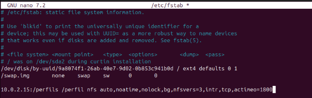

# Perfils mòbils i Compartició de Recursos

## Samba vs. NFS

En aquest apartat explorarem la compartició de recursos mitjançant NFS i Samba, així com la creació i configuració d'usuaris amb perfils mòbils. Es destacaran les diferències principals entre ambdós sistemes i es descriurà l'autenticació a nivell de host, a més de la configuració bàsica tant del servidor com del client per assegurar una integració eficient.

| Característica   | Samba                                                                 | NFS                                                                                      |
|------------------|-----------------------------------------------------------------------|------------------------------------------------------------------------------------------|
| Protocol         | SMB/CIFS                                                              | NFS                                                                                      |
| Entorn principal | Compartició de fitxers en entorns Windows (i també Linux, etc.)       | Compartició de fitxers en entorns Linux/Unix                                             |
| Autenticació     | Basada en usuaris i integrada amb dominis Windows (com Active Directory) | Basada en permisos i autenticació a nivell de host (permisos Unix)                        |
| Compatibilitat   | Compatible amb Windows, Linux i altres sistemes                       | Principalment dissenyat per a Linux/Unix; Windows pot actuar com a client NFS amb configuració addicional |
| Casos d'ús       | Ideal en entorns heterogenis on interactuen Windows i Linux           | Recomanat per a xarxes d'entorns Unix/Linux, amb alt rendiment en transferències de fitxers |
## Instal·lació del servei NFS en Linux

En aquest apartat instal·larem el servei NFS en el nostre servidor, que ja té el LDAP configurat. Primer actualitzarem la llista de paquets executant "apt update".

A continuació, instal·lem el servidor NFS amb la comanda.

`sudo apt install nfs-kernel-server`

Per comprovar que el servei s'està executant correctament, utilitzem.

`sudo systemctl status nfs-server`

Amb això, hem configurat la part del servidor per ara.

### Compartir un Directori

Per compartir un directori, primer el creem:

Posteriorment, assignem els permisos corresponents i configurem el propietari a "nobody:nogroup" per assegurar que tothom tingui accés:

**Seguidament hem de fer que aquesta carpeta sempre estigui muntada**

Per aconseguir-ho, utilitzarem el fitxer /etc/exports per afegir-hi la configuració corresponent. Obrim el fitxer amb:

`nano /etc/exports`

I afegim la següent línia:

`/compartida *(rw,sync,no_subtree_check)`

Després, reiniciem el servei NFS per aplicar els canvis. Cal fer-ho cada vegada que modifiquem la configuració:

`sudo systemctl restart nfs-kernel-server`

**Creem un fitxer dins del directori compartit**

Ara creem un fitxer dins del directori que hem compartit per verificar que la configuració és correcta.

I a continuació, procedim amb la configuració del client Windows per accedir al compartit.

## Client Windows

Per defecte, Windows no té activat el servei NFS. Per això, hem d'activar-lo.

Ens dirigim al Panell de control i seleccionem "Programas i características".

A continuació, triem l'opció "Turn Windows features on or off".

Cerquem NFS i obrim el desplegable. Farem clic a les tres opcions disponibles per activar el servei.

Un cop activat, configurem el client per accedir al recurs compartit. Per aconseguir-ho, obrirem l'Explorador de Fitxers i accedirem a "Aquest PC" > "Mapejar una unitat de xarxa".

Ara, introduïm la ruta al recurs compartit, afegint la IP del servidor i la carpeta compartida.

Acceptem i ja podem observar que s'ha compartit amb èxit.

Ara podem provar de crear un directori o fins i tot editar el fitxer que hem creat al servidor.

**Comprovem dins del nostre servidor**

Utilitzem la comanda ls -l per comprovar si s'han creat els fitxers o directoris des del client Windows. Podrem observar que els fitxers apareixen amb un usuari/grup representat només per números. Això es deu al fet que, en entorns NFS, les identitats d'usuari i grup es basen en identificadors numèrics (UID i GID). Si aquests identificadors no es corresponen amb entrades definides al sistema (o a LDAP), es mostraran simplement com a números.

## Client Linux

En aquesta secció es mostra el procés per muntar un directori compartit via NFS en un client Linux.

### Instal·lació del client NFS

Primer cal instal·lar els paquets necessaris per poder muntar sistemes de fitxers NFS al client:

`apt install nfs-common rpcbind`

**Creació del punt de muntatge i muntatge del directori compartit**

Un cop instal·lats els paquets necessaris, procedim a crear el directori on es muntarà el recurs compartit.

- Es navega fins al directori /mnt/.

- Es crea un directori anomenat nfs amb "mkdir nfs", que servirà com a punt de muntatge.

- Es canvien els permisos del directori nfs amb "chmod -R 777 nfs/" per donar accés complet a tots els usuaris.

- Es comprova que el directori s'ha creat amb "ls nfs/".

- Finalment, es munta la carpeta compartida del servidor NFS (10.0.2.15:/compartida) dins del directori /mnt/nfs/ amb la comanda:

`mount 10.0.2.15:/compartida /mnt/nfs/`

Amb aquests passos, el client Linux tindrà accés als fitxers compartits pel servidor NFS.

Per verificar que el muntatge s'ha realitzat correctament, podem utilitzar la comanda:

`df -h`

Aquesta ens mostrarà els sistemes de fitxers muntats, incloent-hi el nostre recurs NFS.

Un cop confirmat que el directori està muntat, podem accedir-hi i comprovar que conté els fitxers creats tant des del servidor com des del client Windows.

Si creem un nou directori des d'aquest client Linux, observem que apareix amb el propietari nobody:nogroup. Això es deu al fet que aquest client no té una correspondència d'usuaris amb el servidor NFS, i per tant, s'assignen aquests valors per defecte.

Aquesta situació es produeix perquè NFS gestiona els permisos mitjançant els UID (User ID) i GID (Group ID). Si el client Linux crea un fitxer amb un UID/GID que no existeix al servidor, aquest no el pot reconèixer i l’assigna automàticament com nobody:nogroup.

Aquest comportament també es deu a "root squash", una configuració predeterminada en /etc/exports que evita que root del client tingui privilegis en el servidor. Això pot afectar altres usuaris si no hi ha coincidència d'UIDs entre client i servidor.

## Perfils Mòbils

Crearem un directori anomenat "perfils", que serà utilitzat per emmagatzemar els perfils mòbils dels usuaris. Aquest directori tindrà com a propietari nobody:nogroup.

Assignem permisos 777 (lectura, escriptura i execució per a tots els usuaris). Tot i que això facilita les proves, no és recomanable en un entorn de producció, ja que podria suposar un risc de seguretat.

Configuració en /etc/exports

Perquè aquest directori pugui ser compartit a través de NFS, afegim la següent línia al fitxer /etc/exports:

`/perfils *(rw,sync,no_root_squash,no_subtree_check)`

Aquesta línia configura el directori "perfils" amb les següents opcions:

- *rw* → Permet lectura i escriptura des dels clients.

- *sync* → Escriu els canvis immediatament al disc per evitar pèrdues de dades.

- *no_root_squash* → Permet que root dels clients mantingui els seus privilegis en el servidor. Per defecte, NFS converteix root en nobody:nogroup, però amb aquesta opció s’evita aquest comportament.

- *no_subtree_check* → Desactiva la verificació de subarbres, millorant el rendiment i evitant problemes d’accés quan es comparteixen directoris sencers.

Finalment, reiniciem el servei NFS per aplicar els canvis:

`sudo systemctl restart nfs-kernel-server`

### Configuració de Perfils Mòbils amb LDAP

Primerament hem de crear un usuari, he creat un arxiu .ldif i he afegit els següents paràmetres.

Després l'afegim amb ldapadd i ho comprovem amb un search.

### Configuració del Client

Primer, crearem el directori on es muntarà el perfil mòbil i assignarem els permisos adequats.

A continuació, configurarem el fitxer /etc/fstab. MOLT DE COMPTE! Qualsevol error en aquest fitxer pot provocar un mal funcionament del sistema o fins i tot impedir que arrenqui.

Un cop editat, podem executar la comanda "mount -a" per muntar totes les unitats definides a /etc/fstab i verificar que el muntatge s'ha fet correctament.

Quan intentem iniciar sessió amb l'usuari "domin", el sistema crea automàticament el seu directori de perfil dins de "/perfil".

Finalment, obrim un terminal i comprovem que l'usuari està correctament identificat amb les comandes "whoami" i "id".

Amb això, ja tenim el perfil mòbil configurat correctament.