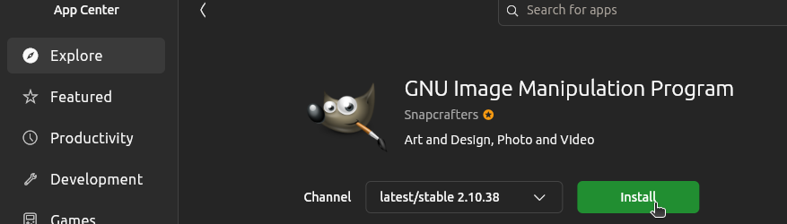
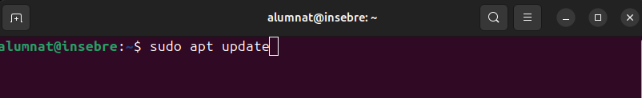
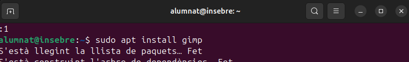
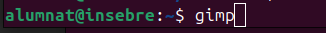
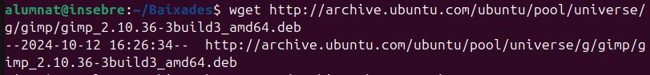
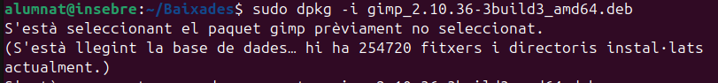
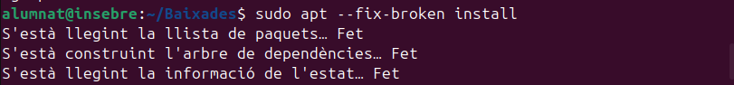
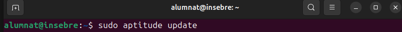
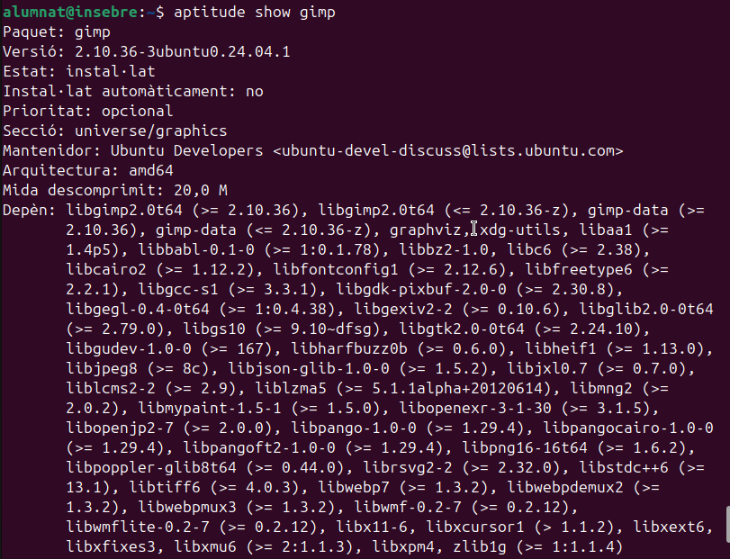

## Instal·lació bàsica de programes

Com a qualsevol (o gairebé qualsevol) SO, Ubuntu permet l'instal·lació de programari o *software* des de repositoris propis o externs i ens ofereix diferents mètodes. que veurem en aquest apartat, per fer possible aquesta instal·lació. Per als exemples intentarem instal·lar amb les diferents eines el **GNU Image Manipulator Program** .

### Instal·lació des de l'entorn gràfic

Ubuntu ofereix l'Ubuntu Software Center (més conegur com App Center), una interfície gràfica fàcil d'utilitzar per cercar, instal·lar i desinstal·lar aplicacions amb un sol clic. Només cal obrir la aplicació, buscar el programa desitjat, i fer clic a "Instal·lar".

### Instal·lació des de terminal

El programari també pot ser instal·lat des del terminal amb una serie d'eines i comandes. Algunes d'elles les veurem a continuació.

#### APT (Advanced Package Tools)

APT és una eina avançada de gestió de paquets que automatitza la instal·lació, actualització i eliminació de programes.

La comanda sudo apt update actualitza la llista de paquets disponibles des dels repositoris configurats, assegurant-se que el sistema tingui la informació més recent sobre versions i nous paquets. Després de realitzar un update, sovint es recomana executar sudo apt upgrade, que instal·la les versions més recents de tots els paquets ja instal·lats al sistema, mantenint-lo al dia. Si es volen actualitzar només alguns paquets específics sense tocar la resta, es pot utilitzar sudo apt install **nom_paquet** , que instal·la o actualitza el paquet especificat. En cas que sigui necessari eliminar un paquet, la comanda adequada és sudo apt remove **nom_paquet** , que desinstal·la el paquet, però deixa intactes els fitxers de configuració. Si es vol eliminar completament un paquet, incloent els fitxers de configuració, cal emprar sudo apt purge **nom_paquet** .

Per identificar paquets instal·lats o disponibles, es pot utilitzar apt search **nom_paquet** , que busca paquets per nom o descripció, o bé apt show **nom_paquet** , que proporciona informació detallada sobre un paquet específic, com la seva versió i dependències. Quan es vol netejar el sistema de paquets i biblioteques que ja no són necessaris, es pot fer servir sudo apt autoremove, que elimina automàticament els paquets orfes. Per a la neteja de paquets descarregats i emmagatzemats a la memòria cau (però no instal·lats), s'utilitza sudo apt clean, que allibera espai al sistema eliminant els fitxers de paquets descarregats.

##### Instal·lació de GIMP amb APT

1. Actualització de repositoris

2. Instal·lació paquets de GIMP.

3. Executar GIMP.

#### DPKG (Debian Package)

El gestor de paquets DPKG és una eina fonamental per gestionar paquets '.deb' manualment en sistemes basats en Debian, com Ubuntu.

Per instal·lar un paquet, s'utilitza la comanda sudo dpkg -i **nom_paquet'**.deb, que instal·la el paquet especificat des d'un fitxer .deb local. Si durant la instal·lació es produeixen errors per dependències trencades, es poden reparar amb sudo apt --fix-broken install. Per consultar els paquets instal·lats en el sistema, s'utilitza dpkg -l, que mostra una llista de tots els paquets instal·lats, incloent la seva versió i estat.

Si necessites verificar si un paquet específic està instal·lat, pots utilitzar dpkg -s **nom_paquet** , que mostra la informació de l'estat del paquet. Per desinstal·lar un paquet mantenint els fitxers de configuració, s'usa la comanda sudo dpkg -r **nom_paquet** , mentre que si es vol eliminar el paquet i tots els fitxers associats, incloent les configuracions, es fa servir sudo dpkg --purge **nom_paquet**.

En cas que vulguis veure el contingut d'un paquet .deb sense instal·lar-lo, pots fer servir dpkg -c **nom_paquet** .deb per llistar els fitxers del paquet. Si el que vols és extreure informació sobre els fitxers que s'han instal·lat des d'un paquet concret, la comanda adequada és dpkg -L **nom_paquet** . Finalment, per reinstal·lar un paquet, pots utilitzar sudo dpkg --configure -a, que reconfigura els paquets pendents de configuració, especialment útil quan s'han interromput instal·lacions.

##### Instal·lació de GIMP amb DPKG

1. Descarregem l'últim paquet '.deb' de GIMP utilitzant la comanda **wget**

2. Instal·lem el paquet Debian amb la comanda **sudo dpkg -i 'nom_paquet'** .

3. Corretgim les dependpencies que s'han pogut trovar trencades.

4. Executem GIMP.

#### Aptitude

Aptitude és un gestor de paquets avançat que ofereix més control sobre la instal·lació i gestió de paquets en comparació amb altres eines com apt o dpkg. És especialment útil per resoldre conflictes de dependències. A continuació es detallen algunes de les comandes més utilitzades d'aptitude i les seves funcions.

Per instal·lar un paquet, s'utilitza la comanda sudo aptitude install **nom_paquet** , que descarrega i instal·la el paquet especificat juntament amb totes les seves dependències. Si el que necessites és eliminar un paquet, pots utilitzar sudo aptitude remove **nom_paquet** , que elimina el paquet però manté els seus fitxers de configuració. Si vols una eliminació completa, incloent els fitxers de configuració, has d'usar sudo aptitude purge **nom_paquet** .

Per actualitzar la llista de paquets disponibles als repositoris configurats, s'executa sudo aptitude update. Aquest pas és important per assegurar que tens les últimes versions disponibles. Si vols actualitzar els paquets instal·lats al sistema, pots utilitzar la comanda sudo aptitude upgrade, que actualitza tots els paquets disponibles sense eliminar ni instal·lar nous paquets. Si desitges una actualització més agressiva que també permeti eliminar i instal·lar nous paquets per completar l'actualització, la comanda adequada és sudo aptitude full-upgrade.

Aptitude també permet cercar paquets amb aptitude search **nom_paquet** , que retorna una llista dels paquets que coincideixen amb el criteri de cerca. Per obtenir més informació sobre un paquet específic, incloent-ne la descripció, versió i dependències, es pot utilitzar aptitude show **nom_paquet** . Finalment, per netejar els paquets que ja no són necessaris, es pot utilitzar sudo aptitude autoclean o sudo aptitude clean. La primera només elimina els paquets que ja no són necessaris però encara tenen versions disponibles, mentre que la segona elimina tots els paquets emmagatzemats a la memòria cau.

##### Instal·lació de GIMP amb APTITUDE

Actualitzem la llista de paquets disponibles al sistema amb la següent comanda

Instal·lem GIMP amb la comanda corresponent.

Si vols revisar les dependències o paquets relacionats abans de la instal·lació, pots fer-ho utilitzant **aptitude show 'nom_programa'** .

Executem el programa amb la comanda adequada.

### Afegir repositoris 

Afegir repositoris a Ubuntu permet accedir a *software* que no està disponible als repositoris oficials del SO, com versions més recents o programes propietaris (Google i les seves aplicacions o controladors de hardware...). A més, facilita les actualitzacions. Els repositoris són fonts segures i verificades que permeten instal·lar i actualitzar *software* de manera senzilla.