# Ús dels permisos amb <code>chown</code>, <code>chgrp</code> i <code>chmod</code>

Per aquesta demostració, hem creat 4 usuaris per exemplificar com aplicar els permisos amb les comandes <code>chown</code>, <code>chgrp</code> i <code>chmod</code>.

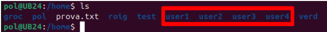

A més, hem creat un grup anomenat **group1** específicament per a aquesta demostració.

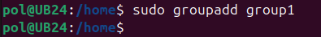

## Creació d'un directori

Comencem creant un nou directoria que anomenarem **carpeta1** per exemplificar:

```sudo mkdir nomDirectori```

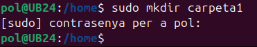


## Assignació de grup propietari del directori

Afegim el **group1** com a propietari del directoria **carpeta1** utilitzant <code>chown</code> (*CHange OWNer* o Canviar Propietari)

```sudo chown :nomGrupPropietari nomDirectori```

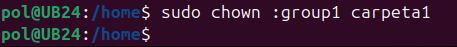


## Assignació de permisos del directori

Utilitzarem la comanda <code>chmod</code> (*CHange MODe* o Canviar Mode) per ajustar els permisos segons requereixi. En aquest cas atorgarem permisos 770. Amb aquest permisos, tant l'usuari propietari com el grup gaudiran de permisos per llegir, escriure i executar. Altres usuari no tindran cap tipus de permís sobre el directori.

```sudo chmod XXX nomDirectori/```

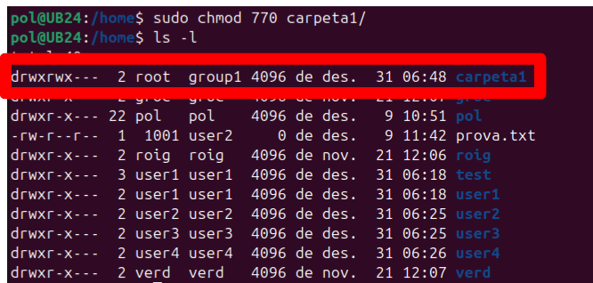

Si ens fixem, els permisos <code>drwxrwx---</code> indiquen que:

- **d**: La primera lletra indica que és un directori.

- **rwx**: El propietari del directori (en aquest cas, root) té permisos de lectura (r), escriptura (w) i execució (x).

- **rwx**: El grup (en aquest cas, group1) també té permisos de lectura (r), escriptura (w) i execució (x).

- ***---***: Altres usuaris no tenen cap permís (no poden llegir, escriure ni executar).

En resum, el directori carpeta1 és accessible i editable pel propietari (**root**, el qual encara no hem modificat i per tant el rol d'usuari propietari queda en mans del creador del directori) i el grup (**group1**), però ningú més pot accedir-hi ni modificar-lo.


### Per comprovar

Intentem accedir al repositori amb algun dels usuaris que hem creat, que no es troben al **group1**.

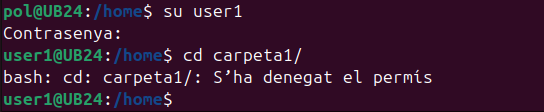

Com es pot observar, l'accés és denegat. Això es deu al fet que l'usuari **user1** encara no forma part del grup **group1** i, per tant, no té els permisos necessaris per accedir al directori.


### Modificacions requerides: donar als usuaris accès al grup propietari

Afegim els usuaris dins del **group1**.

```sudo usermod -aG nomGrup nomUsuari```

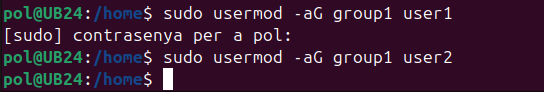

Comprovem que els usuari estan dins del **group1**.

```cat /etc/group | grep nomGrup```


Entrem un altre cop amb l'usuari amb que havíem intentat accedir anteriorment. Si ens permet accedir, provarem a crear un fitxer i un directori dins de **carpeta1**.

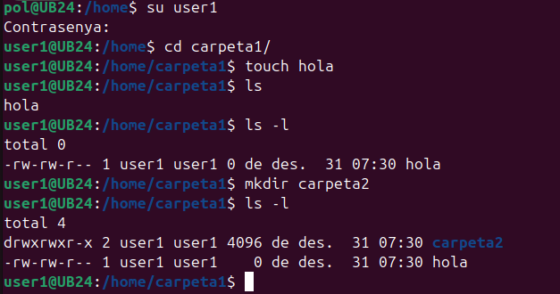

Com es pot observar, s'han creat correctament i l'usuari i grup propietari d'aquests és **user1**.


## Esborrat de fitxers i directoris

Entrem amb l'altre usuari que hem posar al **group1** i intentem esborrar el directori i el fitxer creats per **user1**.

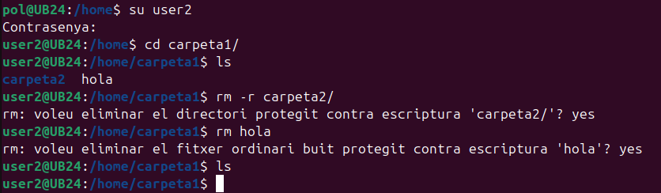

Com es pot observar, els fitxers han estat esborrats. Aixó no és desitjable, ja que els fitxers eren propietat d'altres usuaris i haurien d'estar protegits.

Més endavant, explicarem detingudament la **restricció de fitxers** que haguès estat necessaria perquè això no passi.


## Herència de grup

El **bit SGID** (*Set Group ID*) és una característica del sistema de permisos en Linux que assegura que els fitxers i directoris creats dins d’un directori **hereten el grup propietari del directori pare** en lloc del grup predeterminat de l’usuari que els crea.

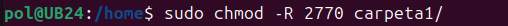

### Com funciona <code>chmod 2XXX</code>?

**Bit SGID (2)**:

Activa l'**herència de grup**, garantint que:

- Els fitxers i directoris creats dins d’un directori amb SGID activat heretin automàticament el grup propietari del directori pare.

- Això assegura que tots els fitxers i directoris dins del directori comparteixin el mateix grup, facilitant el treball col·laboratiu.

**Permisos XXX** (770 seguint l'exemple):

Configura els permisos del directori amb el següent significat:

- **7 (Propietari)**: Permet llegir, escriure i executar.

- **7 (Grup)**: Permet als membres del grup llegir, escriure i executar.

- **0 (Altres)**: No dona cap permís als usuaris que no són ni el propietari ni membres del grup.

Amb aquests permisos:

- Només el propietari i els membres del grup poden accedir al directori o modificar el seu contingut.

- Altres usuaris queden completament exclosos.


### Beneficis de <code>chmod 2770</code>

**Seguretat**:

- Es limita l’accés al directori exclusivament al propietari i als membres del grup.

- Els usuaris no autoritzats no poden veure, modificar ni esborrar el contingut del directori.

**Col·laboració**:

- L’herència de grup assegura que els fitxers i directoris creats dins del directori comparteixin el mateix grup, facilitant la col·laboració entre els membres.

**Control**:

- Garanteix que només el propietari i els membres del grup tinguin permisos per gestionar els fitxers, mantenint una estructura de permisos clara i coherent.


### Situacions recomanades per utilitzar la configuració <code>2770</code>

La configuració amb chmod 2770 és especialment útil en entorns on:

- Diversos usuaris treballen conjuntament en un projecte. 

- Els fitxers i directoris han de ser accessibles només per als membres del grup. 

- És important mantenir la seguretat i coherència dels permisos en un entorn compartit.

Amb aquesta configuració, es pot assegurar un control adequat dels fitxers i una col·laboració eficaç en projectes d’equip.


## ACL

Una **ACL** (*Access Control List*) és una llista que defineix permisos específics per a usuaris o grups sobre un fitxer o directori en sistemes operatius com Linux. A diferència dels permisos tradicionals de Linux (propietari, grup i altres), les ACL permeten una configuració més granular, com donar permisos diferents a usuaris o grups específics.

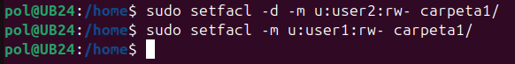

D'aquesta manera:

- **user1**: Pot llegir, escriure i esborrar fitxers, ja que està al grup i no té restriccions addicionals.

- **user2**: Pot llegir i escriure fitxers dins de Carpeta1, però no pot esborrar-los perquè no és el propietari.


### Permisos actuals del directori <code>carpeta1</code>

**Permisos del directori**

| **Tipus**         | **Usuari/Grup** | **Permisos** | **Descripció**                                  |
|-------------------|-----------------|--------------|-------------------------------------------------|
| **Propietari**     | `root`          | `rwx`        | El propietari té permisos complets.             |
| **Usuari específic** | `user2`        | `rw-`        | Pot llegir i escriure, però no executar ni esborrar. |
| **Grup**           | `group1`        | `rwx`        | Els membres del grup tenen permisos complets.   |
| **Mask**           | `-`             | `rwx`        | Defineix el màxim permès pels ACLs.             |
| **Altres**         | `-`             | `---`        | Els altres usuaris no tenen cap accés.          |


**Permisos predeterminats per a nous fixers**

| **Tipus**         | **Usuari/Grup** | **Permisos** | **Descripció**                                  |
|-------------------|-----------------|--------------|-------------------------------------------------|
| **Propietari**     | `root`          | `rwx`        | Els nous fitxers tindran permisos complets per al propietari. |
| **Usuari específic** | `user2`        | `rw-`        | Els nous fitxers tindran permisos de lectura i escriptura, però no d'execució. |
| **Grup**           | `group1`        | `rwx`        | Els nous fitxers tindran permisos complets per al grup. |
| **Mask**           | `-`             | `rwx`        | Defineix el màxim permès pels ACLs predeterminats. |
| **Altres**         | `-`             | `---`        | Els altres usuaris no tindran accés als nous fitxers. |


### Comprovació de les ACL

Per verificar si s'ha aplicat correctament la configuració de la ACL, utilitzem la següent comanda:

```getfacl nomDirectori/```

La sortida hauria de mostrar els permisos configurats actualment per al directori.

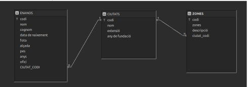


### Ús de les ACL

**Pas 1: Crear un fitxer amb <code>user1</code>.**

Entrem amb l'usuari **user1** i creem un directori o un fitxer dins de **carpeta1**.

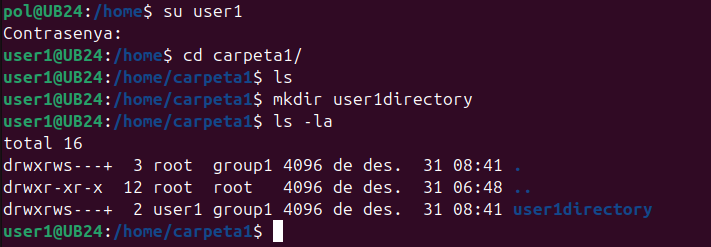

**Pas 2: Intentem accedir amb <code>user2</code>.**

Ara entrem amb l'usuari **user2** i intentem accedir a **carpeta1** o llegir els fitxers.

- *Resultat esperat*: No podem accedir al directori ni llegir els fitxers. Només podem veure que existeix la carpeta, però no tenim informació sobre els permisos ni el seu contingut.

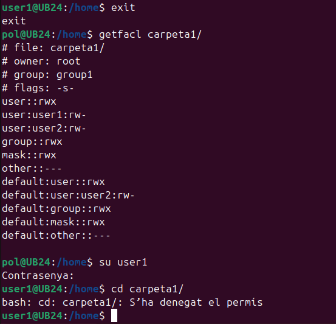

**Pas 3: Afegim permisos per a <code>user2</code> amb ACL.**

Per permetre que **user2** pugui accedir a la carpeta, llegir, modificar i executar fitxers, afegim permisos **rwx** (*Reading, Writing, eXecution*) dins de l'ACL.

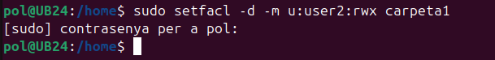

**Compte!** Amb aquesta configuració, el **user2** pot llegir, escriure i també esborrar els fitxers dins de **carpeta1**. Per evitar que el **user2** pugui esborrar els fitxers d'altres usuaris, cal activar el **Sticky Bit**, com veurem a continuació.


## Sticky Bit

### Què és Sticky Bit?

**Sticky Bit** és una característica que s'utilitza en sistemes Linux per protegir els fitxers en directoris compartits. Quan s'activa, només el **propietari del fitxer** o un **administrador** pot esborrar-lo, encara que altres usuaris tinguin permisos d'escriptura al directori.


### Com funciona?

En un directori compartit, com ara <code>/carpeta1</code>: 

- Els usuaris poden crear i editar fitxers lliurement. 

- Amb el Sticky Bit, un usuari no pot esborrar els fitxers d'altres usuaris, però sí els seus propis.

Per evitar que **user2** o qualsevol altre usuari pugui esborrar fitxers que no són seus, afegim el **Sticky Bit** al directori. Això assegura que només el propietari del fitxer o un administrador pot esborrar-lo.


#### Exemple pràctic

Entrem amb el **user1**, creem un directori i un fitxer. Posteriorment, entrem amb el **user2** i intentem esborrar els fitxers de l'usuari **user1**, però no es poden esborrar per falta de permisos. Tot i això, podem crear fitxers propis dins del directori.

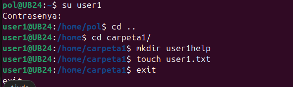

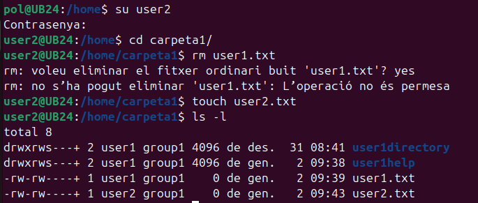

Amb aquesta configuració:

- **user1** pot crear fitxers i directoris, i només ell pot esborrar els seus fitxers. 
- **user2** pot accedir, llegir i escriure fitxers dins de <code>/carpeta1</code>, però no pot esborrar els fitxers d'altres usuaris.


## Umask

**Umask** és una configuració en sistemes Linux que controla els permisos que tindran els fitxers i directoris nous quan es creïn. En altres paraules, determina qui podrà accedir o modificar aquests fitxers o directoris per defecte.

**Com funciona?**

- Quan es crea un fitxer o directori nou, el sistema li assigna uns permisos predeterminats.

- Umask resta alguns permisos d'aquests valors predeterminats per garantir la seguretat i el control d'accés.

**Valors predeterminats**:

- **Fitxers**: Els permisos inicials són 666 (lectura i escriptura per a tothom, però sense execució).

- **Directoris**: Els permisos inicials són 777 (lectura, escriptura i execució per a tothom).

**Per què és important?**

Umask ajuda a controlar la seguretat i la col·laboració en un sistema: 

- **Seguretat**: Evita que altres usuaris tinguin accés complet als teus fitxers per defecte. 

- **Col·laboració**: Permet ajustar els permisos perquè els membres del teu grup puguin treballar amb els teus fitxers si cal.


### Canviar <code>Umask</code> temporalment i crear un fitxer

Primerament comprovem el valor actual de la **umask**


Amb això podem concloure que:

- L'**user2** té configurada la **umask** com <code>0002</code>, permetent que els fitxers nous siguin accessibles per al grup.

- **user2** crea un fitxer de text anomenat <code>umask.txt</code>.

**Permisos del fitxer:**

En fer <code>ls -l</code>, els permisos són <code>-rw-rw----</code>, indicant que:

- El propietari i el grup poden llegir i escriure.

- Altres no tenen cap accés.

**Assignació d'una umask diferent**

Assignem una **umask** més restrictiva i creem un fitxer anomenat <code>hello</code>.

```umask 0077```

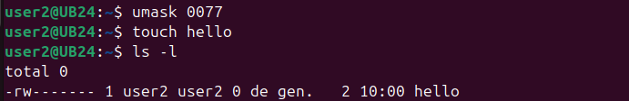

**Comprovació dels permisos**:

En fer <code>ls -l</code>, els permisos són <code>-rw-------</code>, indicant que:

- Només el propietari pot llegir i escriure.

- El grup i altres no tenen cap accés.

**Explicació**:

Amb la umask configurada com <code>0077</code>:

- Els fitxers són completament privats.

- Aquesta configuració és útil per garantir la seguretat en fitxers sensibles.

> **NOTA!** La configuració de la **umask** no s'aplicarà si el directori on es creen els fitxers té permisos configurats amb **ACLs**. En aquest cas, els permisos dels fitxers i directoris nous heretaran les configuracions de l'**ACL**, independentment del valor de la **umask**.

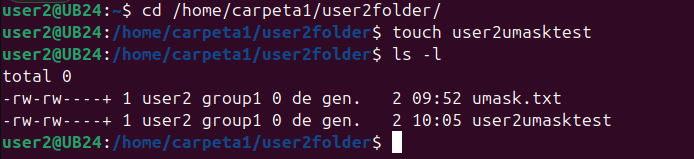


## SGID

**SGID** (*Set Group ID*) és un permís especial en sistemes Unix/Linux que permet que un fitxer o directori hereti el grup propietari de l'arxiu o carpeta en lloc del grup de l'usuari que el va crear.


### Funcionament amb fitxers

Quan un programa amb **SGID** s'executa, funciona amb els permisos del grup propietari del fitxer. Això és útil per assegurar que els processos heretin permisos del grup correcte.

**Configuració de SGID en un fitxer**:

```chmod g+s fitxer```


### Funcionament amb directoris

Quan **SGID** està activat en un directori, qualsevol fitxer creat dins d'aquest heretarà el grup propietari del directori en lloc del grup de l'usuari que el va crear. Això facilita la col·laboració en grups.

**Configuració de SGID en un directori**:

```chmod g+s directori```

#### Notes

L'ús de **SGID** en directoris és especialment útil per a projectes col·laboratius, on diversos usuaris necessiten compartir fitxers dins d'un mateix grup.

Per eliminar el permís **SGID** d'un fitxer o directori:

```chmod g-s fitxer_o_directori```


## SUID

**SUID** (*Set User ID*) és un permís especial en sistemes Unix/Linux que permet que un programa s'executi amb els privilegis del propietari del fitxer, en lloc de l'usuari que l'executa. Això és útil per a certs programes que necessiten permisos elevats per funcionar correctament, com ara aquells que accedeixen a recursos restringits del sistema.


### Exemple d'ús de SUID

En aquest exemple, veurem com configurar **SUID** per a un programa escrit en C, permetent a un usuari sense privilegis accedir al directori <code>/root</code>.

#### Passos a seguir

**Posar-se com a root**

Primer, assegura't d'executar tots els passos següents com a usuari **root**:

```sudo su```

**Crear l'arxiu script.c**

Crea un fitxer anomenat <code>script.c</code> i afegeix el següent codi:


```#include <stdio.h>```  
```#include <dirent.h>```  
``` ```
```int main() {```  
```    struct dirent *entry;```  
```    DIR *dp = opendir("/root");```  
```    if (dp == NULL) {```  
```        perror("No s'ha pogut obrir /root");```  
```        return 1;```  
```    }```  
```    printf("Contingut de /root:\n");```  
```    while ((entry = readdir(dp))) {```  
```        printf("%s\n", entry->d_name);```  
```    }```  
```    closedir(dp);```  
```    return 0;```  
```}```

Aquest codi intenta obrir el directori <code>/root</code> i llistar el seu contingut.

**Compilar el codi**

Compila el codi per generar un executable (si no has intal·lat **GCC** absans fes un <code>sudo apt install gcc</code>):

```sudo gcc script.c -o script```

**Assignar permisos d'execució i SUID**

Ara, dona permisos d'execució al programa i configura SUID:

```sudo chmod +x script```  
```sudo chmod u+s script```  

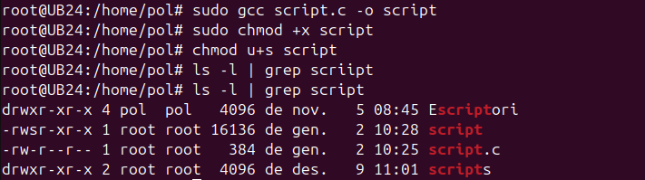

**Provar amb un usuari sense privilegis**

Connecta't amb un usuari que no formi part del grup de *sudoers*, per exemple, **user1**.

Executa l'script:

```./script```

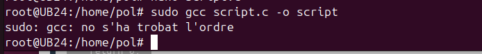

Si s'ha configurat correctament, l'usuari **user1** podrà veure el contingut del directori <code>/root</code>.