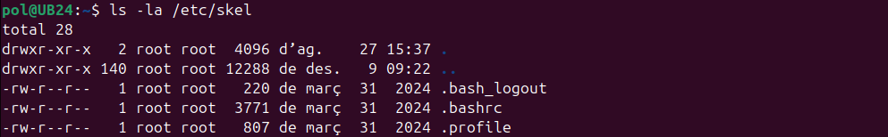
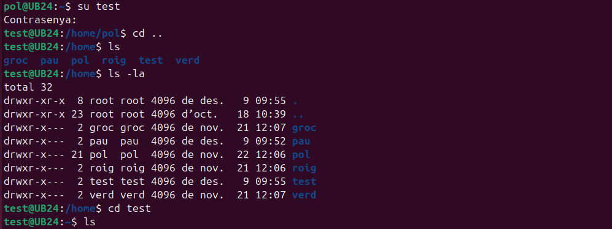
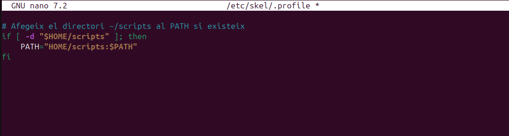
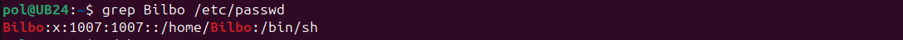
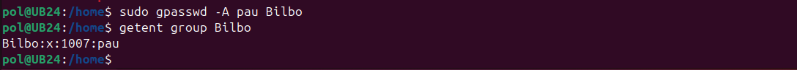

# Gestió d'usuaris

A continuació, es detallen diverses comandes per
gestionar usuaris en un sistema Linux. En aquest exemple, utilitzarem els noms d'usuari "pau" i "mike".

## Afegir un nou usuari

Per afegir un nou usuari amb el nom "pau", utilitzem la següent comanda:

```sudo adduser pau```


Ens demanarà la contrasenya i més informació sobre "David", com el nom complet i el telèfon, entre d'altres.

#### Inici de sessió

Comprovem que l'usuari pot iniciar sessió correctament. Podem observar que "David" està creat i ens demana la contrasenya per accedir-hi.


#### Confirmació d'usuari

La comanda <code>whoami</code> ens confirma que l'usuari és "David" i que la seva carpeta d'usuari (<code>home</code>) està creada correctament.


## Eliminar un usuari sense eliminar la seva carpeta personal

Si volem eliminar un usuari (en aquest cas serà <code>pau</code>, que hem creat anteriorment) però mantenir la seva carpeta personal, podem utilitzar la comanda

```sudo deluser pau```

> **Nota:** La carpeta <code>/home/pau</code> no es perd.


## Comprovació de la carpeta personal

Comprovem si és veritat que la carpeta no s'ha esborrat per a l'usuari <code>pau</code>. Com es pot observar a la imatge, la carpeta existeix amb tots els documents. Això pot ser útil si un usuari abandona l'empresa però després torna, ja que seguirà tenint accés a la seva informació.


## Eliminar un usuari i la seva carpeta personal 

Per eliminar un usuari, incloent la seva carpeta personal i tots els seus fitxers, utilitzarem:

```sudo rm -rf /home/*nomUsuari*```
```sudo userdel -r *nomUsuari*```

> **Nota:** La comanda <code>userdel -r</code> esborra l'usuari especificat juntament amb el seu directori <code>home</code>.


## Bloquejar un usuari

Per bloquejar l'accès d'un usuari utilitzem:

```sudo usermod -L *nomUsuari*```

> Si la segona columna conté un ! al principi (**ex. pau:!:$y$j9T$eqz.gXACdgxhb6wt3h370...**), significa que l'usuari <code>pau</code> està bloquejat.


## Desbloquejar un usuari

Si volem desbloquejar un usuari, executarem la següent comanda:

```sudo usermod -U *nomUsuari*```


> Com es pot observar la segona columna no conté el signe d'exclamació que marca l'usuari com a blocat.


## Creació d'un usuari sense carpeta personal

Quan es crea un usuari a Linux, és possible que no es generi automàticament la seva carpeta personal. Això passa si s'utilitza la comanda <code>useradd</code> sense opcions addicionals.

##### Exemple de creació

Si es crea un usuari com **mike** amb la comanda **useradd mike**, no es crearà la seva carpeta /home/miquel.


La comanda <code>useradd</code> no crea un directori personal per a l'usuari per defecte. Per fer-ho, s'ha d'utilitzar l'opció <code>-m</code>.

#### Creació manual de la carpeta personal

Si l'usuari ja existeix i no té carpeta personal, es pot crear manualment. Després, cal canviar el propietari de la carpeta perquè sigui de l'usuari.

```sudo mkdir /home/*nomUsuari*```

Un cop creada ens interessarà que el propietari i administrador de la carpeta sigui aquell usuari específic. Això ho podrem fer amb la comanda <code>chown</code>.

```sudo chown *nomUsuari*:*nomUsuari* /home/*nomUsuari*/```


També es pot utilitzar la comanda <code>useradd -m</code>, que crea automàticament la carpeta <code>/home/</code> per al nou usuari.

> Cal tenir en compte que <code>useradd -m</code> no crea una contrasenya per a l'usuari; això s'ha de fer amb <code>sudo passwd miquel</code>.


## Configuració per defecte d'usuaris en Linux

Aquest apartat del document descriu els passos necessaris per configurar els paràmetres per defecte dels nous usuaris en un sistema Linux, incloent la configuració de contrasenyes i altres paràmetres generals.

### Configuració del fitxer <code>/etc/default/useradd</code>

El fitxer <code>/etc/default/useradd</code> permet definir els valors per defecte per als nous usuaris, com ara la ubicació del directori home i l'intèrpret de comandes predeterminat.

```sudo nano /etc/default/useradd```

#### Procediments de configuració

1. Edita el fitxer <code>/etc/default/useradd</code>

- Modifica o afegeix les següents línies:

```HOME=/home```
```SHELL=/bin/sh```
```INACTIVE=-1```
```EXPIRE=```
```SKEL=/etc/skel```
```CREATE_MAIL_SPOOL=yes```


Aquestes opcions adicionals estableixen que:

- **INACTIVE=-1**: El compte no es desactivarà mai per manca d'activitat.

- **EXPIRE=**: No hi ha data d'expiració del compte.

- **SKEL=/etc/skel**: S'utilitzarà el directori /etc/skel per copiar els fitxers per defecte al directori home del nou usuari.

- **CREATE_MAIL_SPOOL=yes**: Es crearà una bústia de correu per al nou usuari.

- **HOME=/home**: Estableix el directori <code>home</code> predeterminat per als nous usuaris a <code>/home</code>.

- **SHELL=/bin/sh** Especifica que el shell predeterminat per als nous usuaris serà /bin/sh (el shell Bourne).

Aquesta configuració assegura que els nous usuaris tinguin el seu directori <code>home</code> a <code>/home/**nomUsuari**</code> i utilitzin /bin/sh com a shell per defecte.


#### Política de contrasenyes

El fitxer <code>/etc/login.defs</code> defineix les polítiques de seguretat relacionades amb les contrasenyes.

#### Configuració de seguretat

1. Edita el fitxer <code>/etc/login.defs</code>

```sudo nano /etc/login.defs```

2. Configura els següents paràmetres:

```PASS_MAX_DAYS 100```
```PASS_WARN_AGE 5```
```PASS_MIN_DAYS 0```


Aquesta configueació determina:

- **PASS_MAX_DAYS**: Els dies màxims abans que caduqui la contrasenya (90 dies)

- **PASS_WARN_AGE**: Els dies d'avís abans de la caducitat (7 dies)

- **PASS_MIN_DAYS**: El mínim de dies que un usuari ha de esperar abans de poder canviar la seva contrasenya (0 dies).

Si vulguèssim indicar, per exemple, un requeriment d'un nombre mínim de caràcters per la contrasenya editariem el següent paràmetre a l'arxiu <code>/etc/pam.d/</code>.

```PASS_MIN_LEN```


## Configuració del directori <code>/etc/skel</code>

El directori <code>/etc/skel</code> conté els fitxers i directoris que es copiaran automàticament al directori home dels nous usuaris.

#### Gestió de fitxers per defecte

1. Examina el contingut actual:

```ls -la /etc/skel```

2. Personalitza els fitxers segons les teves necessitats:

    - <code>.bashrc</code>, <code>.profile</code>, .<code>.bash_logout</code>, ...



#### Funsons dels fitxers del <code>/etc/skel</code>

### <code><b>.bash_logout</b></code>

Aquest fitxer s'executa automàticament quan l'usuari finalitza una sessió interactiva. És útil per:

- Netejar recursos o processos temporals.

- Mostar missatges de finalització de sessió.

- Executar scripts de manteniment personalitzats.

##### Exemple de personalització del fitxer <code>.bash_logout</code>

Afegir una línia per netejar l'historial de comandes i mostrar un missatge d'acomiadament.

1. Comprovem l'historial amb la comanda <code>history</code>


2. Afegim aquestes línies dins l'arxiu <code>.bash_logout</code>

```sudo nano /etc/skel/.bash_logout```


Això detemina que:

- **hisotry -c**: L'hisotrial de comandes de la sessió actual s'esborrarà sense afectar l'arxiu persistent <code>~/.bash_history</code>

- **echo "Larga y próspera vida"**: Es mostrarà el missatge escrit entre cometes quan tanquem la sessió.

##### Comprovació

Per posar a prova la modificació de l'arxiu <code>.bash_logout</code> crearem un nou usuari i mirarem que passa quan tanquem la seva sessió.



Hem canviat l'usuari al nou usuari <code>test</code> i hem executat unes poques comandes per crear un petit historial.


Podem veure que quan tanquem la sessió apareix el missatge que havíem indicat (sempre i quan abans haguem obert la sessió del nou usuari al menys una vegada en entorn gràfic).

> Es podria eliminar l'historial complet esborrant l'arxiu amb <code>rm -f ~/.bash_history</code> o sobreescrivint-lo amb  <code>~/.bash_history</code>.

### <code><b>.bashrc</b></code>

- Aquest és un dels fitxers de configuració més importants per a l'usuari.

- S'executa cada vegada que l'usuari inicia una nova sessió de shell <code>Bash</code>.

Conté definicions de variables d'entorn, aliases, funcions i altres configuracions personalitzades per a l'usuari.

##### Exemple de personalització del fitxer <code>.bashrc</code>

Podem editar l'arxiu i afegir algun *alias* més.

```sudo nano /etc/skel/.bashrc```


Comprovem


### <code><b>.profile</b></code>

Aquest fitxer s'executa durant l'inici de sessió. És útil per configurar variables d'entorn i altres ajustaments globals per a l'usuari. Exemples d'ús inclouen:

- Configuració de variables d'entorn, com ara <code>PATH</code>.

- Personalització del prompt o altres configuracions de shell.

- Execució d'altres fitxers de configuració, com <code>.bashrc</code>, si està disponible.

##### Exemple de personalització del fitxer <code>.bashrc</code>

Per exemplificar la personalització d'aquest fitxer afegirem un directori personalitzat al **PATH**.

Això permet als usuaris tenir un directori dedicat als seus scripts i assegurar-se que aquests es poden executar des de qualsevol lloc sense especificar rutes completes.

```if [ -d "$HOME/scripts" ]; then```
```     PATH="$HOME/scripts:$PATH"```
```fi```

Accedirem al fitxer amb la següent comanda i especificarem l'escript que hem indicat abans.

```sudo nano /etc/skel/.profile```



A continuació, crearem el directori, l'escript i també donem permisos d'execució

```sudo mkdir ~/scripts```
```sudo nano ~/scripts/hello.sh```


```sudo chmod +x ~/scripts/hello.sh```
```source ~/.profile```


Executem l'escript. Tan sols hem d'escriure <code>hello.sh</code>


> **Nota**:

> - Aquesta configuració detecta automàticament si el directori scripts existeix al directori home de l'usuari.

> - Si el directori no existeix, la configuració no afecta el PATH, assegurant que no es generen errors.

> - És ideal per sistemes on els usuaris necessiten executar scripts personalitzats amb freqüència.

> - **Consell**: Qualsevol fitxer que afegeixis a <code>/etc/skel</code> es copiarà automàticament al directori home dels nous usuaris.

## Creació d'usuaris

### Mètode amb paràmetres específics

```sudo useradd -m *nomUsuari*```


##### Comprovació de l'usuari

```grep *nomUsuari* /etc/passwd```



Es pot observar que s'ha creat correctament i també se li ha creat la seva carpeta dins del <code>/home/</code>.


Entrem amb l'usuari i comprovem la identitat.


> **IMPORTANT** Després de crear un nou usuari, verifica sempre que pots iniciar sessió correctament abans de tancar la sessió d'administrador.


## Comandes addicionals de gestió d'usuaris i grups

### Assignació de propietat i grup d'usuaris

En un sistema Linux, que un usuari sigui el **propietari** d’un fitxer és **important** perquè el propietari té control sobre els **permisos** i pot decidir qui pot ***llegir, escriure o executar*** aquest fitxer. Això és essencial per a la **seguretat**, ja que garanteix que només els usuaris autoritzats puguin modificar o accedir a informació sensible.

#### Configuració de propietari i grup d'un directori o fitxer

##### <code>chown</code>: 
Aquesta comanda permet assignar un usuari i un grup com a propietaris d'un fitxer o directori. Això és útil per establir qui té control sobre els permisos d'aquests fitxers o directoris.

Exemple:

- Crearem un fitxer de prova i li assignarem el propietari i grup a <code>pau</code> i <code>pau</code>.


Amb la comanda següent, assignem l'usuari i el grup <code>pau</code> com a propietaris del fitxer <code>prova.txt</code>:

```sudo chown pau:pau prova.txt```

Un cop executada aquesta comanda comprovarem amb <code>ls -la</code>.


##### <code>chgrp<code>:

Canvia només el grup propietari.

```sudo chogrp Bilbo prova.txt``` - Canvia el grup a <code>Bilbo</code> sense alterar el propietari <code>pau</code>.


##### <code>chgrp<code>:

Estableix o canvia la contrasenya d'un usuari.

```sudo passwd *nomUsuari*```


#### Assignar una Shell per defecte 

##### Què és una Shell?

En un sistema Linux, una **shell** és una interfície que permet als usuaris interactuar amb el sistema operatiu a través de línies de comanda. Actua com un "intèrpret" de comandes, processant i executant ordres que l'usuari escriu, com la creació de fitxers, el seu desplaçament o l'execució de programes.

Quan un usuari inicia sessió al sistema, la shell és l'entorn on treballa i des d'on pot executar les seves ordres. Les shells més comunes inclouen **sh**.

##### Diferència entre <code>/bin/bash</code> i <code>/bin/sh</code>

<code><b>/bin/bash</b></code>: <b>Bash</b> (Bourne Again SHell) és una shell avançada, basada en la shell oriMiquell de Unix, sh. Ofereix característiques addicionals com històric de comandes, completat de comandes, manipulació d'arxius millorada, entre altres.

> És la shell per defecte en moltes distribucions de Linux.

<code><b>/bin/sh</b></code>: <b>Sh</b> (Bourne Shell) és la shell oriMiquell de Unix, més simple i amb menys funcionalitats que Bash. Sovint és un enllaç a una shell més lleugera com Dash en sistemes amb requisits mínims. S'utilitza per garantir compatibilitat bàsica amb scripts.

##### Exemple en <code>/etc/passwd</code>

> pau:x:1001:1001:,,,:/home/pau:/bin/bash

> mike:x:1002:1002:,,,:/home/mike:/bin/sh

<code><b>chsh -s</b></code>: Aquest comandament permet establir la shell per defecte d'un usuari. Si ets l'usuari que vols modificar, pots utilitzar-lo sense necessitat de permisos d'administrador.

```chsh -s /bin/bash *nomUsuari* (per a usuaris amb shell /sh)```
```chsh -s /bin/sh *nomUsuari* (per a usuaris amb shell /bash)```

També es podria executar amb <code>sudo chsh -s /bin/xxx nomUsuari</code> per canviar la shell d'un altre usuari si tens permisos d'administrador.

```sudo chsh -s /bin/bash *nomUsuari* (per a usuaris amb shell /sh)```
```sudo chsh -s /bin/sh *nomUsuari* (per a usuaris amb shell /bash)```


##### Alternativa amb permisos d'administrador

Una alternativa per canviar la shell d'un altre usuari necessitaràs permisos d'administrador. En aquest cas, pots utilitzar el següent comandament:

```sudo usermod --shell /bin/bash *nomUsuari* (per a usuaris amb shell /sh)```
```sudo usermod --shell /bin/sh *nomUsuari* (per a usuaris amb shell /bash)```


##### Avís sobre el canvi de shell d'un usuari

Canviar la shell d'un usuari pot tenir algunes implicacions:

- **Canvi en el comportament**: El canvi a bash ofereix més funcionalitats, però si l'usuari estava acostumat a una shell més senzilla com sh, pot notar canvis en el seu comportament.

- **Compatibilitat de scripts**: Alguns scripts creats per sh podrien necessitar ajustos per funcionar amb bash, tot i que bash és compatible amb sh en general.

- **Reiniciar sessió**: L'usuari haurà de tancar la sessió i iniciar-la novament perquè el canvi de shell tingui efecte.


### Gestió de grups per a un usuari

##### Afegir un usuari a un grup existent

<code><b>gpasswd -a</b></code>: Afegeix l'usuari a un grup secundari

```sudo gpasswd -a *nomUsuari* *nomGrup*```


> Es pot observar que el grup principal que miquel no ha canviat si no que s'ha afegit a un altre grup.

##### Assignar administració de grup

<code><b>gpasswd -A</b></code>: Designa un usuari com administrador de grup.

```sudo gpasswd -A *nomUsuari* *nomGrup*```



##### Canviar el grup principal d'un usuari

<code><b>usermod -g</b></code>: Defineix el grup principal d'un usuari

```sudo usermod -g *nomGrup* *nomUsuari*```


Aquesta sortida confirma que:

- Grup primari: El grup primari de **pau** és **Bilbo**(gid=1007).

- Grups secundaris: **pau** també és membre del grup **Bilbo** (gid=1007).
